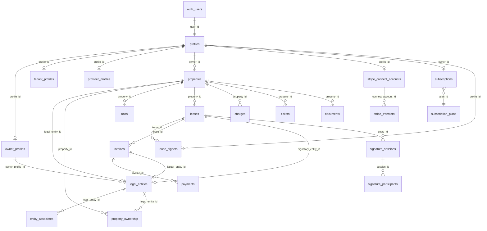

# Rapport d'Audit — Compte Proprietaire & Gestion Multi-Entreprises (Talok)

**Date** : 5 fevrier 2026
**Version** : 1.0
**Auditeur** : Claude (Architecture logicielle)
**Stack** : Next.js 14+ App Router, Supabase (PostgreSQL + RLS), TypeScript, Netlify

---

## SECTION 1 -- Etat des lieux de l'architecture actuelle

### 1.1 Modele de donnees

#### Schema ER textuel



#### Description des tables principales

| Table | Colonnes cles | Contraintes / FK | Role |
|-------|--------------|------------------|------|
| **profiles** | `id`, `user_id` (UNIQUE → auth.users), `role` (admin/owner/tenant/provider), `prenom`, `nom`, `telephone`, `avatar_url` | PK uuid, role CHECK | Profil de base de tout utilisateur |
| **owner_profiles** | `profile_id` (PK → profiles), `type` (particulier/societe), `siret`, `tva`, `iban`, `adresse_facturation` | 1:1 avec profiles | Donnees specifiques proprietaire |
| **tenant_profiles** | `profile_id` (PK → profiles), `situation_pro`, `revenus_mensuels`, `nb_adultes`, `nb_enfants` | 1:1 avec profiles | Donnees specifiques locataire |
| **provider_profiles** | `profile_id` (PK → profiles), `type_services[]`, `certifications`, `zones_intervention` | 1:1 avec profiles | Donnees specifiques prestataire |
| **legal_entities** | `id`, `owner_profile_id` (→ owner_profiles), `entity_type`, `nom`, `siren`, `siret`, `regime_fiscal`, `iban`, `is_active` | 1:N depuis owner_profiles | Entites juridiques (SCI, SARL, etc.) |
| **entity_associates** | `id`, `legal_entity_id` (→ legal_entities), `profile_id`, `parent_entity_id`, `nombre_parts`, `pourcentage_capital`, `is_gerant` | N:1 vers legal_entities | Associes des entites |
| **properties** | `id`, `owner_id` (→ profiles), `legal_entity_id` (→ legal_entities), `detention_mode`, `type`, `adresse_complete`, `unique_code` | FK vers profiles ET legal_entities | Biens immobiliers |
| **property_ownership** | `id`, `property_id`, `legal_entity_id` XOR `profile_id`, `detention_type`, `pourcentage_detention` (GENERATED) | Contrainte XOR entity/profile | Multi-detention, indivision, demembrement |
| **leases** | `id`, `property_id`, `unit_id`, `signatory_entity_id` (→ legal_entities), `type_bail`, `loyer`, `statut` | FK optionnelle vers legal_entities | Baux locatifs |
| **lease_signers** | `id`, `lease_id`, `profile_id`, `role` (proprietaire/locataire_principal/colocataire/garant), `signature_status` | UNIQUE(lease_id, profile_id) | Signataires des baux |
| **invoices** | `id`, `lease_id`, `owner_id`, `tenant_id`, `issuer_entity_id` (→ legal_entities), `montant_total`, `statut` | FK optionnelle vers legal_entities | Facturation |
| **payments** | `id`, `invoice_id`, `montant`, `moyen` (cb/virement/prelevement), `statut` | FK vers invoices | Paiements |
| **stripe_connect_accounts** | `id`, `profile_id` (UNIQUE → profiles), `stripe_account_id` (UNIQUE), `charges_enabled`, `payouts_enabled` | **1:1 avec profiles** | Comptes Stripe Connect |
| **subscriptions** | `id`, `owner_id` (UNIQUE → profiles), `plan_id`, `stripe_subscription_id`, `status`, `billing_cycle` | **1:1 avec profiles** | Abonnements SaaS |
| **signature_sessions** | `id`, `document_type`, `entity_id`, `status`, `signature_level` (SES/AES/QES/RES), `owner_id` | FK vers profiles | Signature numerique interne |
| **documents** | `id`, `type`, `owner_id`, `tenant_id`, `property_id`, `lease_id`, `storage_path`, `metadata` | FK multiples | Stockage documents |

---

### 1.2 Flux utilisateur proprietaire

#### Parcours inscription → dashboard

```
1. /signup/role
   └── Choix du role : Proprietaire / Locataire / Prestataire / Garant

2. /signup/account (account_creation)
   └── Email, mot de passe, prenom, nom, telephone
   └── Consentements (CGU, RGPD)
   └── signUp() → creation auth.users → trigger handle_new_user() → insert profiles + owner_profiles

3. /auth/verify-email (email_verification)
   └── Code OTP ou lien magic

4. Onboarding owner (steps sequentiels) :
   a. owner_profile    → Type (particulier/societe), SIRET si societe, adresse
   b. owner_finance     → IBAN pour reception des loyers
   c. first_property    → Creation du premier bien
   d. final_review      → Recapitulatif

5. /owner/dashboard
   └── Dashboard gating : email verifie + IBAN configure + 1 bien cree
   └── FirstLoginOrchestrator : welcome modal → guided tour
```

**Point critique** : Aucune etape de creation d'entite juridique (`legal_entity`) dans l'onboarding. Le trigger `create_default_particulier_entity` cree automatiquement une entite "particulier" a l'insertion dans `owner_profiles` si `type = 'particulier'`.

#### Description des formulaires cles

- **Formulaire d'inscription** : email, password, prenom, nom, telephone. Le role est passe en metadata Supabase Auth. Pas de champ "entreprise".
- **Formulaire owner_profile** : choix particulier/societe, SIRET (si societe), adresse de facturation. Pas de choix de structure juridique detaille (SCI, SARL...).
- **Formulaire first_property** : wizard multi-etapes (type, adresse, surface, DPE, photos). Le champ `owner_id` est rempli automatiquement. Pas de selecteur d'entite juridique visible dans le wizard d'onboarding.

---

### 1.3 Gestion actuelle des entreprises

#### Creation d'entite

**Mecanisme automatique** : Un trigger PostgreSQL `trigger_create_default_entity` cree une entite `legal_entities` de type `'particulier'` a chaque insertion dans `owner_profiles` (si `type = 'particulier'`).

**Mecanisme manuel** : L'API `POST /api/owner/legal-entities` permet de creer des entites de tous types (SCI, SARL, SAS, etc.) avec validation SIREN/SIRET. Le service `legal-entities.service.ts` expose des methodes CRUD completes.

#### Champs stockes pour une entite

Les `legal_entities` sont tres riches : ~45 colonnes couvrant l'identite, l'immatriculation, la fiscalite (regime IR/IS, TVA), les parts sociales, la gerance, les coordonnees bancaires, et des metadonnees UI (couleur, icone).

#### Relation profile ↔ company

```
profiles (1) ──── owner_profiles (1) ──── legal_entities (N)
                                              │
                                              ├── entity_associates (N)
                                              ├── property_ownership (N)
                                              └── properties.legal_entity_id
```

**Relation actuelle : 1:N** — Un `owner_profile` peut avoir plusieurs `legal_entities`. C'est deja une architecture multi-entreprises cote base de donnees.

#### Limitations identifiees

| # | Limitation | Impact |
|---|-----------|--------|
| 1 | **Pas de `company_id` dans le contexte applicatif** : `OwnerDataProvider` charge les donnees par `profile.id`, pas par entite | Toutes les donnees sont aggregees sans distinction d'entite |
| 2 | **Pas de company switcher UI** : L'`OwnerAppLayout` ne contient aucun selecteur d'entite | Le proprietaire ne peut pas filtrer par entite dans le dashboard |
| 3 | **`fetchProperties(profile.id)`** filtre par `owner_id`, pas par `legal_entity_id` | Le dashboard melange les biens de toutes les entites |
| 4 | **`fetchDashboard(profile.id)`** aggrege tout sans ventilation par entite | Metriques financieres non-segmentees |
| 5 | **Onboarding ne cree pas d'entite "societe"** | Les proprietaires en SCI doivent creer l'entite apres l'onboarding |
| 6 | **`owner_profiles.type`** doublon avec `legal_entities.entity_type` | Source de verite ambigue (particulier/societe) |

---

### 1.4 Politiques RLS en place

#### Tableau recapitulatif

| Table | Politique | Operation | Filtre principal | Supporte multi-entites ? |
|-------|-----------|-----------|-----------------|-------------------------|
| **profiles** | Users can view own profile | SELECT | `user_id = auth.uid()` | N/A |
| **profiles** | Admins can view all | SELECT | `user_role() = 'admin'` | N/A |
| **owner_profiles** | Users can view own | SELECT | `profile_id = user_profile_id()` | N/A |
| **properties** | owner_select_properties | SELECT | `owner_id = user_profile_id()` | **NON** — filtre par profile, pas par entite |
| **properties** | owner_insert_properties | INSERT | `owner_id = user_profile_id()` | **NON** |
| **properties** | tenant_select_properties | SELECT | Via lease_signers | N/A |
| **leases** | leases_owner_all | ALL | Via `property.owner_id` | **NON** — ne verifie pas `signatory_entity_id` |
| **leases** | leases_tenant_select | SELECT | Via lease_signers | N/A |
| **invoices** | Owners can view | SELECT | `owner_id = user_profile_id()` | **NON** — pas de filtre `issuer_entity_id` |
| **payments** | Users can view accessible | SELECT | Via invoice owner/tenant | **NON** (herite d'invoices) |
| **documents** | Users can view accessible | SELECT | `owner_id` ou `tenant_id` ou `property_id` | **NON** |
| **legal_entities** | Users can view their own | SELECT/INSERT/UPDATE/DELETE | `owner_profile_id` via chain | **OUI** — filtre par owner_profile |
| **entity_associates** | View/Manage associates | SELECT/ALL | Via `legal_entity_id` → owner | **OUI** |
| **property_ownership** | View ownership | SELECT | Via property owner OU entity owner | **PARTIEL** |
| **stripe_connect_accounts** | (non documente dans migrations) | — | `profile_id` | **NON** — 1:1 avec profile |
| **subscriptions** | Owners can view their | SELECT | `owner_id = user_profile_id()` | **NON** — 1:1 avec profile |
| **tickets** | Users can view accessible | SELECT | Via property owner | **NON** |
| **charges** | Owners can manage own | ALL | Via property owner | **NON** |

#### Evaluation

Les politiques RLS des tables `legal_entities`, `entity_associates` et `property_ownership` supportent correctement le multi-entites. **Cependant, toutes les autres tables cles** (properties, leases, invoices, payments, documents, tickets, charges) filtrent par `owner_id` / `profile_id` directement, sans passer par la relation `legal_entity_id`. Cela signifie :

- Un proprietaire voit **tous** ses biens/baux/factures quelle que soit l'entite
- Il n'y a **pas de cloisonnement** entre entites du meme proprietaire
- L'isolation inter-entites est **inexistante** cote RLS pour les tables metier

#### Failles de securite potentielles

1. **Pas de faille de fuite inter-proprietaires** : les RLS filtrent correctement par `owner_id` via `user_profile_id()`. Un proprietaire A ne peut pas voir les donnees du proprietaire B.
2. **Pas d'isolation intra-proprietaire** : un proprietaire avec 2 SCI voit tout melange. Ce n'est pas une faille de securite stricto sensu mais un probleme fonctionnel pour la comptabilite par entite.
3. **RLS `property_ownership` asymetriques** : la politique SELECT autorise l'acces via `legal_entity_id`, mais la politique ALL (INSERT/UPDATE/DELETE) ne filtre que par `property.owner_id`. Un associe qui serait lie a une entite (sans etre le proprietaire du bien) ne pourrait pas gerer l'ownership.

---

### 1.5 Integrations tierces

#### Stripe Connect

| Aspect | Etat actuel |
|--------|------------|
| **Rattachement** | `stripe_connect_accounts.profile_id` → 1:1 avec `profiles` |
| **Type de compte** | Express uniquement |
| **Business type** | `individual` par defaut, `company` en option |
| **Pays** | France (FR) par defaut |
| **Onboarding URL** | Retour vers `/owner/settings/payments` |
| **Commission plateforme** | 2.5% + 0.25 EUR fixe (configurable) |
| **Virements** | Quotidiens avec delai de 2 jours |

**Probleme multi-entites** : Un proprietaire avec une SCI IR et une SARL devrait avoir **2 comptes Stripe Connect distincts** (un par entite juridique, car IBAN et obligations fiscales differents). Actuellement, il n'a qu'un seul compte lie a son profil.

#### Signature numerique interne

| Aspect | Etat actuel |
|--------|------------|
| **Systeme** | Interne (pas Yousign/DocuSign) |
| **Niveaux** | SES, AES, QES, RES |
| **Rattachement** | `signature_sessions.owner_id` → profiles |
| **OTP** | Optionnel par session |
| **Preuve** | Document de preuve consolide (`proof_document_id`) |

Le systeme de signature est lie au `owner_id` (profile), pas a l'entite. Cela fonctionne car le signataire est toujours une personne physique, mais le document signe devrait mentionner l'entite signataire.

#### Abonnements SaaS

| Aspect | Etat actuel |
|--------|------------|
| **Rattachement** | `subscriptions.owner_id` (UNIQUE) → 1:1 avec profiles |
| **Limites** | `max_properties`, `max_leases`, `max_tenants`, `max_documents_gb` |
| **Features** | `signatures`, `ocr`, `scoring`, `automations`, `api_access`, `white_label`, `multi_users` |
| **Facturation** | Mensuelle ou annuelle |

**Probleme** : Les limites d'abonnement (max_properties, etc.) comptent tous les biens du proprietaire, toutes entites confondues. Si on veut des abonnements par entite, l'architecture doit changer.

---

## SECTION 2 -- Analyse des lacunes (Gap Analysis)

### 2.1 Fonctionnalites manquantes

| # | Fonctionnalite | Etat | Priorite |
|---|---------------|------|----------|
| 1 | **Creation d'entite juridique** | Backend OK (API + service), Frontend: page `/owner/legal-entities` existe | Ameliorer l'integration dans l'onboarding |
| 2 | **Multi-entites (N entites)** | Schema DB OK (1:N), **pas de contexte applicatif** | **CRITIQUE** |
| 3 | **Switcher d'entite** | **ABSENT** — ni dans la sidebar, ni dans le header | **CRITIQUE** |
| 4 | **Dashboard filtre par entite** | **ABSENT** — `fetchDashboard(profile.id)` aggrege tout | HAUTE |
| 5 | **Invitation de collaborateurs** | Service `invitations.service.ts` existe pour locataires, **pas pour collaborateurs d'entite** | MOYENNE |
| 6 | **Roles intra-entite** | `entity_associates` a des flags (`is_gerant`, `is_president`) mais **pas de gestion d'acces applicatif** | MOYENNE |
| 7 | **Comptabilite par entite** | `get_entity_stats()` existe mais **pas d'UI dediee** | HAUTE |
| 8 | **IBAN par entite** | `legal_entities.iban` existe mais **non utilise** pour Stripe Connect | HAUTE |

### 2.2 Problemes architecturaux

#### 2.2.1 Couplage `profile` ↔ donnees metier

Le `owner_id` sur `properties` pointe vers `profiles.id`, pas vers une entite juridique. Meme si `legal_entity_id` a ete ajoute, la plupart des requetes (`fetchProperties`, `fetchDashboard`, `fetchContracts`) utilisent `owner_id` comme filtre principal :

```typescript
// app/owner/layout.tsx:54-58
const [propertiesResult, dashboardResult, contractsResult] = await Promise.allSettled([
  fetchProperties(profile.id),        // Filtre par profile_id, pas entity_id
  fetchDashboard(profile.id),         // Idem
  fetchContracts({ ownerId: profile.id }), // Idem
]);
```

#### 2.2.2 Absence de contexte "entite active"

Le `OwnerDataProvider` ne contient aucune notion d'entite :

```typescript
// app/owner/_data/OwnerDataProvider.tsx
export interface OwnerDataContextValue {
  properties: PropertiesWithStats | null;
  dashboard: OwnerDashboardData | null;
  contracts: LeaseRow[] | null;
  isLoading?: boolean;
  refetch?: () => void;
  // MANQUANT: activeEntityId, entities, setActiveEntity
}
```

#### 2.2.3 Middleware sans notion d'entite

Le middleware (`middleware.ts`) verifie uniquement la presence d'un cookie auth et redirige vers `/auth/signin` si absent. Il ne verifie ni le role, ni l'entite active, ni les permissions intra-entite.

#### 2.2.4 Stripe Connect 1:1 avec profile

```typescript
// app/api/stripe/connect/route.ts:46-50
const { data: connectAccount } = await supabase
  .from("stripe_connect_accounts")
  .select("*")
  .eq("profile_id", profile.id)  // 1:1 avec profile, pas entity
  .maybeSingle();
```

Un proprietaire ne peut avoir qu'**un seul** compte Stripe Connect, meme s'il a plusieurs entites avec des IBAN differents.

### 2.3 Risques identifies

| # | Risque | Severite | Description |
|---|--------|----------|-------------|
| 1 | **Melange comptable** | HAUTE | Les revenus de toutes les entites sont agreges. Impossible de generer un bilan par SCI. |
| 2 | **Non-conformite fiscale** | HAUTE | Une SCI a l'IS et une SCI a l'IR ont des obligations declaratives differentes. Sans separation, le reporting est incorrect. |
| 3 | **Stripe Connect inadapte** | HAUTE | Verser les loyers d'une SCI sur le compte bancaire personnel du proprietaire pose un probleme juridique et fiscal. |
| 4 | **Impossibilite de scale** | MOYENNE | Un proprietaire avec 5 SCI ne peut pas gerer efficacement ses biens sans vue par entite. |
| 5 | **Invitation collaborateur bloquee** | MOYENNE | Pas de mecanisme pour qu'un comptable accede a une SCI specifique sans voir les autres. |
| 6 | **Doublon `owner_profiles.type` / `legal_entities.entity_type`** | BASSE | Source de verite ambigue, risque de desynchronisation. |

---

## SECTION 3 -- Recommandations architecturales

### 3.1 Modele de donnees cible

#### Nouvelles tables / modifications

**Aucune nouvelle table necessaire** pour le coeur multi-entites. Le schema `legal_entities` + `entity_associates` + `property_ownership` est deja en place. Les modifications portent sur :

1. **`stripe_connect_accounts`** : changer la FK de `profile_id` vers `legal_entity_id`
2. **`subscriptions`** : decider si l'abonnement reste par profil (recommande pour un SaaS a ~3 140 clients)
3. **Ajouter une table `entity_members`** pour gerer les collaborateurs applicatifs (distinct des associes juridiques)

#### Migration 1 : Table `entity_members` (collaborateurs applicatifs)

```sql
-- Migration: Collaborateurs applicatifs par entite
BEGIN;

CREATE TABLE IF NOT EXISTS entity_members (
  id UUID PRIMARY KEY DEFAULT uuid_generate_v4(),
  legal_entity_id UUID NOT NULL REFERENCES legal_entities(id) ON DELETE CASCADE,
  profile_id UUID NOT NULL REFERENCES profiles(id) ON DELETE CASCADE,

  -- Role applicatif (distinct du role juridique dans entity_associates)
  app_role TEXT NOT NULL DEFAULT 'viewer' CHECK (app_role IN (
    'admin',       -- Acces total a l'entite
    'manager',     -- Gestion biens/baux, pas de config entite
    'accountant',  -- Lecture finances, generation rapports
    'viewer'       -- Lecture seule
  )),

  invited_by UUID REFERENCES profiles(id),
  invited_at TIMESTAMPTZ DEFAULT NOW(),
  accepted_at TIMESTAMPTZ,

  is_active BOOLEAN DEFAULT true,
  created_at TIMESTAMPTZ NOT NULL DEFAULT NOW(),
  updated_at TIMESTAMPTZ NOT NULL DEFAULT NOW(),

  UNIQUE(legal_entity_id, profile_id)
);

-- Index
CREATE INDEX idx_entity_members_entity ON entity_members(legal_entity_id);
CREATE INDEX idx_entity_members_profile ON entity_members(profile_id);
CREATE INDEX idx_entity_members_active ON entity_members(legal_entity_id) WHERE is_active = true;

-- RLS
ALTER TABLE entity_members ENABLE ROW LEVEL SECURITY;

CREATE POLICY "Members can view their memberships"
  ON entity_members FOR SELECT
  USING (profile_id IN (SELECT id FROM profiles WHERE user_id = auth.uid()));

CREATE POLICY "Entity admins can manage members"
  ON entity_members FOR ALL
  USING (
    legal_entity_id IN (
      SELECT legal_entity_id FROM entity_members
      WHERE profile_id IN (SELECT id FROM profiles WHERE user_id = auth.uid())
        AND app_role = 'admin'
        AND is_active = true
    )
  );

CREATE POLICY "Entity owners can manage members"
  ON entity_members FOR ALL
  USING (
    legal_entity_id IN (
      SELECT id FROM legal_entities
      WHERE owner_profile_id IN (
        SELECT profile_id FROM owner_profiles
        WHERE profile_id IN (SELECT id FROM profiles WHERE user_id = auth.uid())
      )
    )
  );

CREATE POLICY "Admins can do everything on entity_members"
  ON entity_members FOR ALL
  USING (EXISTS (SELECT 1 FROM profiles WHERE user_id = auth.uid() AND role = 'admin'));

-- Trigger updated_at
CREATE TRIGGER update_entity_members_updated_at
  BEFORE UPDATE ON entity_members
  FOR EACH ROW EXECUTE FUNCTION update_updated_at_column();

-- Auto-inserer le proprietaire comme admin de ses entites existantes
INSERT INTO entity_members (legal_entity_id, profile_id, app_role, accepted_at)
SELECT le.id, le.owner_profile_id, 'admin', NOW()
FROM legal_entities le
WHERE le.is_active = true
  AND NOT EXISTS (
    SELECT 1 FROM entity_members em
    WHERE em.legal_entity_id = le.id AND em.profile_id = le.owner_profile_id
  );

COMMIT;
```

#### Migration 2 : Stripe Connect par entite

```sql
-- Migration: Stripe Connect multi-entites
BEGIN;

-- Ajouter legal_entity_id a stripe_connect_accounts
ALTER TABLE stripe_connect_accounts
  ADD COLUMN IF NOT EXISTS legal_entity_id UUID REFERENCES legal_entities(id) ON DELETE SET NULL;

CREATE INDEX IF NOT EXISTS idx_stripe_connect_entity
  ON stripe_connect_accounts(legal_entity_id) WHERE legal_entity_id IS NOT NULL;

-- Retirer la contrainte UNIQUE sur profile_id (permettre N comptes par profil)
-- D'abord identifier le nom de la contrainte
DO $$
BEGIN
  IF EXISTS (
    SELECT 1 FROM pg_constraint
    WHERE conname = 'stripe_connect_accounts_profile_id_key'
  ) THEN
    ALTER TABLE stripe_connect_accounts
      DROP CONSTRAINT stripe_connect_accounts_profile_id_key;
  END IF;
END $$;

-- Ajouter une contrainte UNIQUE sur (profile_id, legal_entity_id)
ALTER TABLE stripe_connect_accounts
  ADD CONSTRAINT stripe_connect_unique_entity
  UNIQUE (profile_id, legal_entity_id);

-- Lier les comptes existants a l'entite par defaut du proprietaire
UPDATE stripe_connect_accounts sca
SET legal_entity_id = (
  SELECT le.id
  FROM legal_entities le
  WHERE le.owner_profile_id = sca.profile_id
  ORDER BY le.created_at ASC
  LIMIT 1
)
WHERE sca.legal_entity_id IS NULL;

COMMIT;
```

#### Migration 3 : Fonction helper `get_user_entity_ids()`

```sql
-- Migration: Helper functions pour multi-entites
BEGIN;

-- Retourne les IDs de toutes les entites accessibles par l'utilisateur courant
CREATE OR REPLACE FUNCTION get_user_entity_ids()
RETURNS SETOF UUID AS $$
BEGIN
  RETURN QUERY
  -- Entites dont l'utilisateur est proprietaire
  SELECT le.id
  FROM legal_entities le
  JOIN owner_profiles op ON le.owner_profile_id = op.profile_id
  JOIN profiles p ON op.profile_id = p.id
  WHERE p.user_id = auth.uid()
    AND le.is_active = true

  UNION

  -- Entites dont l'utilisateur est membre (collaborateur)
  SELECT em.legal_entity_id
  FROM entity_members em
  JOIN profiles p ON em.profile_id = p.id
  WHERE p.user_id = auth.uid()
    AND em.is_active = true;
END;
$$ LANGUAGE plpgsql STABLE SECURITY DEFINER SET search_path = public;

-- Retourne l'entite active (stockee en user metadata ou premiere par defaut)
CREATE OR REPLACE FUNCTION get_active_entity_id()
RETURNS UUID AS $$
DECLARE
  v_entity_id UUID;
  v_raw_meta JSONB;
BEGIN
  -- Essayer de lire l'entite active depuis les metadonnees utilisateur
  SELECT raw_user_meta_data INTO v_raw_meta
  FROM auth.users WHERE id = auth.uid();

  v_entity_id := (v_raw_meta ->> 'active_entity_id')::UUID;

  -- Verifier que l'entite est accessible
  IF v_entity_id IS NOT NULL AND EXISTS (
    SELECT 1 FROM get_user_entity_ids() WHERE get_user_entity_ids = v_entity_id
  ) THEN
    RETURN v_entity_id;
  END IF;

  -- Sinon retourner la premiere entite
  SELECT id INTO v_entity_id
  FROM legal_entities le
  JOIN owner_profiles op ON le.owner_profile_id = op.profile_id
  JOIN profiles p ON op.profile_id = p.id
  WHERE p.user_id = auth.uid()
    AND le.is_active = true
  ORDER BY le.created_at ASC
  LIMIT 1;

  RETURN v_entity_id;
END;
$$ LANGUAGE plpgsql STABLE SECURITY DEFINER SET search_path = public;

COMMIT;
```

#### Strategie de migration des donnees

1. Les `legal_entities` existantes (type "particulier" auto-creees) restent inchangees
2. Les `properties` ont deja `legal_entity_id` rempli (migration 20260115 l'a fait)
3. Les `stripe_connect_accounts` existants sont lies a l'entite par defaut
4. Les `entity_members` sont auto-remplis (proprietaire = admin de ses entites)
5. **Zero downtime** : toutes les modifications sont additives (ADD COLUMN, INSERT)

---

### 3.2 Flux multi-entreprises propose

#### Parcours : creer une 1ere entreprise

```
1. Onboarding existant → creation owner_profile (type='particulier')
2. Trigger cree legal_entities (type='particulier', nom="Prenom Nom")
3. Trigger cree entity_members (profile_id=owner, app_role='admin')
4. Proprietaire arrive sur /owner/dashboard
5. Toutes les donnees sont filtrees par cette entite unique
```

#### Parcours : ajouter une 2eme entreprise

```
1. /owner/legal-entities → bouton "Ajouter une structure"
2. Formulaire : type (SCI IR, SARL, etc.), raison sociale, SIREN, SIRET
3. POST /api/owner/legal-entities → creation legal_entity
4. Auto-creation entity_member (owner = admin)
5. Proposition : configurer le compte Stripe Connect pour cette entite
6. Retour au dashboard → company switcher affiche 2 entites
```

#### Parcours : switcher entre entreprises

```
1. Clic sur le company switcher (header/sidebar)
2. Liste des entites avec stats (nb biens, loyer mensuel, couleur)
3. Selection → update user_metadata.active_entity_id (Supabase Auth)
4. Re-fetch des donnees via OwnerDataProvider avec entity_id
5. Dashboard, biens, baux : tous filtres par l'entite active
6. Option "Vue globale" pour voir toutes les entites aggregees
```

#### Parcours : inviter un collaborateur

```
1. /owner/legal-entities/[id]/members → bouton "Inviter"
2. Formulaire : email, role (manager/accountant/viewer)
3. POST /api/owner/legal-entities/[id]/members/invite
4. Email d'invitation avec lien tokenise
5. Collaborateur s'inscrit ou se connecte → entity_members cree
6. Acces limite a cette entite selon le role
```

---

### 3.3 Modifications RLS requises

#### Nouvelles politiques pour `properties`

```sql
-- Remplacer les politiques existantes pour supporter le filtrage par entite
-- SANS CASSER l'acces existant

-- Les proprietaires voient les biens de leurs entites
DROP POLICY IF EXISTS "owner_select_properties" ON properties;
CREATE POLICY "owner_select_properties" ON properties FOR SELECT
USING (
  owner_id IN (SELECT id FROM profiles WHERE user_id = auth.uid())
  OR
  legal_entity_id IN (SELECT get_user_entity_ids())
);

-- Les proprietaires inserent des biens pour leurs entites
DROP POLICY IF EXISTS "owner_insert_properties" ON properties;
CREATE POLICY "owner_insert_properties" ON properties FOR INSERT
WITH CHECK (
  owner_id IN (SELECT id FROM profiles WHERE user_id = auth.uid())
);

-- Les proprietaires modifient les biens de leurs entites
DROP POLICY IF EXISTS "owner_update_properties" ON properties;
CREATE POLICY "owner_update_properties" ON properties FOR UPDATE
USING (
  owner_id IN (SELECT id FROM profiles WHERE user_id = auth.uid())
  OR
  legal_entity_id IN (SELECT get_user_entity_ids())
);
```

**Note** : Les politiques tenant et admin restent inchangees.

#### Nouvelles politiques pour `leases`

```sql
-- Proprietaires et membres d'entites voient les baux
DROP POLICY IF EXISTS "leases_owner_all" ON leases;
CREATE POLICY "leases_owner_all" ON leases FOR ALL
USING (
  property_id IN (
    SELECT id FROM properties
    WHERE owner_id IN (SELECT id FROM profiles WHERE user_id = auth.uid())
  )
  OR
  signatory_entity_id IN (SELECT get_user_entity_ids())
);
```

#### Nouvelles politiques pour `invoices`

```sql
-- Proprietaires voient les factures de leurs entites
DROP POLICY IF EXISTS "Owners can view invoices of own properties" ON invoices;
CREATE POLICY "owners_select_invoices" ON invoices FOR SELECT
USING (
  owner_id IN (SELECT id FROM profiles WHERE user_id = auth.uid())
  OR
  issuer_entity_id IN (SELECT get_user_entity_ids())
);
```

#### Tests de securite recommandes

| # | Test | Resultat attendu |
|---|------|-----------------|
| 1 | Proprietaire A ne voit pas les biens de Proprietaire B | Aucun resultat retourne |
| 2 | Proprietaire voit les biens de toutes SES entites | Tous les biens affiches |
| 3 | Collaborateur "viewer" voit les biens de l'entite partagee | Biens de l'entite uniquement |
| 4 | Collaborateur "viewer" ne voit pas les biens des autres entites du proprietaire | Aucun resultat |
| 5 | Locataire ne voit que les biens de ses baux actifs | Filtrage correct |
| 6 | Admin voit tout | Acces complet |
| 7 | Changement d'entite active filtre correctement | Donnees changent |

---

### 3.4 Modifications frontend requises

#### 3.4.1 Composant `CompanySwitcher`

```typescript
// components/layout/company-switcher.tsx

"use client";

import { useState, useTransition } from "react";
import { Check, ChevronsUpDown, Plus, Building2, User } from "lucide-react";
import {
  Popover,
  PopoverContent,
  PopoverTrigger,
} from "@/components/ui/popover";
import {
  Command,
  CommandEmpty,
  CommandGroup,
  CommandInput,
  CommandItem,
  CommandSeparator,
} from "@/components/ui/command";
import { cn } from "@/lib/utils";
import { useRouter } from "next/navigation";

interface EntityOption {
  id: string;
  nom: string;
  entity_type: string;
  couleur?: string | null;
  properties_count?: number;
  monthly_rent?: number;
}

interface CompanySwitcherProps {
  entities: EntityOption[];
  activeEntityId: string | null;
  onSwitch: (entityId: string | null) => Promise<void>;
  className?: string;
}

const ENTITY_TYPE_LABELS: Record<string, string> = {
  particulier: "Personnel",
  sci_ir: "SCI (IR)",
  sci_is: "SCI (IS)",
  sarl: "SARL",
  sarl_famille: "SARL Famille",
  sas: "SAS",
  sasu: "SASU",
  eurl: "EURL",
  indivision: "Indivision",
  holding: "Holding",
};

export function CompanySwitcher({
  entities,
  activeEntityId,
  onSwitch,
  className,
}: CompanySwitcherProps) {
  const [open, setOpen] = useState(false);
  const [isPending, startTransition] = useTransition();
  const router = useRouter();

  const activeEntity = entities.find((e) => e.id === activeEntityId);

  const handleSelect = (entityId: string | null) => {
    setOpen(false);
    startTransition(async () => {
      await onSwitch(entityId);
      router.refresh();
    });
  };

  return (
    <Popover open={open} onOpenChange={setOpen}>
      <PopoverTrigger asChild>
        <button
          role="combobox"
          aria-expanded={open}
          aria-label="Selectionner une structure"
          className={cn(
            "flex items-center gap-2 rounded-lg border px-3 py-2 text-sm",
            "hover:bg-accent transition-colors w-full justify-between",
            isPending && "opacity-50 pointer-events-none",
            className
          )}
        >
          <div className="flex items-center gap-2 truncate">
            {activeEntity?.couleur && (
              <div
                className="h-3 w-3 rounded-full shrink-0"
                style={{ backgroundColor: activeEntity.couleur }}
              />
            )}
            {!activeEntity?.couleur && (
              <Building2 className="h-4 w-4 shrink-0 text-muted-foreground" />
            )}
            <span className="truncate">
              {activeEntity?.nom ?? "Toutes les structures"}
            </span>
          </div>
          <ChevronsUpDown className="h-4 w-4 shrink-0 opacity-50" />
        </button>
      </PopoverTrigger>
      <PopoverContent className="w-[280px] p-0" align="start">
        <Command>
          <CommandInput placeholder="Rechercher..." />
          <CommandEmpty>Aucune structure trouvee.</CommandEmpty>
          <CommandGroup heading="Structures">
            <CommandItem onSelect={() => handleSelect(null)}>
              <User className="mr-2 h-4 w-4" />
              Toutes les structures
              {!activeEntityId && <Check className="ml-auto h-4 w-4" />}
            </CommandItem>
            {entities.map((entity) => (
              <CommandItem
                key={entity.id}
                onSelect={() => handleSelect(entity.id)}
              >
                <div className="flex items-center gap-2 flex-1 min-w-0">
                  {entity.couleur ? (
                    <div
                      className="h-3 w-3 rounded-full shrink-0"
                      style={{ backgroundColor: entity.couleur }}
                    />
                  ) : (
                    <Building2 className="h-4 w-4 shrink-0 text-muted-foreground" />
                  )}
                  <div className="truncate">
                    <div className="truncate font-medium">{entity.nom}</div>
                    <div className="text-xs text-muted-foreground">
                      {ENTITY_TYPE_LABELS[entity.entity_type] ?? entity.entity_type}
                      {entity.properties_count != null && ` - ${entity.properties_count} bien(s)`}
                    </div>
                  </div>
                </div>
                {entity.id === activeEntityId && (
                  <Check className="ml-auto h-4 w-4 shrink-0" />
                )}
              </CommandItem>
            ))}
          </CommandGroup>
          <CommandSeparator />
          <CommandGroup>
            <CommandItem
              onSelect={() => {
                setOpen(false);
                router.push("/owner/legal-entities/new");
              }}
            >
              <Plus className="mr-2 h-4 w-4" />
              Ajouter une structure
            </CommandItem>
          </CommandGroup>
        </Command>
      </PopoverContent>
    </Popover>
  );
}
```

#### 3.4.2 Mise a jour du `OwnerDataProvider`

```typescript
// app/owner/_data/OwnerDataProvider.tsx (modifications)

export interface OwnerDataContextValue {
  properties: PropertiesWithStats | null;
  dashboard: OwnerDashboardData | null;
  contracts: LeaseRow[] | null;
  // AJOUTS :
  entities: LegalEntityWithStats[];
  activeEntityId: string | null;
  setActiveEntityId: (id: string | null) => Promise<void>;
  isLoading?: boolean;
  refetch?: () => void;
}
```

#### 3.4.3 Mise a jour du `OwnerLayout`

```typescript
// app/owner/layout.tsx (modifications a integrer)
// Ajouter le fetch des entites et l'entite active

import { getLegalEntitiesWithStats } from "@/features/legal-entities/services/legal-entities.service";

// Dans la fonction OwnerLayout, apres le fetch du profil :
const ownerProfile = await supabase
  .from("owner_profiles")
  .select("profile_id")
  .eq("profile_id", profile.id)
  .single();

// Recuperer les entites
const entities = ownerProfile.data
  ? await getLegalEntitiesWithStats(profile.id)
  : [];

// Recuperer l'entite active depuis les metadonnees user
const activeEntityId = user.user_metadata?.active_entity_id ?? entities[0]?.id ?? null;

// Passer au provider
<OwnerDataProvider
  properties={properties}
  dashboard={dashboard}
  contracts={contracts}
  entities={entities}
  activeEntityId={activeEntityId}
>
```

#### 3.4.4 Server Action pour changer d'entite

```typescript
// lib/actions/switch-entity.ts
"use server";

import { createClient } from "@/lib/supabase/server";
import { revalidatePath } from "next/cache";

export async function switchActiveEntity(entityId: string | null) {
  const supabase = await createClient();

  const { data: { user }, error } = await supabase.auth.getUser();
  if (error || !user) throw new Error("Non autorise");

  // Mettre a jour les metadonnees utilisateur
  await supabase.auth.updateUser({
    data: { active_entity_id: entityId },
  });

  // Revalider les pages owner
  revalidatePath("/owner", "layout");
}
```

#### 3.4.5 Pages a modifier

| Fichier | Modification |
|---------|-------------|
| `app/owner/layout.tsx` | Ajouter fetch entites + activeEntityId, passer au Provider |
| `app/owner/_data/OwnerDataProvider.tsx` | Ajouter `entities`, `activeEntityId`, `setActiveEntityId` |
| `app/owner/_data/fetchProperties.ts` | Ajouter parametre optionnel `entityId` pour filtrer |
| `app/owner/_data/fetchDashboard.ts` | Ajouter parametre optionnel `entityId` pour filtrer |
| `app/owner/_data/fetchContracts.ts` | Ajouter parametre optionnel `entityId` pour filtrer |
| `components/layout/owner-app-layout.tsx` | Integrer `CompanySwitcher` dans la sidebar (au-dessus de la navigation) |
| `app/owner/dashboard/page.tsx` | Afficher le nom de l'entite active, stats filtrees |
| `app/owner/properties/page.tsx` | Filtrer les biens par entite active |
| `app/owner/leases/page.tsx` | Filtrer les baux par entite active |
| `features/properties/services/` | Ajouter filtre `entity_id` aux requetes |
| `features/leases/services/leases.service.ts` | Ajouter filtre `signatory_entity_id` |
| `app/api/stripe/connect/route.ts` | Accepter `entity_id` en body, lier le compte a l'entite |
| `app/api/properties/route.ts` | Respecter le filtre `entity_id` si fourni |
| `app/api/leases/route.ts` | Respecter le filtre `entity_id` si fourni |

---

### 3.5 Modifications Stripe Connect

#### Architecture cible

```
AVANT :
  profile_id (1) ─── stripe_connect_accounts (1)

APRES :
  profile_id (1) ─── legal_entity_id (N) ─── stripe_connect_accounts (N)
  Chaque entite juridique a son propre compte Stripe Connect
```

#### Modifications API Stripe Connect

```typescript
// app/api/stripe/connect/route.ts - POST modifie

export async function POST(request: NextRequest) {
  // ... auth checks existants ...

  const body = await request.json().catch(() => ({}));
  const entityId = body.entity_id; // NOUVEAU: ID de l'entite
  const businessType = body.business_type || "individual";

  // Verifier que l'entite appartient au proprietaire
  if (entityId) {
    const { data: entity } = await supabase
      .from("legal_entities")
      .select("id, entity_type, nom, siren")
      .eq("id", entityId)
      .single();

    if (!entity) {
      return NextResponse.json(
        { error: "Entite non trouvee" },
        { status: 404 }
      );
    }

    // Si c'est une societe, forcer business_type = company
    const isCompany = entity.entity_type !== "particulier";
    const effectiveBusinessType = isCompany ? "company" : businessType;

    // Verifier si un compte existe deja pour cette entite
    const { data: existingAccount } = await supabase
      .from("stripe_connect_accounts")
      .select("id, stripe_account_id")
      .eq("profile_id", profile.id)
      .eq("legal_entity_id", entityId)
      .maybeSingle();

    // ... suite de la logique existante avec effectiveBusinessType ...
  }
}
```

#### Impact sur les abonnements

**Recommandation** : Garder l'abonnement par proprietaire (profile), pas par entite.

Justification :
- Le modele economique Talok vise ~3 140 clients a ~26 EUR/mois moyen
- Facturer par entite fragmenterait le revenu et compliquerait le pricing
- Les limites (`max_properties`, etc.) s'appliquent au total du proprietaire
- Le plan "Pro" inclurait la feature `multi_entities` comme flag boolean

```typescript
// subscription_plans.features JSONB
{
  "multi_entities": true,       // Autorise la creation de plusieurs entites
  "max_entities": 5,            // Nombre max d'entites (null = illimite)
  "multi_users": true,          // Autorise l'invitation de collaborateurs
  "max_collaborators_per_entity": 3
}
```

#### Migration des comptes Stripe existants

1. Les comptes existants sont lies a l'entite par defaut (Migration 2 ci-dessus)
2. Aucun changement Stripe cote API : le `stripe_account_id` reste le meme
3. Les nouveaux comptes sont crees avec `legal_entity_id` obligatoire
4. Le proprietaire peut initier l'onboarding Stripe pour chaque entite depuis `/owner/legal-entities/[id]/settings`

---

### 3.6 Plan d'implementation

#### Phase 1 : Fondations (Complexite : M)

| Etape | Description | Dependance |
|-------|-------------|------------|
| 1.1 | Migration SQL : `entity_members` + auto-peuplement | Aucune |
| 1.2 | Migration SQL : `get_user_entity_ids()` et `get_active_entity_id()` | 1.1 |
| 1.3 | Server Action `switchActiveEntity` | Aucune |
| 1.4 | Composant `CompanySwitcher` | Aucune |
| 1.5 | Mise a jour `OwnerDataProvider` (ajout entities/activeEntityId) | 1.2 |
| 1.6 | Mise a jour `OwnerLayout` (fetch entites, passer au provider) | 1.5 |
| 1.7 | Integration `CompanySwitcher` dans `owner-app-layout.tsx` | 1.4, 1.6 |

**Risques Phase 1** :
- La modification de `OwnerDataProvider` affecte tous les composants enfants. Tester chaque page owner.
- Le `CompanySwitcher` doit fonctionner meme avec 1 seule entite (cas majoritaire). Ne pas afficher si une seule entite.

**Tests** : Verifier que le dashboard fonctionne identiquement avant/apres pour les proprietaires n'ayant qu'une entite.

#### Phase 2 : Filtrage par entite (Complexite : L)

| Etape | Description | Dependance |
|-------|-------------|------------|
| 2.1 | Modifier `fetchProperties` pour filtrer par `entityId` optionnel | Phase 1 |
| 2.2 | Modifier `fetchDashboard` pour filtrer par `entityId` optionnel | Phase 1 |
| 2.3 | Modifier `fetchContracts` pour filtrer par `entityId` optionnel | Phase 1 |
| 2.4 | Modifier les API routes properties/leases/invoices | 2.1-2.3 |
| 2.5 | Mise a jour des pages owner (dashboard, properties, leases) | 2.1-2.4 |
| 2.6 | Migration RLS : nouvelles politiques avec `get_user_entity_ids()` | 1.2 |

**Risques Phase 2** :
- Les RLS modifiees doivent etre testees exhaustivement. Utiliser des transactions pour rollback.
- Les politiques doivent rester retrocompatibles (pas de casse pour les comptes existants).

**Strategie de mitigation** : Ajouter les nouvelles politiques **en parallele** des anciennes, puis supprimer les anciennes apres validation.

#### Phase 3 : Stripe Connect multi-entites (Complexite : M)

| Etape | Description | Dependance |
|-------|-------------|------------|
| 3.1 | Migration SQL : `legal_entity_id` sur `stripe_connect_accounts` | Phase 1 |
| 3.2 | Modifier `POST /api/stripe/connect` pour accepter `entity_id` | 3.1 |
| 3.3 | Modifier `GET /api/stripe/connect` pour retourner par entite | 3.1 |
| 3.4 | UI : page `/owner/legal-entities/[id]/payments` | 3.2, 3.3 |
| 3.5 | Modifier le webhook Stripe pour associer les paiements a l'entite | 3.1 |

**Risques Phase 3** :
- Les comptes Stripe Express existants ne peuvent pas etre "transferes" a une entite. La migration est purement interne (ajout de FK).
- Les nouveaux paiements doivent router vers le bon compte Connect selon l'entite du bail.

#### Phase 4 : Collaborateurs (Complexite : M)

| Etape | Description | Dependance |
|-------|-------------|------------|
| 4.1 | API : `POST /api/owner/legal-entities/[id]/members/invite` | Phase 1 |
| 4.2 | UI : page de gestion des membres par entite | 4.1 |
| 4.3 | Email d'invitation avec lien tokenise | 4.1 |
| 4.4 | Acceptation de l'invitation (inscription ou connexion) | 4.3 |
| 4.5 | Middleware : verification des permissions par `app_role` | 4.1 |

**Risques Phase 4** :
- Bien distinguer `entity_associates` (associes juridiques) de `entity_members` (collaborateurs applicatifs).
- Un collaborateur ne doit voir que l'entite partagee, pas les autres entites du proprietaire.

#### Phase 5 : Ameliorations (Complexite : S)

| Etape | Description | Dependance |
|-------|-------------|------------|
| 5.1 | Integration dans l'onboarding : choix du type de structure | Phase 1 |
| 5.2 | Dashboard : vue "toutes structures" agregee | Phase 2 |
| 5.3 | Export comptable par entite (CSV/PDF) | Phase 2 |
| 5.4 | Support DOM-TOM : codes departements, TVA reduite | Aucune |

**Note DOM-TOM** : Les departements d'outre-mer (971-976) ont des particularites :
- TVA reduite (8.5% au lieu de 20% pour la Guadeloupe, Martinique, Reunion)
- Pas de TVA pour la Guyane et Mayotte
- Codes postaux specifiques (97XXX)
- Le champ `legal_entities.tva_taux_defaut` supporte deja cette variation

---

## SECTION 4 -- Inventaire technique complet

### 4.1 Fichiers impactes

| Fichier | Type de modification | Phase |
|---------|---------------------|-------|
| `supabase/migrations/YYYYMMDD_entity_members.sql` | **CREATION** | 1 |
| `supabase/migrations/YYYYMMDD_entity_helpers.sql` | **CREATION** | 1 |
| `supabase/migrations/YYYYMMDD_stripe_connect_entity.sql` | **CREATION** | 3 |
| `supabase/migrations/YYYYMMDD_rls_multi_entity.sql` | **CREATION** | 2 |
| `components/layout/company-switcher.tsx` | **CREATION** | 1 |
| `lib/actions/switch-entity.ts` | **CREATION** | 1 |
| `lib/types/legal-entity.ts` | Modification (ajouter EntityMember) | 1 |
| `app/owner/_data/OwnerDataProvider.tsx` | Modification (ajouter entities/activeEntityId) | 1 |
| `app/owner/layout.tsx` | Modification (fetch entites) | 1 |
| `components/layout/owner-app-layout.tsx` | Modification (integrer CompanySwitcher) | 1 |
| `app/owner/_data/fetchProperties.ts` | Modification (filtre entityId) | 2 |
| `app/owner/_data/fetchDashboard.ts` | Modification (filtre entityId) | 2 |
| `app/owner/_data/fetchContracts.ts` | Modification (filtre entityId) | 2 |
| `app/owner/dashboard/page.tsx` | Modification (afficher entite active) | 2 |
| `app/owner/properties/page.tsx` | Modification (filtrer par entite) | 2 |
| `app/owner/leases/page.tsx` | Modification (filtrer par entite) | 2 |
| `app/api/properties/route.ts` | Modification (filtre entityId) | 2 |
| `app/api/leases/route.ts` | Modification (filtre entityId) | 2 |
| `app/api/invoices/route.ts` | Modification (filtre entityId) | 2 |
| `app/api/stripe/connect/route.ts` | Modification (accepter entity_id) | 3 |
| `app/api/webhooks/stripe/route.ts` | Modification (associer entite) | 3 |
| `lib/stripe/connect.service.ts` | Modification (metadata entity_id) | 3 |
| `features/legal-entities/services/legal-entities.service.ts` | Modification (ajout methodes members) | 4 |
| `app/api/owner/legal-entities/[entityId]/members/route.ts` | **CREATION** | 4 |
| `app/owner/legal-entities/[entityId]/members/page.tsx` | **CREATION** | 4 |
| `features/onboarding/services/onboarding.service.ts` | Modification (etape structure) | 5 |

### 4.2 Nouvelles migrations SQL

Voir Section 3.1 pour les scripts complets :
1. **`entity_members`** : table + RLS + auto-peuplement (~80 lignes)
2. **`get_user_entity_ids()` + `get_active_entity_id()`** : fonctions helper (~60 lignes)
3. **Stripe Connect multi-entites** : ALTER TABLE + migration donnees (~30 lignes)
4. **RLS multi-entites** : DROP/CREATE policies sur properties, leases, invoices (~40 lignes)

### 4.3 Nouveaux composants a creer

| Composant | Props | State | Comportement |
|-----------|-------|-------|-------------|
| `CompanySwitcher` | `entities`, `activeEntityId`, `onSwitch` | `open` (popover), `isPending` (transition) | Popover avec liste d'entites, recherche, lien creation |
| `EntityMembersList` | `entityId`, `members` | CRUD local | Liste des collaborateurs avec role, invite, suppression |
| `InviteMemberDialog` | `entityId`, `onInvite` | Formulaire email + role | Dialog modal d'invitation |
| `EntityPaymentSetup` | `entityId`, `entity` | Stripe onboarding state | Configuration Stripe Connect par entite |

### 4.4 Routes API / Server Actions a modifier

| Route | Changement | Phase |
|-------|-----------|-------|
| `GET /api/properties` | Ajouter query param `?entity_id=` pour filtrer | 2 |
| `POST /api/properties` | Verifier que `legal_entity_id` appartient au user | 2 |
| `GET /api/leases` | Ajouter query param `?entity_id=` pour filtrer via `signatory_entity_id` | 2 |
| `GET /api/invoices` | Ajouter query param `?entity_id=` pour filtrer via `issuer_entity_id` | 2 |
| `POST /api/stripe/connect` | Accepter `entity_id` dans le body, creer le compte pour l'entite | 3 |
| `GET /api/stripe/connect` | Accepter query param `?entity_id=` pour retourner le compte de l'entite | 3 |
| `POST /api/owner/legal-entities/[id]/members/invite` | **CREATION** — Inviter un collaborateur | 4 |
| `DELETE /api/owner/legal-entities/[id]/members/[memberId]` | **CREATION** — Retirer un collaborateur | 4 |
| `PATCH /api/owner/legal-entities/[id]/members/[memberId]` | **CREATION** — Changer le role | 4 |
| Server Action `switchActiveEntity` | **CREATION** — Changer d'entite active | 1 |

---

## Resume executif

### Etat actuel

L'architecture Talok a deja pose les **fondations solides** du multi-entites cote base de donnees (migration `20260115000000_multi_entity_architecture.sql`). Les tables `legal_entities`, `entity_associates` et `property_ownership` sont bien concues et couvrent l'ensemble des structures juridiques francaises (SCI IR/IS, SARL, SAS, indivision, demembrement, holding).

### Lacune principale

Le **lien entre le backend multi-entites et le frontend est absent**. Le dashboard, les requetes de donnees et le contexte React ne connaissent pas la notion d'"entite active". Tout est filtre par `profile_id`, ce qui aggrege les donnees de toutes les entites sans distinction.

### Effort estime

| Phase | Description | Complexite | Estimation |
|-------|-------------|-----------|------------|
| Phase 1 | Fondations (switcher, context, migrations) | M | 3-5 jours dev |
| Phase 2 | Filtrage par entite (requetes, pages, RLS) | L | 5-8 jours dev |
| Phase 3 | Stripe Connect multi-entites | M | 3-4 jours dev |
| Phase 4 | Collaborateurs | M | 3-5 jours dev |
| Phase 5 | Ameliorations (onboarding, export, DOM-TOM) | S | 2-3 jours dev |
| **Total** | | | **16-25 jours dev** |

### Priorite recommandee

**Phase 1 + Phase 2** en premier : permettre le filtrage par entite est la valeur ajoutee principale. Un proprietaire avec plusieurs SCI doit pouvoir voir ses biens, baux et finances par structure. C'est la fonctionnalite qui debloque le segment "proprietaires multi-SCI" qui represente une part significative du marche cible.
