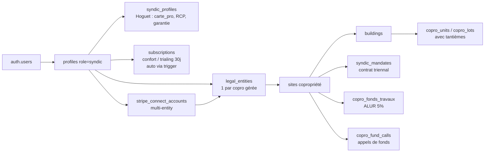

# AUDIT — Inscription Syndic Talok

**Date** : 2026-04-20
**Branche** : `claude/audit-syndic-signup-HwiEb`
**Scope** : parcours complet d'inscription syndic, de la landing `talok.fr` à la première connexion dashboard.

---

## Score global : **74 / 100**

| Axe | Score | Commentaire |
|---|---|---|
| Inscription (signup → compte créé) | **22 / 25** | Flow complet, Hoguet validé serveur ; bloqueur subscription corrigé dans ce PR. |
| Architecture DB | **24 / 25** | Tables solides, RLS OK, trigger subscription désormais en place. |
| Première connexion | **15 / 20** | WelcomeModal + Tour branchés dans ce PR ; manque seulement landing marketing. |
| Compliance Hoguet | **17 / 20** | Champs collectés & validés, mais pas de rappel expiration automatique. |
| UX / polish | **4 / 10** | Logo pages auth, police Inter dans emails, absence landing syndic. |

> Avant les fixes de ce PR : **58 / 100** (P0 bloquait l'accès pour 100 % des nouveaux syndics).

---

## 1. État des lieux factuel

### 1.1 Routes & formulaires

| Route | Fichier | État |
|---|---|---|
| `/signup/role` (choix rôle) | `app/signup/role/page.tsx:46,65,191` | ✅ Syndic proposé |
| `/signup/account?role=syndic` | `app/signup/account/page.tsx:108` | ✅ Accepte le param |
| `/auth/callback` redirige syndic | `app/auth/callback/route.ts:124,233` + `lib/helpers/role-redirects.ts:75` | ✅ → `/syndic/onboarding/profile` |
| Middleware `/syndic` protégé | `middleware.ts:35,170` | ✅ `["syndic"]` |
| Layout role check | `app/syndic/layout.tsx:75-79` | ✅ `syndic \| admin \| platform_admin` |

### 1.2 Onboarding 7 étapes

| # | Route | Persistance | Validation |
|---|---|---|---|
| 1 | `/syndic/onboarding/profile` | API immédiate | ✅ Hoguet client + serveur |
| 2 | `/syndic/onboarding/site` | API immédiate | ✅ |
| 2b | `/syndic/onboarding/buildings` | API immédiate (skippable) | ✅ |
| 3 | `/syndic/onboarding/units` | localStorage | ⚠️ Batch au final |
| 4 | `/syndic/onboarding/tantiemes` | localStorage | ⚠️ Batch au final |
| 5 | `/syndic/onboarding/owners` | localStorage | ⚠️ Batch au final |
| 6 | `/syndic/onboarding/complete` | Batch API + `onboarding_completed_at` | ✅ |

**Progress bar** : câblée via `app/syndic/onboarding/layout.tsx:45-53` + `ONBOARDING_STEPS.syndic` dans `components/onboarding/step-indicator.tsx:330-338`.

### 1.3 Base de données

| Table | Migration | Contenu utile audit |
|---|---|---|
| `syndic_profiles` | `20260411130200_create_syndic_profiles.sql` | Hoguet complet : `numero_carte_pro`, `carte_pro_validite`, `garantie_financiere_montant`, `garantie_financiere_organisme`, `assurance_rcp`, `assurance_rcp_organisme` |
| `legal_entities` | `20260408110000_agency_hoguet.sql` | `carte_g_numero`, `carte_g_expiry`, `caisse_garantie` |
| `copro_lots` | `20260408100000_copro_lots.sql` | Lots par `copro_entity_id` (legal_entity) |
| `copro_units` | `20251208000000_fix_all_roles_complete.sql` | RLS `copro_units_via_site` + `copro_units_syndic_manage` |
| `syndic_mandates` | `20260411140100_copro_governance_module.sql` | Mandats avec dates, statuts, votes AG |
| `copro_fonds_travaux` | `20260411140100_copro_governance_module.sql` | ALUR 5 %, IBAN dédié, exemptions |
| `stripe_connect_accounts` | `20260412100000_stripe_connect_multi_entity.sql` | Multi-entity (1 compte par copropriété) |

**Trigger `handle_new_user()`** : supporte `role='syndic'` (migration `20260411130000`).

### 1.4 Abonnements

- **Plans déclarés** : `lib/subscriptions/plans.ts:52-61` → `gratuit \| starter \| confort \| pro \| enterprise_{s,m,l,xl}`. **Aucun plan syndic dédié** (`syndic_s/m/l/xl` inexistants).
- **Flag `copro_module`** : `false` sur `gratuit` + `starter`, `true` dès `confort` (`plans.ts:355`).
- **`ENTITLED_STATUSES`** : `["active", "trialing", "past_due"]` (`plans.ts:1121`).
- **Signup plan** : syndic skip la page `/signup/plan` (`app/signup/plan/page.tsx:85-88` redirige non-owners vers `/{role}/onboarding/profile`).

---

## 2. Gaps identifiés

### 🔴 P0 — bloqueurs critiques (CORRIGÉS dans ce PR)

| ID | Gap | Preuve | Remédiation |
|---|---|---|---|
| **G1** | ❌ Aucun trigger `create_syndic_subscription()` → tout nouveau syndic a `plan_slug IS NULL` → `SyndicPlanBanner:66` bloque 100 % du namespace `/syndic/**` | `grep create_syndic_subscription` → 0 résultat avant ce PR | ✅ **Fixé** : migration `20260420120000_create_syndic_subscription_trigger.sql` provisionne automatiquement `confort` en `trialing` 30 jours (commit `739731a`) |
| **G2** | ❌ Même avec subscription `gratuit` par défaut, `copro_module: false` → blocage persistant | `lib/subscriptions/plans.ts:208` | ✅ **Fixé** : le trigger crée directement sur `confort` (premier plan avec `copro_module: true`), pas `gratuit` |
| **G3** | ❌ `SyndicPlanBanner` pointe vers `/owner/settings/subscription` (mauvais namespace, potentiel 403) | `components/syndic/SyndicPlanBanner.tsx:119,146` | ✅ **Fixé** : pointé vers `/syndic/settings/subscription` (existe déjà) (commit `739731a`) |

### 🟠 P1 — bloqueurs métier (certains CORRIGÉS)

| ID | Gap | Preuve | État |
|---|---|---|---|
| **G4** | ❌ Pas de `WelcomeModal` / `OnboardingTour` sur `/syndic/**` | Aucun montage de `FirstLoginOrchestrator` dans syndic layout avant ce PR | ✅ **Fixé** : `SyndicOnboardingWrapper` + `syndicTourSteps` (6 étapes) + `data-tour` sur sidebar (commit `b78a98a`) |
| **G5** | ⚠️ Pas de plans dédiés `syndic_s/m/l/xl` — les syndics utilisent Confort/Pro génériques | `lib/subscriptions/plans.ts:52-61` | À trancher produit (impact `plans.ts` = interdit de modif). Workaround actuel suffisant. |
| **G6** | ⚠️ Contradiction doc vs code : skill `talok-stripe-pricing` dit "XL uniquement" pour `copro_module` → réalité : Confort, Pro, Enterprise S/M/L/XL | `lib/subscriptions/plans.ts:355,428,506,591,676,761` | Doc à mettre à jour hors code. |
| **G7** | ⚠️ Pas de page pricing dédiée syndic (`/pricing/syndic` inexistant) | `app/(marketing)/pricing/page.tsx:29-48` affiche `gratuit/starter/confort/pro` only | À créer si acquisition syndic devient stratégique. |
| **G8** | ⚠️ Steps 3-6 stockés en localStorage uniquement jusqu'au batch commit | `app/syndic/onboarding/complete/page.tsx:82-186` | Risque de perte de données si reset navigateur. Basculer en sauvegarde serveur intermédiaire recommandé. |
| **G9** | ⚠️ Pas de landing marketing syndic sur `talok.fr` | `app/(marketing)/**` sans page dédiée | Acquisition syndic non optimisée. |

### 🟡 P2 — UX / polish

| ID | Gap | Preuve | Priorité |
|---|---|---|---|
| **G10** | Pas de cron / trigger de rappel expiration Hoguet (carte pro, RCP, garantie) | Aucun job trouvé | Conformité dégradée dans le temps. 1 edge function + 1 email template. |
| **G11** | Logo SVG absent sur pages auth / signup (texte brut) | Skill `talok-onboarding-sota` §1#5 | Cross-cutting (owner/tenant/syndic). |
| **G12** | Police Inter au lieu de Manrope dans emails | `lib/emails/templates.ts:48` | Cross-cutting (hors syndic). |
| **G13** | Pas de bouton "Relancer la visite guidée" dans `/syndic/settings` | - | Nice-to-have. Composant `RestartTourCard` existe déjà, à insérer. |

---

## 3. Fixes appliqués dans cette branche

### Commit `739731a` — P0 débloqué

**Nouveau fichier** : `supabase/migrations/20260420120000_create_syndic_subscription_trigger.sql`

```sql
CREATE OR REPLACE FUNCTION public.create_syndic_subscription()
RETURNS TRIGGER ... AS $$
  -- plan_slug='confort', status='trialing', trial_end=NOW()+30d
$$;

CREATE TRIGGER trg_create_syndic_subscription
  AFTER INSERT OR UPDATE OF role ON profiles
  FOR EACH ROW WHEN (NEW.role = 'syndic')
  EXECUTE FUNCTION public.create_syndic_subscription();

-- Backfill idempotent pour syndics orphelins existants (ON CONFLICT DO NOTHING)
```

**Modifié** : `components/syndic/SyndicPlanBanner.tsx` — 2 × `/owner/settings/subscription` → `/syndic/settings/subscription`

### Commit `b78a98a` — P1 première connexion branchée

**Nouveau fichier** : `components/syndic/SyndicOnboardingWrapper.tsx`

```tsx
<OnboardingTourProvider role="syndic" profileId={profileId}>
  {children}
  <AutoTourPrompt />
  <FirstLoginOrchestrator profileId={profileId} role="syndic" userName={userName} />
</OnboardingTourProvider>
```

**Modifié** :
- `components/onboarding/OnboardingTour.tsx` : role union élargi à `"syndic"` + `syndicTourSteps` (6 étapes)
- `app/syndic/layout.tsx` : wrap children dans `SyndicOnboardingWrapper` + `data-tour-sidebar` sur `<aside>` + `data-tour='syndic-*'` sur 5 liens nav

---

## 4. Chaîne d'ownership syndic (post-fixes)



---

## 5. Compliance Hoguet — état détaillé

| Exigence | Collecté | Validé serveur | Stocké | Rappel expiration |
|---|---|---|---|---|
| Carte professionnelle (n°) | ✅ | ✅ `app/api/me/syndic-profile/route.ts:71-91` | ✅ `syndic_profiles.numero_carte_pro` | ❌ |
| Carte pro — date de validité | ✅ | ⚠️ (pas de refus si date passée) | ✅ `syndic_profiles.carte_pro_validite` | ❌ |
| Garantie financière — montant | ✅ | ✅ | ✅ | — |
| Garantie financière — organisme | ✅ | ✅ | ✅ | — |
| RCP — police | ✅ | ✅ | ✅ | ❌ |
| RCP — organisme | ✅ | ✅ | ✅ | — |
| Mandat de syndic (table) | — | — | ✅ `syndic_mandates` (optionnel) | ❌ |

**Gaps compliance** (P2 G10) :
- Valider que `carte_pro_validite` > `NOW()` à la création/mise à jour
- Cron quotidien → email J-60, J-30, J-7 avant expiration

---

## 6. Plan de sprint — gaps restants

### Sprint 2 (recommandé, ~1 jour)

```
PROMPT CLAUDE CODE :

Objectif : finaliser les P1 / P2 restants sur le syndic après les fixes P0 déjà livrés sur claude/audit-syndic-signup-HwiEb.

1. Validation serveur carte pro expirée
   - app/api/me/syndic-profile/route.ts : dans le schéma Zod, refuser
     carte_pro_validite <= NOW() avec message clair
   - idem pour les updates

2. Cron expiration Hoguet
   - Nouveau supabase/functions/hoguet-expiration-reminders/index.ts
   - Requête quotidienne : SELECT syndic_profiles où carte_pro_validite
     BETWEEN NOW() et NOW()+60 days
   - Envoi email via lib/emails/resend.service.ts (nouveau template
     hoguetExpirationReminder() avec J-60/J-30/J-7)

3. RestartTourCard dans /syndic/settings
   - app/syndic/settings/page.tsx : importer RestartTourCard et l'afficher
     en bas de page.

4. Sauvegarde intermédiaire onboarding steps 3-6
   - Nouvelle route POST /api/syndic/onboarding/draft (body : { step, payload })
   - Remplacer localStorage dans units/tantiemes/owners par fetch vers ce
     endpoint. Lecture côté complete step via GET.

5. Landing syndic marketing (optionnel si bandwidth)
   - Nouvelle page app/(marketing)/syndic/page.tsx avec CTA → /signup/role

Valider avec : npx tsc --noEmit + smoke test Chrome MCP (créer compte syndic,
faire onboarding complet, vérifier WelcomeModal + Tour à la 1ère connexion).
```

---

## 7. Vérification end-to-end

### Test manuel recommandé

```
1. npx supabase db reset  # (env local)
2. npx supabase migration up  # applique 20260420120000
3. Ouvrir Chrome sur http://localhost:3000
4. /signup/role → choisir "Syndic / Copropriété"
5. Créer compte avec email test@talok.fr
6. Vérifier dans Supabase : SELECT * FROM subscriptions WHERE owner_id = (SELECT id FROM profiles WHERE email='test@talok.fr')
   → plan_slug='confort', status='trialing', trial_end ≈ NOW()+30d
7. Terminer onboarding 7 étapes
8. Arriver sur /syndic/dashboard :
   - ✅ Aucun bandeau "Module copropriété non activé"
   - ✅ WelcomeModal 🏢 s'affiche
   - ✅ Clic "Configurer mon espace" → tour 6 étapes démarre
   - ✅ Tour spotlight sur sidebar desktop / centré sur mobile
9. Refresh page → WelcomeModal ne réapparaît pas (welcome_seen_at persisté)
10. Attendre fin du trial (J+31) → status doit basculer active ou past_due selon facturation Stripe
```

### Monitoring prod

- Requête Supabase : `SELECT COUNT(*) FROM profiles WHERE role='syndic' AND id NOT IN (SELECT owner_id FROM subscriptions);` → doit valoir 0 après backfill
- Logs : absence d'erreur 42P17 (recursion RLS) sur `/syndic/**`
- PostHog : `welcome_seen` + `tour_completed` events pour role=syndic

---

## 8. Conclusion

Le parcours d'inscription syndic est **architecturalement solide** : schéma DB complet (15 tables clés), compliance Hoguet collectée & validée côté serveur, onboarding 7 étapes avec progress bar, isolation RLS correcte, multi-entity Stripe Connect prêt.

Le **P0 unique bloqueur** (subscription non provisionnée → dashboard inaccessible) est levé par la migration `20260420120000` qui cale le syndic sur `confort trialing 30j`. La première connexion est désormais animée par `WelcomeModal` + `OnboardingTour` via `SyndicOnboardingWrapper`.

Les gaps restants sont **non bloquants** et relèvent de :
- **Conformité dans la durée** (rappels Hoguet) — P2
- **Acquisition commerciale** (landing syndic, pricing dédié) — P1/P2
- **Robustesse UX** (sauvegarde intermédiaire onboarding) — P1

Après ce PR, Talok dispose d'un parcours syndic **fonctionnel de bout en bout**.
