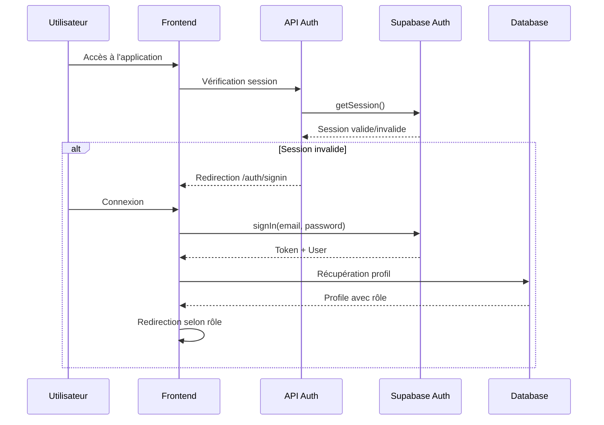
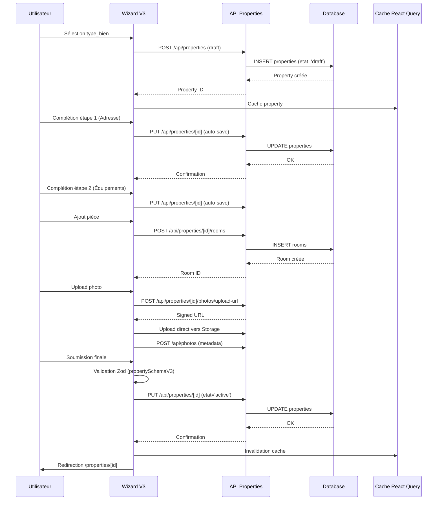
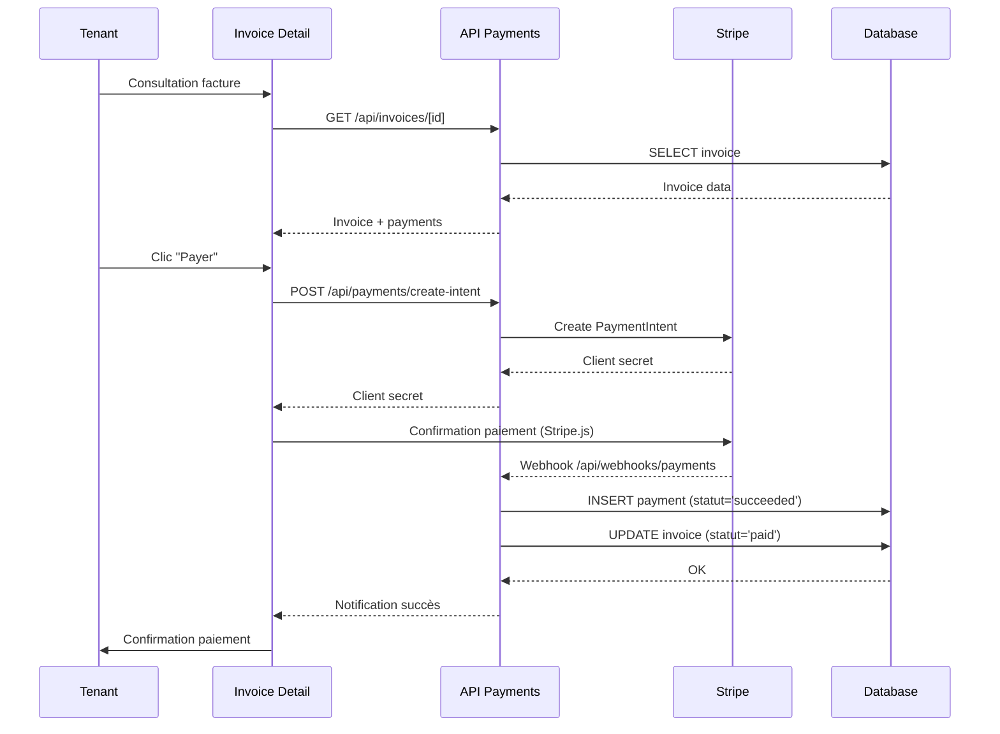
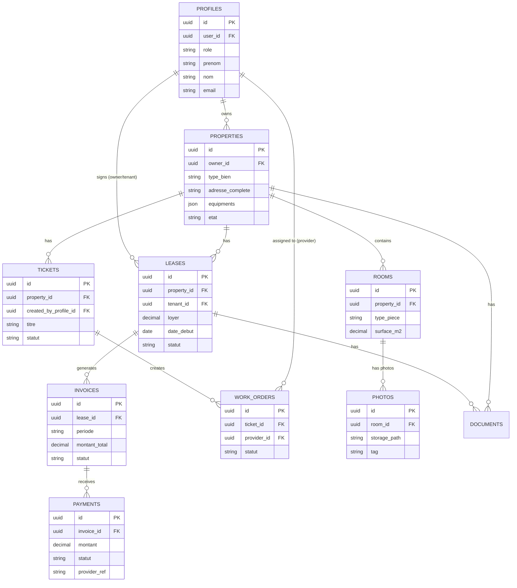
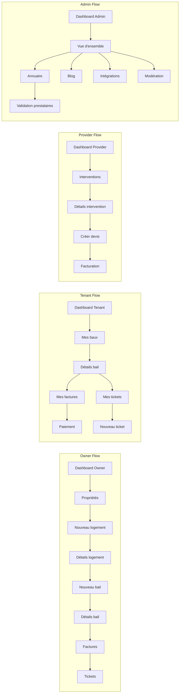
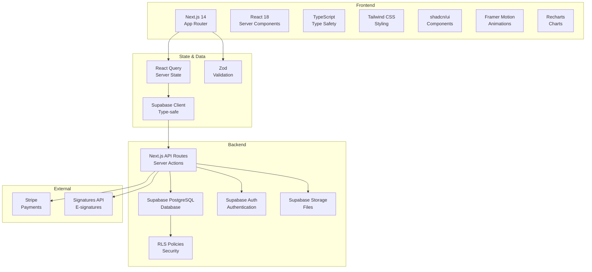

# 🏗️ Diagramme d'Architecture - Talok

## Vue d'ensemble du système

```mermaid
graph TB
    subgraph "Frontend - Next.js App Router"
        A[Page d'accueil /] --> B[Authentification]
        B --> C[Onboarding]
        C --> D[Dashboards par rôle]
        
        D --> E[Dashboard Owner]
        D --> F[Dashboard Tenant]
        D --> G[Dashboard Provider]
        D --> H[Dashboard Admin]
        
        E --> I[Propriétés]
        E --> J[Baux]
        E --> K[Factures]
        E --> L[Tickets]
        
        F --> J
        F --> K
        F --> L
        
        G --> M[Ordres de travail]
        
        H --> N[Modération]
        H --> O[Blog]
        H --> P[Intégrations]
    end
    
    subgraph "API Routes - Next.js"
        Q[API Properties] --> R[CRUD Propriétés]
        Q --> S[Rooms & Photos]
        Q --> T[Share & Export]
        
        U[API Leases] --> V[CRUD Baux]
        U --> W[Signature]
        U --> X[Paiements]
        
        Y[API Invoices] --> Z[CRUD Factures]
        Y --> AA[Export PDF]
        
        AB[API Tickets] --> AC[CRUD Tickets]
        AB --> AD[Messages]
        AB --> AE[Devis]
        
        AF[API Admin] --> AG[Modération]
        AF --> AH[Stats]
        AF --> AI[Gestion utilisateurs]
    end
    
    subgraph "State Management"
        AJ[React Query] --> AK[useProperties]
        AJ --> AL[useLeases]
        AJ --> AM[useInvoices]
        AJ --> AN[useTickets]
        AJ --> AO[usePayments]
        AJ --> AP[useWorkOrders]
        AJ --> AQ[useDocuments]
    end
    
    subgraph "Backend - Supabase"
        AR[PostgreSQL] --> AS[Tables: properties, leases, invoices, tickets]
        AR --> AT[RLS Policies: 44 policies]
        AR --> AU[Functions: current_user_profile_id, is_admin_user]
        
        AV[Auth] --> AW[Email/Password]
        AV --> AX[Magic Links]
        AV --> AY[2FA]
        
        AZ[Storage] --> BA[Documents]
        AZ --> BB[Photos]
    end
    
    subgraph "Intégrations externes"
        BC[Stripe] --> BD[Paiements]
        BE[Signatures] --> BF[Signatures électroniques]
    end
    
    I --> Q
    J --> U
    K --> Y
    L --> AB
    
    Q --> AR
    U --> AR
    Y --> AR
    AB --> AR
    
    AJ --> Q
    AJ --> U
    AJ --> Y
    AJ --> AB
    
    X --> BC
    W --> BE
```

## Flux d'authentification

## Flux de création de propriété (Wizard V3)

## Flux de paiement

## Architecture des données

## Flux de navigation par rôle

## Stack technique

---

**Diagrammes générés le** : 2025-02-15

