# 🏗️ Diagramme d'Architecture - Talok

## Vue d'ensemble du système

```mermaid
graph TB
    subgraph "Frontend - Next.js App Router"
        A[Page d'accueil /] --> B[Authentification]
        B --> C[Onboarding]
        C --> D[Dashboards par rôle]
        
        D --> E[Dashboard Owner]
        D --> F[Dashboard Tenant]
        D --> G[Dashboard Provider]
        D --> H[Dashboard Admin]
        
        E --> I[Propriétés]
        E --> J[Baux]
        E --> K[Factures]
        E --> L[Tickets]
        
        F --> J
        F --> K
        F --> L
        
        G --> M[Ordres de travail]
        
        H --> N[Modération]
        H --> O[Blog]
        H --> P[Intégrations]
    end
    
    subgraph "API Routes - Next.js"
        Q[API Properties] --> R[CRUD Propriétés]
        Q --> S[Rooms & Photos]
        Q --> T[Share & Export]
        
        U[API Leases] --> V[CRUD Baux]
        U --> W[Signature]
        U --> X[Paiements]
        
        Y[API Invoices] --> Z[CRUD Factures]
        Y --> AA[Export PDF]
        
        AB[API Tickets] --> AC[CRUD Tickets]
        AB --> AD[Messages]
        AB --> AE[Devis]
        
        AF[API Admin] --> AG[Modération]
        AF --> AH[Stats]
        AF --> AI[Gestion utilisateurs]
    end
    
    subgraph "State Management"
        AJ[React Query] --> AK[useProperties]
        AJ --> AL[useLeases]
        AJ --> AM[useInvoices]
        AJ --> AN[useTickets]
        AJ --> AO[usePayments]
        AJ --> AP[useWorkOrders]
        AJ --> AQ[useDocuments]
    end
    
    subgraph "Backend - Supabase"
        AR[PostgreSQL] --> AS[Tables: properties, leases, invoices, tickets]
        AR --> AT[RLS Policies: 44 policies]
        AR --> AU[Functions: current_user_profile_id, is_admin_user]
        
        AV[Auth] --> AW[Email/Password]
        AV --> AX[Magic Links]
        AV --> AY[2FA]
        
        AZ[Storage] --> BA[Documents]
        AZ --> BB[Photos]
    end
    
    subgraph "Intégrations externes"
        BC[Stripe] --> BD[Paiements]
        BE[Signatures] --> BF[Signatures électroniques]
    end
    
    I --> Q
    J --> U
    K --> Y
    L --> AB
    
    Q --> AR
    U --> AR
    Y --> AR
    AB --> AR
    
    AJ --> Q
    AJ --> U
    AJ --> Y
    AJ --> AB
    
    X --> BC
    W --> BE
```

## Flux d'authentification

```mermaid
sequenceDiagram
    participant U as Utilisateur
    participant F as Frontend
    participant A as API Auth
    participant S as Supabase Auth
    participant D as Database
    
    U->>F: Accès à l'application
    F->>A: Vérification session
    A->>S: getSession()
    S-->>A: Session valide/invalide
    
    alt Session invalide
        A-->>F: Redirection /auth/signin
        U->>F: Connexion
        F->>S: signIn(email, password)
        S-->>F: Token + User
        F->>D: Récupération profil
        D-->>F: Profile avec rôle
        F->>F: Redirection selon rôle
    end
```

## Flux de création de propriété (Wizard V3)

```mermaid
sequenceDiagram
    participant U as Utilisateur
    participant W as Wizard V3
    participant A as API Properties
    participant D as Database
    participant C as Cache React Query
    
    U->>W: Sélection type_bien
    W->>A: POST /api/properties (draft)
    A->>D: INSERT properties (etat='draft')
    D-->>A: Property créée
    A-->>W: Property ID
    W->>C: Cache property
    
    U->>W: Complétion étape 1 (Adresse)
    W->>A: PUT /api/properties/[id] (auto-save)
    A->>D: UPDATE properties
    D-->>A: OK
    A-->>W: Confirmation
    
    U->>W: Complétion étape 2 (Équipements)
    W->>A: PUT /api/properties/[id] (auto-save)
    
    U->>W: Ajout pièce
    W->>A: POST /api/properties/[id]/rooms
    A->>D: INSERT rooms
    D-->>A: Room créée
    A-->>W: Room ID
    
    U->>W: Upload photo
    W->>A: POST /api/properties/[id]/photos/upload-url
    A-->>W: Signed URL
    W->>A: Upload direct vers Storage
    W->>A: POST /api/photos (metadata)
    
    U->>W: Soumission finale
    W->>W: Validation Zod (propertySchemaV3)
    W->>A: PUT /api/properties/[id] (etat='active')
    A->>D: UPDATE properties
    D-->>A: OK
    A-->>W: Confirmation
    W->>C: Invalidation cache
    W->>U: Redirection /properties/[id]
```

## Flux de paiement

## Architecture des données

## Flux de navigation par rôle

```mermaid
graph LR
    subgraph "Owner Flow"
        O1[Dashboard Owner] --> O2[Propriétés]
        O2 --> O3[Nouveau logement]
        O3 --> O4[Détails logement]
        O4 --> O5[Nouveau bail]
        O5 --> O6[Détails bail]
        O6 --> O7[Factures]
        O7 --> O8[Tickets]
    end
    
    subgraph "Tenant Flow"
        T1[Dashboard Tenant] --> T2[Mes baux]
        T2 --> T3[Détails bail]
        T3 --> T4[Mes factures]
        T4 --> T5[Paiement]
        T3 --> T6[Mes tickets]
        T6 --> T7[Nouveau ticket]
    end
    
    subgraph "Provider Flow"
        P1[Dashboard Provider] --> P2[Interventions]
        P2 --> P3[Détails intervention]
        P3 --> P4[Créer devis]
        P4 --> P5[Facturation]
    end
    
    subgraph "Admin Flow"
        A1[Dashboard Admin] --> A2[Vue d'ensemble]
        A2 --> A3[Annuaire]
        A3 --> A4[Validation prestataires]
        A2 --> A5[Blog]
        A2 --> A6[Intégrations]
        A2 --> A7[Modération]
    end
```

## Stack technique

---

**Diagrammes générés le** : 2025-02-15

