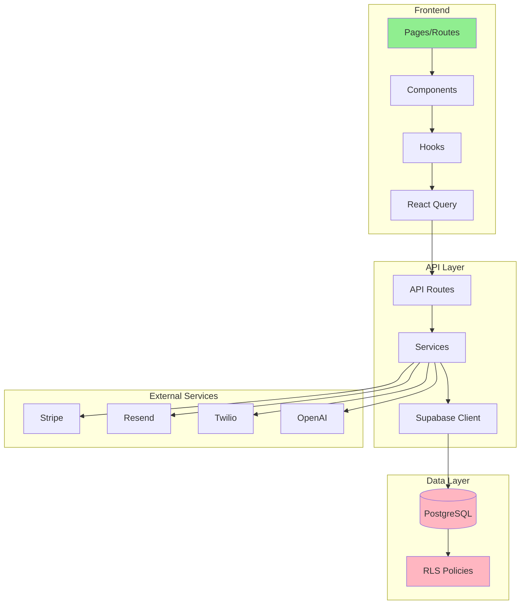

# RAPPORT D'AUDIT TECHNIQUE TALOK - Janvier 2026

**Date de l'audit** : 28 janvier 2026
**Version auditée** : Branch `claude/talok-technical-audit-20bQ4`
**Auditeur** : Claude Code (Opus 4.5)

---

## RÉSUMÉ EXÉCUTIF

TALOK est une plateforme de gestion locative mature avec **439 routes API**, **271 composants**, et **27 modules features**. L'architecture est solide avec une bonne séparation des responsabilités, mais l'audit révèle **8 vulnérabilités critiques** nécessitant une correction immédiate avant tout déploiement en production.

### Statistiques Clés

| Métrique | Valeur |
|----------|--------|
| Routes API | 439 |
| Composants React | 271 |
| Modules Features | 27 |
| Custom Hooks | 47 |
| Services métier | 39 |
| Tables Supabase | ~200 |
| Migrations SQL | 92 fichiers |
| Fichiers @ts-nocheck | 417 ⚠️ |

### Score Global

| Catégorie | Score | Commentaire |
|-----------|-------|-------------|
| Architecture | 8/10 | Bonne modularisation, dette technique mineure |
| Sécurité | 5/10 | Vulnérabilités critiques à corriger |
| Performance | 7/10 | Bonnes optimisations, améliorations possibles |
| Fiabilité données | 6/10 | Risques de perte de données identifiés |
| Accessibilité | 4/10 | Travail significatif nécessaire |

---

## 🚨 CRITIQUES (P0 - Bloquants production)

### [SEC-001] Secrets de chiffrement par défaut

**Localisation** :
- `/lib/helpers/encryption.ts:12`
- `/lib/security/csrf.ts:9`

**Description** : Les clés de chiffrement utilisent des valeurs par défaut codées en dur si les variables d'environnement ne sont pas définies.

```typescript
// ❌ CRITIQUE
const masterKey = process.env.API_KEY_MASTER_KEY ||
                 "default-key-for-dev-only-32chars!";

const CSRF_SECRET = process.env.CSRF_SECRET ||
                   "fallback-secret-change-me";
```

**Impact** : Exposition complète des données chiffrées et vulnérabilité CSRF si les env vars sont manquantes.

**Correction** :
```typescript
// ✅ CORRECTION
const masterKey = process.env.API_KEY_MASTER_KEY;
if (!masterKey) {
  throw new Error("API_KEY_MASTER_KEY is required");
}
```

**Effort** : 1h | **Sprint** : Immédiat

---

### [SEC-002] Vulnérabilité SSRF sur /api/scrape

**Localisation** : `/app/api/scrape/route.ts`

**Description** : L'endpoint permet de fetch n'importe quelle URL sans authentification ni validation.

```typescript
// ❌ CRITIQUE - Aucune validation d'URL
export async function POST(request: Request) {
  const { url } = await request.json();
  const response = await fetch(url); // URLs internes accessibles!
}
```

**Risques** :
- Accès au localhost et services internes
- Lecture des métadonnées cloud (AWS, GCP)
- Scan de réseau interne
- DoS via URLs lentes/grandes

**Correction** :
```typescript
// ✅ CORRECTION
const BLOCKED_HOSTS = ['localhost', '127.0.0.1', '0.0.0.0', '169.254.169.254'];
const urlObj = new URL(url);
if (BLOCKED_HOSTS.includes(urlObj.hostname) ||
    urlObj.hostname.startsWith('192.168.') ||
    urlObj.hostname.startsWith('10.')) {
  return NextResponse.json({ error: "URL not allowed" }, { status: 400 });
}
// + Ajouter authentification admin
```

**Effort** : 2h | **Sprint** : Immédiat

---

### [SEC-003] Endpoint /api/revalidate sans authentification

**Localisation** : `/app/api/revalidate/route.ts`

**Description** : Permet d'invalider le cache Next.js sans aucune vérification d'identité.

**Impact** : DoS possible via invalidation massive du cache.

**Correction** : Ajouter middleware d'authentification admin.

**Effort** : 30min | **Sprint** : Immédiat

---

### [SEC-004] Secrets 2FA non chiffrés

**Localisation** : `/app/api/auth/2fa/enable/route.ts:42`

```typescript
two_factor_secret: secret, // TODO: À chiffrer en production
```

**Impact** : Compromission des secrets TOTP si la base de données est exposée.

**Effort** : 2h | **Sprint** : Immédiat

---

### [SEC-005] Rate limiting en mémoire uniquement

**Localisation** : `/lib/middleware/rate-limit.ts`

```typescript
const store: RateLimitStore = {}; // Réinitialisé à chaque redémarrage
```

**Impact** :
- Inefficace en multi-instances (Netlify Functions)
- Réinitialisé à chaque cold start
- Aucune protection contre attaques coordonnées

**Correction** : Implémenter Redis via Upstash.

**Effort** : 4h | **Sprint** : Immédiat

---

### [DATA-001] Limite de 20 propriétés pour les médias

**Localisation** : `/app/api/owner/properties/route.ts:129`

```typescript
const limitedPropertyIds = propertyIds.slice(0, 20); // ❌ Troncature silencieuse!
```

**Impact** : Les propriétaires avec >20 biens ne voient pas les photos des biens 21+.

**Correction** : Implémenter une vraie pagination ou supprimer la limite.

**Effort** : 2h | **Sprint** : Immédiat

---

### [DATA-002] Formulaire bail sans auto-save

**Localisation** : `/components/leases/lease-form.tsx`

**Description** : Contrairement au wizard propriété, le formulaire de bail n'a pas de sauvegarde automatique.

| Composant | Auto-Save | Draft | Debounce |
|-----------|-----------|-------|----------|
| Property Wizard | ✅ | ✅ localStorage | ✅ 500ms |
| Lease Form | ❌ | ❌ | ❌ |
| Lease Renewal | ❌ | ❌ | ❌ |

**Impact** : Perte de données si navigation accidentelle ou rafraîchissement page.

**Correction** : Implémenter auto-save avec debounce 1s + localStorage.

**Effort** : 4h | **Sprint** : Immédiat

---

### [SEC-006] Bypass webhook en mode dev

**Localisation** : `/app/api/signatures/webhook/route.ts`

```typescript
if (!secret) {
  if (process.env.NODE_ENV === "production") {
    return false;
  }
  return true; // ❌ Bypass si secret non configuré
}
```

**Impact** : Si la variable YOUSIGN_WEBHOOK_SECRET est absente en prod, les webhooks non signés sont acceptés.

**Correction** : Fail-safe - rejeter en production même si secret absent.

**Effort** : 30min | **Sprint** : Immédiat

---

## ⚠️ IMPORTANTS (P1 - À traiter sous 2 semaines)

### [SEC-007] Génération de codes de récupération faible

**Localisation** : `/lib/auth/totp.ts:88`

```typescript
// ❌ Math.random() n'est pas cryptographiquement sécurisé
Math.random().toString(36).substring(2, 6).toUpperCase()
```

**Correction** : Utiliser `crypto.getRandomValues()`.

**Effort** : 1h | **Sprint** : Next

---

### [PERF-001] 417 fichiers avec @ts-nocheck

**Localisation** : Codebase globale

**Impact** :
- Erreurs TypeScript masquées
- Maintenance difficile
- Bugs potentiels non détectés

**Recommandation** : Plan de correction progressif (5 fichiers/jour minimum).

**Effort** : 40h+ | **Sprint** : Continu

---

### [DATA-003] Real-time non synchronisé avec React Query

**Localisation** :
- `/lib/hooks/use-realtime-tenant.ts`
- `/lib/hooks/use-realtime-dashboard.ts`

**Description** : Les updates real-time modifient l'état local mais pas le cache React Query.

```typescript
// Real-time met à jour l'état local
setData(prev => ({ ...prev, currentRent: lease.loyer }));

// Mais React Query a toujours l'ancienne valeur dans son cache!
const { data } = useQuery({ queryKey: ["leases"] });
```

**Impact** : Données incohérentes entre composants.

**Correction** :
```typescript
// Mettre à jour le cache React Query lors des events real-time
queryClient.setQueryData(["leases"], (old) => /* merged data */);
```

**Effort** : 8h | **Sprint** : Next

---

### [DATA-004] Invalidation de cache sélective insuffisante

**Localisation** : Multiples hooks dans `/lib/hooks/`

**Description** : Les mutations n'invalident pas les requêtes connexes.

```typescript
// Exemple: mise à jour propriété
onSuccess: () => {
  queryClient.invalidateQueries({ queryKey: ["properties"] });
  // ❌ Manque: ["leases"], ["dashboard"], ["invoices"]
}
```

**Effort** : 4h | **Sprint** : Next

---

### [DB-001] 20+ tables potentiellement sans RLS

**Localisation** : Schema Supabase

**Description** : 254 tables ont RLS confirmé, mais 274 tables existent.

**Action** : Exécuter requête d'audit :
```sql
SELECT tablename FROM pg_tables
WHERE schemaname='public'
AND tablename NOT IN (SELECT DISTINCT tablename FROM pg_policies);
```

**Effort** : 4h | **Sprint** : Next

---

### [DB-002] Historique de récursion RLS

**Localisation** : `/supabase/migrations/` (25+ fichiers de fix)

**Description** : Les policies RLS ont nécessité 25+ corrections pour récursion infinie.

**Risque** : Nouvelles policies pourraient réintroduire le problème.

**Recommandation** : Tests automatisés pour RLS policies.

**Effort** : 8h | **Sprint** : Next

---

### [A11Y-001] Accessibilité insuffisante

**Problèmes identifiés** :
- Canvas signature sans `aria-label`
- `window.confirm()` non accessible (5+ occurrences)
- Erreurs de formulaire non liées par `aria-describedby`
- Indicateurs de focus manquants

**Effort** : 16h | **Sprint** : Next 2 sprints

---

### [INTEG-001] Pas de retry sur échec webhook

**Localisation** : Handlers Stripe, Yousign, Twilio

**Description** : Si le traitement d'un webhook échoue, il n'y a pas de mécanisme de retry.

**Correction** : Ajouter champ `status` dans `webhook_logs`, worker de retry.

**Effort** : 8h | **Sprint** : Next

---

## 💡 AMÉLIORATIONS (P2 - Backlog)

### [DX-001] Services dupliqués à consolider

**Fichiers concernés** :
- `export-service.ts` / `export.service.ts`
- `ocr-service.ts` / `ocr.service.ts`
- `sms-service.ts` / `sms.service.ts`
- `notification-service.ts` / `notification.service.ts`

**Action** : Déprécier les anciens, migrer vers convention `.service.ts`.

**Effort** : 4h | **Sprint** : Backlog

---

### [DX-002] Barrel exports manquants

**Features sans `index.ts`** :
- leases, profiles, documents
- properties, tenant, tickets
- finance, diagnostics, reports

**Effort** : 2h | **Sprint** : Backlog

---

### [PERF-002] Queries N+1 à optimiser

**Localisations** :
- `/app/api/owner/properties/route.ts` - 3 queries au lieu d'1 JOIN
- `/app/api/leases/route.ts` - Signers en requête séparée
- `/features/.../fetchInvoices.ts` - Leases/properties séparés

**Effort** : 8h | **Sprint** : Backlog

---

### [PERF-003] Monitoring Sentry désactivé

**Status** : Commenté dans `sentry.*.config.ts`

**Action** : Activer avec sampling approprié (0.1 prod, 1.0 dev).

**Effort** : 2h | **Sprint** : Backlog

---

### [PERF-004] Routes dynamiques excessives

**Description** : La plupart des routes utilisent `force-dynamic`.

**Opportunité** : Pages publiques (pricing, FAQ, legal) pourraient être SSG/ISR.

**Effort** : 4h | **Sprint** : Backlog

---

### [SEC-008] CSRF non appliqué aux routes API

**Localisation** : `/lib/security/csrf.ts`

**Description** : Implémentation CSRF présente mais non appliquée aux routes.

**Effort** : 4h | **Sprint** : Backlog

---

### [UI-001] PropertyWizardV4.tsx vide

**Localisation** : `/features/properties/components/v4/PropertyWizardV4.tsx`

**Description** : Fichier placeholder non implémenté.

**Action** : Supprimer ou implémenter.

**Effort** : 1h | **Sprint** : Backlog

---

## 📊 MÉTRIQUES & DETTE TECHNIQUE

### Couverture de Tests

| Type | Status |
|------|--------|
| Tests unitaires | ⚠️ Partiels (lease-validation OK) |
| Tests composants | ❌ Absents |
| Tests E2E | ❌ Absents |
| Tests sécurité | ❌ Absents |

### Dette Technique Estimée

| Catégorie | Effort |
|-----------|--------|
| Corrections P0 (critiques) | ~16h |
| Corrections P1 (importants) | ~56h |
| Améliorations P2 (backlog) | ~40h |
| **Total** | **~112h (14 jours-dev)** |

### Core Web Vitals (Estimés)

| Métrique | Estimation | Target | Status |
|----------|------------|--------|--------|
| LCP | ~2.5s | <2.5s | ⚠️ Limite |
| FID | ~80ms | <100ms | ✅ OK |
| CLS | ~0.05 | <0.1 | ✅ OK |
| TTFB | ~500ms | <600ms | ✅ OK |

---

## 🗺️ MATRICE DE DÉPENDANCES



---

## 📋 PLAN D'ACTION PRIORISÉ

### Sprint Immédiat (P0)

| # | Ticket | Effort | Impact | Assigné |
|---|--------|--------|--------|---------|
| 1 | SEC-001: Supprimer secrets par défaut | 1h | Critique | - |
| 2 | SEC-002: Fix SSRF /api/scrape | 2h | Critique | - |
| 3 | SEC-003: Auth /api/revalidate | 30min | Critique | - |
| 4 | SEC-004: Chiffrer 2FA secrets | 2h | Critique | - |
| 5 | SEC-005: Redis rate limiting | 4h | Critique | - |
| 6 | DATA-001: Fix limite 20 propriétés | 2h | Critique | - |
| 7 | DATA-002: Auto-save formulaire bail | 4h | Critique | - |
| 8 | SEC-006: Fix bypass webhook | 30min | Critique | - |

### Sprint Next (P1)

| # | Ticket | Effort | Impact | Assigné |
|---|--------|--------|--------|---------|
| 1 | SEC-007: Fix recovery codes | 1h | High | - |
| 2 | DATA-003: Sync realtime/React Query | 8h | High | - |
| 3 | DATA-004: Cache invalidation | 4h | High | - |
| 4 | DB-001: Audit RLS coverage | 4h | High | - |
| 5 | DB-002: Tests RLS automatisés | 8h | High | - |
| 6 | A11Y-001: Fixes accessibilité | 16h | Medium | - |
| 7 | INTEG-001: Webhook retry | 8h | Medium | - |

### Backlog (P2)

| # | Ticket | Effort | Impact |
|---|--------|--------|--------|
| 1 | DX-001: Consolider services | 4h | Low |
| 2 | DX-002: Barrel exports | 2h | Low |
| 3 | PERF-002: Fix N+1 queries | 8h | Medium |
| 4 | PERF-003: Enable Sentry | 2h | Medium |
| 5 | PERF-004: SSG pages publiques | 4h | Low |
| 6 | @ts-nocheck cleanup | 40h+ | Medium |

---

## ✅ POINTS POSITIFS

1. **Architecture modulaire** - Bonne séparation features/lib/components
2. **Wizard propriété** - Excellent pattern avec debounce, undo/redo, persistence
3. **RBAC complet** - 12 rôles, 50+ permissions, bien structuré
4. **Outbox pattern** - Event-driven architecture pour webhooks
5. **Prefetch intelligent** - Respect connexion lente, delay configurable
6. **Audit logging** - Traçabilité des actions sensibles
7. **Chiffrement AES-256-GCM** - Implémentation correcte pour IBAN
8. **17+ indexes DB** - Optimisation des requêtes fréquentes
9. **Passkeys WebAuthn** - Support authentification moderne
10. **Lazy loading charts** - Réduction bundle initial ~200KB

---

## 📁 FICHIERS CLÉS ANALYSÉS

### Sécurité
- `/lib/auth/totp.ts` - 2FA
- `/lib/auth/passkeys.ts` - WebAuthn
- `/lib/rbac.ts` - Authorization
- `/lib/security/encryption.service.ts` - Chiffrement
- `/lib/security/audit.service.ts` - Audit logging
- `/lib/middleware/rate-limit.ts` - Rate limiting

### Performance
- `/next.config.js` - Build config
- `/components/providers/query-provider.tsx` - React Query
- `/lib/hooks/use-prefetch.ts` - Prefetching
- `/lib/hooks/use-performance.ts` - Web Vitals

### Data Flow
- `/features/properties/stores/wizard-store.ts` - Zustand
- `/lib/hooks/use-realtime-tenant.ts` - Supabase realtime
- `/app/api/owner/properties/route.ts` - API critique

### Intégrations
- `/lib/stripe/` - Paiements
- `/lib/signatures/` - Signatures électroniques
- `/lib/emails/resend.service.ts` - Email
- `/app/api/webhooks/` - Webhook handlers

---

## 🔗 RESSOURCES

- [OWASP Top 10 2021](https://owasp.org/Top10/)
- [Next.js Security](https://nextjs.org/docs/app/building-your-application/configuring/security)
- [Supabase RLS Guide](https://supabase.com/docs/guides/auth/row-level-security)

---

**Fin du rapport d'audit technique TALOK - Janvier 2026**
