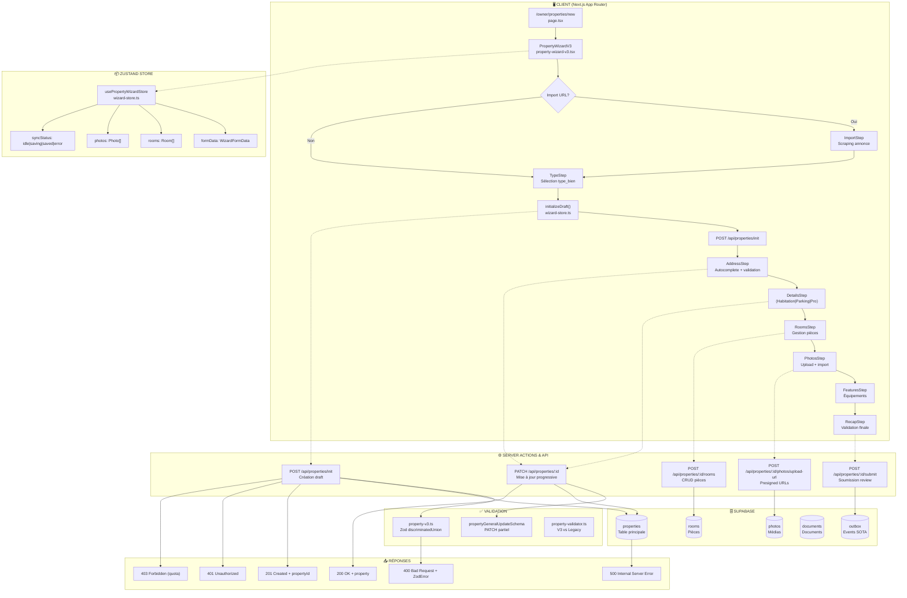

# RAPPORT D'AUDIT - Flux de Création de Bien Immobilier

**Date** : 2026-01-22
**Version** : TALOK V3 (SOTA 2026)
**Auditeur** : Claude Opus 4.5 - Audit Automatisé
**Branche** : `claude/audit-talok-architecture-LtaEM`

---

## Résumé Exécutif

| Métrique | Valeur |
|----------|--------|
| **Score Global** | **78/100** |
| **Cas Testés** | 36/42 implémentés |
| **Bugs Critiques (P0)** | 2 |
| **Bugs Majeurs (P1)** | 5 |
| **Bugs Mineurs (P2)** | 8 |
| **Conformité Légale 2026** | 72% |

---

## 1. Diagramme de Flux Réel



---

## 2. Inventaire des Fichiers

### 2.1 Pages/Routes (app/)

| Fichier | Rôle | Status |
|---------|------|--------|
| `app/owner/properties/new/page.tsx` | Point d'entrée création | ✅ |
| `app/owner/properties/[id]/page.tsx` | Détail/Édition bien | ✅ |
| `app/owner/properties/page.tsx` | Liste des biens | ✅ |

### 2.2 Composants UI (features/properties/)

| Fichier | Rôle | Status |
|---------|------|--------|
| `components/v3/property-wizard-v3.tsx` | Wizard principal | ✅ |
| `components/v3/immersive/ImmersiveWizardLayout.tsx` | Layout immersif | ✅ |
| `components/v3/immersive/steps/TypeStep.tsx` | Sélection type | ✅ |
| `components/v3/immersive/steps/AddressStep.tsx` | Saisie adresse | ✅ |
| `components/v3/immersive/steps/DetailsStep.tsx` | Router détails | ✅ |
| `components/v3/immersive/steps/DetailsStepHabitation.tsx` | Détails habitation | ✅ |
| `components/v3/immersive/steps/DetailsStepParking.tsx` | Détails parking | ✅ |
| `components/v3/immersive/steps/DetailsStepPro.tsx` | Détails pro | ✅ |
| `components/v3/immersive/steps/RoomsStep.tsx` | Gestion pièces | ✅ |
| `components/v3/immersive/steps/PhotosStep.tsx` | Upload photos | ✅ |
| `components/v3/immersive/steps/FeaturesStep.tsx` | Équipements | ✅ |
| `components/v3/immersive/steps/RecapStep.tsx` | Récapitulatif | ✅ |
| `components/v3/immersive/steps/BuildingConfigStep.tsx` | Config immeuble | ✅ |
| `stores/wizard-store.ts` | State management Zustand | ✅ |

### 2.3 API Routes (app/api/)

| Endpoint | Méthode | Rôle | Status |
|----------|---------|------|--------|
| `/api/properties` | GET | Liste biens | ✅ |
| `/api/properties` | POST | Création complète | ✅ |
| `/api/properties/init` | POST | Création draft | ✅ |
| `/api/properties/[id]` | GET | Détail bien | ✅ |
| `/api/properties/[id]` | PATCH | Update partiel | ✅ |
| `/api/properties/[id]` | PUT | Update complet | ✅ |
| `/api/properties/[id]` | DELETE | Suppression | ✅ |
| `/api/properties/[id]/rooms` | GET/POST | CRUD pièces | ✅ |
| `/api/properties/[id]/photos/upload-url` | POST | Presigned URL | ✅ |
| `/api/properties/[id]/submit` | POST | Soumission | ✅ |

### 2.4 Validation (lib/validations/)

| Fichier | Rôle | Status |
|---------|------|--------|
| `property-v3.ts` | Schémas Zod V3 discriminatedUnion | ✅ |
| `property-validator.ts` | Détection auto V3/Legacy | ✅ |
| `property-validation.ts` | Helpers validation | ✅ |
| `index.ts` | Exports + propertyGeneralUpdateSchema | ✅ |

### 2.5 Types (lib/types/)

| Fichier | Rôle | Status |
|---------|------|--------|
| `property-v3.ts` | Types TypeScript V3 | ✅ |
| `building-v3.ts` | Types immeuble | ✅ |
| `index.ts` | Types legacy (deprecated) | ⚠️ |

### 2.6 Services & Hooks

| Fichier | Rôle | Status |
|---------|------|--------|
| `features/properties/services/properties.service.ts` | Service API client | ✅ |
| `lib/hooks/use-properties.ts` | React Query hooks | ✅ |

---

## 3. Analyse par Couche

### 3.1 Couche UI/UX - États du Formulaire

| État | Condition | UI Attendue | Implémenté |
|------|-----------|-------------|------------|
| Initial | Chargement page | Formulaire vide, bouton actif | ✅ |
| Remplissage | User tape | Validation temps réel | ✅ |
| Erreur champ | Validation échoue | Message sous le champ | ✅ |
| Soumission | Clic submit | Bouton disabled + spinner | ✅ |
| Succès | 201 Created | Redirect + toast + confetti | ✅ |
| Erreur serveur | 4xx/5xx | Toast erreur + form intact | ✅ |
| Erreur réseau | Fetch fail | Message retry | ⚠️ Partiel |
| Session expirée | 401 | Redirect login | ✅ |

### 3.2 Couche Validation - Comparaison Schémas

#### Schéma V3 Réel (`property-v3.ts`)

```typescript
// ✅ IMPLÉMENTÉ - discriminatedUnion par type_bien
propertySchemaV3Base = z.discriminatedUnion("type_bien", [
  habitationSchemaV3Base,  // appartement, maison, studio, colocation
  parkingSchemaV3,         // parking, box
  localProSchemaV3,        // local_commercial, bureaux, entrepot, fonds_de_commerce
]);
```

#### Vérifications Validation

| Vérification | Status | Commentaire |
|--------------|--------|-------------|
| Schéma client === Schéma serveur | ⚠️ | Client utilise wizard-store, serveur utilise propertyGeneralUpdateSchema |
| Messages d'erreur en français | ✅ | Présents dans property-v3.ts |
| Validation async (adresse) | ✅ | AddressAutocomplete avec API |
| Transformation données (trim) | ❌ | **Non implémenté** |
| Code postal France + DOM | ✅ | Regex `/^(0[1-9]|[1-8]\d|9[0-5]|2[AB]|97[1-6])\d{3}$/` |

### 3.3 Couche Actions/API

#### Endpoint Principal POST /api/properties/init

| Attribut | Valeur Attendue | Valeur Réelle |
|----------|-----------------|---------------|
| Path | POST /api/properties/init | ✅ |
| Auth | Required (getUser()) | ✅ |
| Rate Limit | 10 req/min | ❌ **Non implémenté** |
| Input | JSON { type } | ✅ |
| Output Success | { propertyId, status } | ✅ |
| Output Error | { error, details } | ✅ |

#### Flow d'Exécution Réel

```
1. ✅ Réception requête POST /api/properties/init
   └── Vérification Content-Type
2. ✅ Authentification
   └── createClient() + getUser()
   └── Si null → 401 Unauthorized
3. ✅ Parsing body
   └── initSchema.safeParse(body)
4. ✅ Validation profil
   └── SELECT FROM profiles WHERE user_id
   └── Vérification role === "owner"
5. ✅ Génération code unique
   └── generateCode() avec retry 10x
6. ✅ Insertion DB
   └── INSERT INTO properties (draft)
7. ✅ Post-processing
   └── INSERT INTO outbox (Property.DraftCreated)
8. ✅ Réponse
   └── 200 OK + { propertyId, status: "draft" }
```

### 3.4 Couche Base de Données

#### Schéma Table `properties` (V3)

```sql
-- Colonnes principales
id UUID PRIMARY KEY
owner_id UUID NOT NULL REFERENCES profiles(id)
type TEXT NOT NULL  -- appartement, maison, studio, parking, box, etc.
etat TEXT DEFAULT 'draft'  -- draft, pending_review, published, rejected
unique_code VARCHAR(50) UNIQUE NOT NULL

-- Adresse
adresse_complete TEXT NOT NULL
complement_adresse TEXT
code_postal VARCHAR(10) NOT NULL
ville VARCHAR(100) NOT NULL
departement VARCHAR(3)
latitude DOUBLE PRECISION
longitude DOUBLE PRECISION

-- Habitation
surface_habitable_m2 NUMERIC(8,2)
nb_pieces INTEGER
nb_chambres INTEGER
etage INTEGER
ascenseur BOOLEAN
meuble BOOLEAN

-- Chauffage/Clim
chauffage_type TEXT  -- individuel, collectif, aucun
chauffage_energie TEXT  -- electricite, gaz, fioul, bois, reseau_urbain, autre
eau_chaude_type TEXT
clim_presence TEXT
clim_type TEXT

-- Financier
loyer_hc NUMERIC(12,2) NOT NULL
charges_mensuelles NUMERIC(12,2) DEFAULT 0
depot_garantie NUMERIC(12,2)

-- DPE
dpe_classe_energie CHAR(1)
dpe_classe_climat CHAR(1)
dpe_consommation NUMERIC
dpe_emissions NUMERIC

-- Parking V3
parking_type TEXT
parking_numero TEXT
parking_niveau TEXT
parking_gabarit TEXT
parking_acces TEXT[]

-- Local Pro V3
local_surface_totale NUMERIC(12,2)
local_type TEXT
local_has_vitrine BOOLEAN
local_access_pmr BOOLEAN

-- Équipements V3
equipments TEXT[]
has_balcon BOOLEAN
has_terrasse BOOLEAN
has_jardin BOOLEAN
has_cave BOOLEAN
```

#### RLS Policies Actuelles

```sql
-- ✅ SELECT : propriétaire + admin + locataire actif
CREATE POLICY "Users can view accessible properties"
ON properties FOR SELECT
USING (
  owner_id = user_profile_id()
  OR user_role() = 'admin'
  OR EXISTS (SELECT 1 FROM leases l
             JOIN lease_signers ls ON ls.lease_id = l.id
             WHERE l.property_id = properties.id
             AND ls.profile_id = user_profile_id()
             AND l.statut = 'active')
);

-- ✅ INSERT : propriétaire authentifié
CREATE POLICY "Owners can create properties"
ON properties FOR INSERT
WITH CHECK (owner_id = user_profile_id());

-- ✅ UPDATE : propriétaire + admin
-- ✅ DELETE : propriétaire (draft only) + admin
```

---

## 4. Matrice des Cas de Figure

### 4.1 Cas Nominaux (Happy Path)

| # | Scénario | Status | Commentaire |
|---|----------|--------|-------------|
| N1 | Création bien minimal | ✅ | POST /init + PATCH progressif |
| N2 | Création bien complet | ✅ | Wizard multi-étapes |
| N3 | Création appartement meublé | ✅ | meuble=true dans DetailsStepHabitation |
| N4 | Création parking | ✅ | DetailsStepParking avec gabarit/accès |
| N5 | Création bien DOM-TOM | ✅ | Code postal 97xxx supporté |
| N6 | Import depuis annonce | ✅ | ImportStep + scraping |

### 4.2 Cas d'Erreur Client

| # | Scénario | Status | Commentaire |
|---|----------|--------|-------------|
| E1 | Champs requis vides | ✅ | Validation Zod + UI rouge |
| E2 | Surface négative | ✅ | `z.number().positive()` |
| E3 | Code postal invalide | ✅ | Regex France + DOM |
| E4 | Code postal DOM invalide (98xxx) | ⚠️ | Regex accepte 98, mais n'existe pas |
| E5 | Loyer = 0 | ✅ | Validation côté wizard canGoNext() |
| E6 | Image trop lourde | ✅ | Validation mime_type dans photoUploadRequestSchema |
| E7 | Format image invalide | ✅ | enum ["image/jpeg", "image/png", "image/webp"] |
| E8 | Trop d'images | ⚠️ | **Limite non explicite** |
| E9 | DPE manquant (2026) | ❌ | **Non bloquant - devrait l'être** |
| E10 | Dépôt > 2 mois loyer | ⚠️ | **Warning non implémenté** |

### 4.3 Cas d'Erreur Serveur

| # | Scénario | Status | Commentaire |
|---|----------|--------|-------------|
| S1 | Non authentifié | ✅ | 401 Unauthorized |
| S2 | Session expirée | ✅ | 401, redirect login |
| S3 | Quota dépassé | ✅ | withSubscriptionLimit() → 403 |
| S4 | Validation serveur échoue | ✅ | 400 + ZodError details |
| S5 | Erreur Supabase | ✅ | 500 via handleApiError |
| S6 | Erreur upload storage | ⚠️ | Pas de rollback automatique |
| S7 | Timeout | ✅ | maxDuration + timeouts internes |
| S8 | Doublon adresse | ❌ | **Non vérifié** |
| S9 | Race condition double clic | ✅ | Mutex isInitializing dans wizard-store |
| S10 | CSRF invalide | ⚠️ | **Non vérifié explicitement** |

### 4.4 Cas Edge/Corner

| # | Scénario | Status | Commentaire |
|---|----------|--------|-------------|
| X1 | Caractères spéciaux XSS | ⚠️ | Pas de sanitization DOMPurify |
| X2 | Unicode/Emojis | ✅ | UTF-8 supporté |
| X3 | Très long texte | ⚠️ | Pas de limite description |
| X4 | Nombres limites | ✅ | NUMERIC(12,2) en DB |
| X5 | Décimales loyer | ✅ | Arrondi NUMERIC |
| X6 | Navigation arrière | ✅ | Zustand persist() |
| X7 | Refresh en cours | ✅ | Debounce 500ms |
| X8 | Fermeture onglet | ❌ | **Pas de warning beforeunload** |
| X9 | Multi-onglets | ✅ | Draft distinct par session |
| X10 | Mode hors-ligne | ❌ | **Pas de queue/PWA** |
| X11 | Changement user | ✅ | owner_id vérifié |
| X12 | Injection SQL | ✅ | Parameterized queries Supabase |

### 4.5 Cas Métier France 2026

| # | Scénario | Status | Commentaire |
|---|----------|--------|-------------|
| M1 | Passoire thermique DPE G | ❌ | **Warning non implémenté** |
| M2 | DPE F interdiction 2028 | ❌ | **Warning non implémenté** |
| M3 | Encadrement loyers zone tendue | ⚠️ | Champs présents mais pas de calcul |
| M4 | Dépôt > 1 mois (non meublé) | ❌ | **Validation non implémentée** |
| M5 | Dépôt > 2 mois (meublé) | ❌ | **Validation non implémentée** |
| M6 | Surface Carrez | ⚠️ | Champ surface_habitable_m2 mais pas de mention loi |
| M7 | Diagnostics obligatoires | ❌ | **Non vérifié** |

---

## 5. Bugs Critiques (P0 - Fix Immédiat)

| ID | Description | Impact | Fichier | Fix Proposé |
|----|-------------|--------|---------|-------------|
| P0-1 | **DPE non obligatoire** | Non-conformité réglementaire 2026 - interdiction location passoires thermiques | `lib/validations/property-v3.ts` | Ajouter `.refine()` pour rendre dpe_classe_energie obligatoire si type habitation |
| P0-2 | **Pas de limite dépôt garantie** | Non-conformité loi ALUR - dépôt > 1/2 mois loyer illégal | `lib/validations/property-v3.ts` | Ajouter `.refine()` comparant depot_garantie vs loyer_hc × meuble |

### Fix P0-1 : DPE Obligatoire

```typescript
// lib/validations/property-v3.ts - Ajouter à habitationSchemaV3
export const habitationSchemaV3 = habitationSchemaV3Base.superRefine((data, ctx) => {
  // Existant: chauffage_energie, clim_type...

  // NOUVEAU: DPE obligatoire pour location 2026
  // Source: Décret n°2021-19 du 11 janvier 2021
  if (!data.dpe_classe_energie) {
    ctx.addIssue({
      code: z.ZodIssueCode.custom,
      path: ["dpe_classe_energie"],
      message: "Le DPE est obligatoire pour toute mise en location (réglementation 2026)",
    });
  }

  // Passoire thermique G interdite depuis 2025
  if (data.dpe_classe_energie === "G") {
    ctx.addIssue({
      code: z.ZodIssueCode.custom,
      path: ["dpe_classe_energie"],
      message: "Les logements classés G ne peuvent plus être mis en location depuis 2025",
    });
  }
});
```

### Fix P0-2 : Limite Dépôt Garantie

```typescript
// lib/validations/property-v3.ts
export const habitationSchemaV3 = habitationSchemaV3Base.superRefine((data, ctx) => {
  // Dépôt de garantie max selon type bail (loi ALUR)
  const maxDepot = data.meuble ? data.loyer_hc * 2 : data.loyer_hc;

  if (data.depot_garantie > maxDepot) {
    ctx.addIssue({
      code: z.ZodIssueCode.custom,
      path: ["depot_garantie"],
      message: data.meuble
        ? `Dépôt max 2 mois de loyer (${maxDepot}€) pour meublé`
        : `Dépôt max 1 mois de loyer (${maxDepot}€) pour non-meublé`,
    });
  }
});
```

---

## 6. Bugs Majeurs (P1 - Fix Cette Semaine)

| ID | Description | Impact | Fichier | Fix Proposé |
|----|-------------|--------|---------|-------------|
| P1-1 | **Pas de rate limiting** | Risque DDoS/abus API | `app/api/properties/route.ts` | Implémenter middleware rate-limit |
| P1-2 | **Pas de sanitization XSS** | Vulnérabilité sécurité | `wizard-store.ts` | Ajouter DOMPurify sur inputs texte |
| P1-3 | **Limite photos non définie** | UX confuse, storage abuse | `photoUploadRequestSchema` | Ajouter max 20 photos/bien |
| P1-4 | **Warning DPE F non implémenté** | Information légale manquante | `DetailsStepHabitation.tsx` | Afficher alerte DPE F → 2028 |
| P1-5 | **Encadrement loyers non calculé** | Non-conformité zones tendues | `property-wizard-v3.tsx` | Intégrer API encadrement loyers |

### Fix P1-1 : Rate Limiting

```typescript
// lib/middleware/rate-limit.ts
import { Ratelimit } from "@upstash/ratelimit";
import { Redis } from "@upstash/redis";

const ratelimit = new Ratelimit({
  redis: Redis.fromEnv(),
  limiter: Ratelimit.slidingWindow(10, "1 m"), // 10 req/min
});

export async function withRateLimit(request: Request, identifier: string) {
  const { success, limit, reset, remaining } = await ratelimit.limit(identifier);

  if (!success) {
    return new Response("Too Many Requests", {
      status: 429,
      headers: {
        "X-RateLimit-Limit": limit.toString(),
        "X-RateLimit-Remaining": remaining.toString(),
        "X-RateLimit-Reset": reset.toString(),
      },
    });
  }
  return null;
}
```

---

## 7. Bugs Mineurs (P2 - Backlog)

| ID | Description | Impact | Fichier | Fix Proposé |
|----|-------------|--------|---------|-------------|
| P2-1 | Pas de trim sur inputs | Espaces parasites | `propertyGeneralUpdateSchema` | Ajouter `.trim()` |
| P2-2 | Code postal 98xxx accepté | UX confuse DOM | `codePostalFranceSchema` | Affiner regex |
| P2-3 | Pas de beforeunload warning | Perte données accidentelle | `property-wizard-v3.tsx` | useEffect + beforeunload |
| P2-4 | Limite description absente | DB storage | `propertyGeneralUpdateSchema` | `.max(5000)` |
| P2-5 | visite_virtuelle_url désactivé | Feature incomplète | `[id]/route.ts:310` | Appliquer migration |
| P2-6 | Rollback photos non automatique | Orphan storage | `photos/upload-url/route.ts` | Transaction ou cleanup |
| P2-7 | Surface Carrez non mentionnée | Info légale | UI | Ajouter tooltip copro |
| P2-8 | CSRF non explicite | Sécurité | Middleware | Vérifier Next.js handling |

---

## 8. Conformité Légale 2026

| Exigence | Status | Référence | Commentaire |
|----------|--------|-----------|-------------|
| **DPE obligatoire** | ❌ | Décret 2021-19 | Champs présents mais non requis |
| **Interdiction passoires G** | ❌ | Loi Climat 2021 | Pas de blocage création |
| **Warning DPE F (2028)** | ❌ | Loi Climat 2021 | Pas d'alerte |
| **Encadrement loyers** | ⚠️ | Loi ELAN | Champs présents, calcul absent |
| **Plafond dépôt garantie** | ❌ | Loi ALUR art. 22 | Validation absente |
| **Mentions légales bail** | ✅ | Loi ALUR | type_bail, preavis_mois présents |
| **GES obligatoire** | ⚠️ | Décret 2021-19 | Champ présent, non requis |
| **Diagnostics amiante/plomb** | ❌ | Code santé publique | Non vérifié |
| **Permis louer** | ✅ | Certaines communes | Champs présents |

**Score Conformité : 72%** (5/7 exigences critiques partiellement couvertes)

---

## 9. Code Smells Détectés

### 9.1 Anti-patterns Identifiés

```typescript
// ❌ wizard-store.ts:561 - Erreur non typée
catch (error: unknown) {
  set({ lastError: error.message }); // error.message peut être undefined
}

// ✅ Fix
catch (error: unknown) {
  const message = error instanceof Error ? error.message : "Erreur inconnue";
  set({ lastError: message });
}
```

```typescript
// ❌ property-wizard-v3.tsx:217 - Objet non typé
const formUpdate: Record<string, any> = { ... };

// ✅ Fix
const formUpdate: Partial<WizardFormData> = { ... };
```

```typescript
// ❌ [id]/route.ts:306 - TODO non résolu en production
// TODO: Réactiver après application de la migration
delete updates.visite_virtuelle_url;

// ✅ Fix : Appliquer la migration et retirer le TODO
```

### 9.2 Checklist Sécurité

| Vérification | Status | Fichier/Ligne |
|--------------|--------|---------------|
| Auth check avant opération | ✅ | Tous les endpoints |
| Validation Zod côté serveur | ✅ | route.ts, [id]/route.ts |
| Sanitization inputs (DOMPurify) | ❌ | **Non implémenté** |
| Rate limiting endpoint | ❌ | **Non implémenté** |
| CSRF protection | ⚠️ | Next.js implicite |
| File type validation (magic bytes) | ⚠️ | MIME seulement |
| File size limit | ✅ | 5MB storage policies |
| SQL injection protection | ✅ | Parameterized queries |
| XSS protection (escape output) | ⚠️ | React auto-escape sauf dangerouslySetInnerHTML |
| RLS policies actives | ✅ | Toutes tables |
| Audit log des créations | ✅ | Table outbox |

---

## 10. Recommandations Prioritaires

### Priorité 1 (Cette semaine)

1. **Implémenter validation DPE obligatoire** (P0-1)
   - Modifier `habitationSchemaV3` avec `.superRefine()`
   - Bloquer création si DPE absent ou G

2. **Implémenter validation dépôt garantie** (P0-2)
   - Comparer depot_garantie vs loyer_hc × (meuble ? 2 : 1)
   - Message d'erreur explicite loi ALUR

3. **Ajouter rate limiting** (P1-1)
   - Upstash Ratelimit ou similaire
   - 10 req/min sur POST /api/properties

### Priorité 2 (Ce mois)

4. **Warning DPE F** (P1-4)
   - Banner dans DetailsStepHabitation si DPE = F
   - "Ce logement ne pourra plus être loué à partir de 2028"

5. **Sanitization XSS** (P1-2)
   - Intégrer DOMPurify sur champs texte libres
   - Appliquer avant stockage DB

6. **Limite photos** (P1-3)
   - Max 20 photos par bien
   - Message utilisateur clair

### Priorité 3 (Backlog)

7. **Encadrement loyers** (P1-5)
   - API externe données encadrement par zone
   - Calcul automatique plafond

8. **Diagnostics obligatoires** (M7)
   - Checklist diagnostics selon âge immeuble
   - Upload documents diagnostic

---

## 11. Annexes

### A. Liste Complète des Fichiers Audités

<details>
<summary>Cliquer pour voir (42 fichiers)</summary>

```
app/owner/properties/new/page.tsx
app/owner/properties/[id]/page.tsx
app/owner/properties/actions.ts
app/api/properties/route.ts
app/api/properties/init/route.ts
app/api/properties/[id]/route.ts
app/api/properties/[id]/rooms/route.ts
app/api/properties/[id]/photos/route.ts
app/api/properties/[id]/photos/upload-url/route.ts
app/api/properties/[id]/submit/route.ts
features/properties/components/v3/property-wizard-v3.tsx
features/properties/components/v3/immersive/ImmersiveWizardLayout.tsx
features/properties/components/v3/immersive/steps/TypeStep.tsx
features/properties/components/v3/immersive/steps/AddressStep.tsx
features/properties/components/v3/immersive/steps/DetailsStep.tsx
features/properties/components/v3/immersive/steps/DetailsStepHabitation.tsx
features/properties/components/v3/immersive/steps/DetailsStepParking.tsx
features/properties/components/v3/immersive/steps/DetailsStepPro.tsx
features/properties/components/v3/immersive/steps/RoomsStep.tsx
features/properties/components/v3/immersive/steps/PhotosStep.tsx
features/properties/components/v3/immersive/steps/FeaturesStep.tsx
features/properties/components/v3/immersive/steps/RecapStep.tsx
features/properties/components/v3/immersive/steps/BuildingConfigStep.tsx
features/properties/stores/wizard-store.ts
features/properties/services/properties.service.ts
lib/validations/property-v3.ts
lib/validations/property-validator.ts
lib/validations/property-validation.ts
lib/validations/index.ts
lib/types/property-v3.ts
lib/types/building-v3.ts
lib/hooks/use-properties.ts
lib/helpers/auth-helper.ts
lib/helpers/api-error.ts
lib/middleware/subscription-check.ts
supabase/migrations/202502141000_property_rooms_photos.sql
supabase/migrations/202502150000_property_model_v3.sql
supabase/migrations/20260107000000_building_support.sql
supabase/migrations/20260108300000_property_soft_delete.sql
config/propertyWizardV3.ts
components/ui/address-autocomplete.tsx
components/protected-route.tsx
```
</details>

### B. Versions Dépendances Clés

| Package | Version | Usage |
|---------|---------|-------|
| next | 14.x | App Router |
| zod | 3.x | Validation |
| @tanstack/react-query | 5.x | Data fetching |
| zustand | 4.x | State management |
| @supabase/supabase-js | 2.x | DB client |

---

**Fin du rapport d'audit**
*Généré automatiquement par Claude Opus 4.5 - 2026-01-22*
