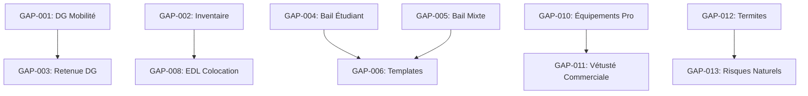

# Plan d'Action - Correction des Gaps Identifiés

**Date:** 27 janvier 2026
**Basé sur:** Audit Baux/EDL + Rapport SOTA 2026
**Objectif:** Atteindre 100% de conformité légale et 98% de couverture fonctionnelle

---

## Executive Summary

| Catégorie | Gaps | Critiques | Moyens | Faibles |
|-----------|------|-----------|--------|---------|
| **Conformité Légale** | 5 | 2 | 2 | 1 |
| **Baux Manquants** | 4 | 0 | 2 | 2 |
| **EDL** | 4 | 1 | 2 | 1 |
| **DOM-TOM** | 3 | 0 | 2 | 1 |
| **Templates** | 4 | 0 | 3 | 1 |
| **Total** | **20** | **3** | **11** | **6** |

**Effort estimé:** 15-18 jours développeur

---

## Phase 1 : Conformité Légale Critique (Sprint 1)

### 1.1 GAP-001 : Bail Mobilité - DG Autorisé (CRITIQUE)

**Problème:** Le système permet de définir un dépôt de garantie pour les baux mobilité, ce qui est **illégal** (loi ELAN 2018).

**Impact:** Non-conformité légale, risque de litiges

**Solution:**

#### Fichiers à modifier:

```
app/owner/leases/new/LeaseWizard.tsx
├── Ligne ~450: Ajouter condition pour masquer champ DG
├── Ligne ~520: Validation côté client

features/leases/services/leases.service.ts
├── Ajouter validation serveur

lib/validations/lease-financial.ts
├── Créer règle de validation

supabase/migrations/YYYYMMDD_block_dg_bail_mobilite.sql
├── Contrainte CHECK en base
```

#### Code à implémenter:

**LeaseWizard.tsx:**
```tsx
// Dans le formulaire financier
{leaseType !== 'bail_mobilite' && (
  <FormField
    name="deposit_amount"
    label="Dépôt de garantie"
    // ...
  />
)}

// Si bail mobilité, forcer à 0
useEffect(() => {
  if (leaseType === 'bail_mobilite') {
    setValue('deposit_amount', 0);
    setValue('deposit_months', 0);
  }
}, [leaseType]);
```

**Migration SQL:**
```sql
ALTER TABLE leases
ADD CONSTRAINT chk_bail_mobilite_no_deposit
CHECK (
  type != 'bail_mobilite' OR deposit_amount = 0
);
```

#### Tests à écrire:
```typescript
// __tests__/unit/lease-validation.test.ts
describe('Bail Mobilité', () => {
  it('should reject deposit for bail_mobilite', async () => {
    const result = await createLease({
      type: 'bail_mobilite',
      deposit_amount: 500
    });
    expect(result.error).toContain('dépôt de garantie');
  });

  it('should allow bail_mobilite with zero deposit', async () => {
    const result = await createLease({
      type: 'bail_mobilite',
      deposit_amount: 0
    });
    expect(result.success).toBe(true);
  });
});
```

#### Critères d'acceptance:
- [ ] Champ DG masqué quand type = bail_mobilite
- [ ] Valeur forcée à 0 côté client
- [ ] Validation serveur rejette DG > 0
- [ ] Contrainte SQL empêche insertion
- [ ] Tests unitaires passent
- [ ] Test E2E du wizard

**Complexité:** 3/10
**Estimation:** 0.5 jour

---

### 1.2 GAP-002 : EDL Meublé sans Inventaire Séparé (CRITIQUE)

**Problème:** L'inventaire mobilier obligatoire (décret 2015-981) n'est pas intégré dans le formulaire EDL pour les baux meublés.

**Impact:** Non-conformité au décret du 31 juillet 2015

**Solution:**

#### Fichiers à créer:

```
features/edl/components/inventaire-meuble-edl.tsx     # Nouveau composant
features/edl/types/inventaire.ts                      # Types inventaire
lib/templates/edl/inventaire-meuble.template.ts      # Template PDF
```

#### Fichiers à modifier:

```
features/end-of-lease/components/edl-conductor.tsx
├── Ajouter étape inventaire si bail meublé

lib/templates/edl/edl.template.ts
├── Intégrer section inventaire

lib/types/edl-meters.ts
├── Ajouter types inventaire
```

#### Liste des 11 éléments obligatoires (décret 2015-981):

```typescript
// features/edl/types/inventaire.ts
export const MOBILIER_OBLIGATOIRE = [
  { id: 'literie', label: 'Literie (couette ou couverture)', category: 'chambre' },
  { id: 'volets', label: 'Volets ou rideaux occultants (chambres)', category: 'chambre' },
  { id: 'plaques', label: 'Plaques de cuisson', category: 'cuisine' },
  { id: 'four', label: 'Four ou four micro-ondes', category: 'cuisine' },
  { id: 'refrigerateur', label: 'Réfrigérateur avec compartiment congélation', category: 'cuisine' },
  { id: 'vaisselle', label: 'Vaisselle et ustensiles de cuisine', category: 'cuisine' },
  { id: 'table', label: 'Table et sièges', category: 'sejour' },
  { id: 'rangements', label: 'Étagères de rangement', category: 'sejour' },
  { id: 'luminaires', label: 'Luminaires', category: 'general' },
  { id: 'menage', label: 'Matériel d\'entretien ménager', category: 'general' },
  { id: 'linge_maison', label: 'Linge de maison (si meublé touristique)', category: 'general', optional: true }
] as const;

export interface InventaireItem {
  id: string;
  present: boolean;
  quantity: number;
  condition: 'neuf' | 'bon' | 'moyen' | 'mauvais';
  notes?: string;
  photos?: string[];
}
```

#### Composant inventaire:

```tsx
// features/edl/components/inventaire-meuble-edl.tsx
"use client";

import { useState } from "react";
import { Card, CardContent, CardHeader, CardTitle } from "@/components/ui/card";
import { Checkbox } from "@/components/ui/checkbox";
import { Select } from "@/components/ui/select";
import { MOBILIER_OBLIGATOIRE, InventaireItem } from "../types/inventaire";

interface InventaireMeubleEDLProps {
  value: InventaireItem[];
  onChange: (items: InventaireItem[]) => void;
  edlType: 'entree' | 'sortie';
  entreeInventaire?: InventaireItem[]; // Pour comparaison à la sortie
}

export function InventaireMeubleEDL({
  value,
  onChange,
  edlType,
  entreeInventaire
}: InventaireMeubleEDLProps) {
  // Grouper par catégorie
  const categories = {
    chambre: 'Chambre',
    cuisine: 'Cuisine',
    sejour: 'Séjour',
    general: 'Général'
  };

  return (
    <Card>
      <CardHeader>
        <CardTitle className="flex items-center gap-2">
          <Package className="h-5 w-5" />
          Inventaire du mobilier
          <Badge variant="destructive">Obligatoire</Badge>
        </CardTitle>
        <p className="text-sm text-muted-foreground">
          Décret n°2015-981 du 31 juillet 2015
        </p>
      </CardHeader>
      <CardContent>
        {Object.entries(categories).map(([catId, catLabel]) => (
          <div key={catId} className="mb-6">
            <h4 className="font-medium mb-3">{catLabel}</h4>
            {MOBILIER_OBLIGATOIRE
              .filter(item => item.category === catId)
              .map(item => (
                <InventaireItemRow
                  key={item.id}
                  item={item}
                  value={value.find(v => v.id === item.id)}
                  onChange={(updated) => {
                    const newItems = [...value];
                    const idx = newItems.findIndex(v => v.id === item.id);
                    if (idx >= 0) newItems[idx] = updated;
                    else newItems.push(updated);
                    onChange(newItems);
                  }}
                  entreeValue={entreeInventaire?.find(v => v.id === item.id)}
                  edlType={edlType}
                />
              ))}
          </div>
        ))}
      </CardContent>
    </Card>
  );
}
```

#### Critères d'acceptance:
- [ ] Composant InventaireMeubleEDL créé
- [ ] Affichage automatique si bail meublé
- [ ] 11 éléments obligatoires listés
- [ ] État (neuf/bon/moyen/mauvais) par élément
- [ ] Quantité et notes optionnelles
- [ ] Comparaison entrée/sortie
- [ ] Intégré dans template PDF
- [ ] Tests unitaires

**Complexité:** 7/10
**Estimation:** 2 jours

---

### 1.3 GAP-003 : Bail Mobilité - Retenue DG Impossible

**Problème:** À la fin d'un bail mobilité, le système calcule une retenue sur DG alors qu'il n'y en a pas.

**Solution:**

#### Fichiers à modifier:

```
features/end-of-lease/ai/deposit-retention.graph.ts
├── Vérifier si bail mobilité avant calcul

features/end-of-lease/services/end-of-lease.service.ts
├── Skip étape retenue pour bail mobilité

features/end-of-lease/components/deposit-refund-wizard.tsx
├── Afficher message spécifique
```

#### Code:

```typescript
// deposit-retention.graph.ts - Ajouter au début
async function checkLeaseType(state: StateType): Promise<Partial<StateType>> {
  // Si bail mobilité, pas de calcul de retenue
  if (state.leaseType === 'bail_mobilite') {
    return {
      skipRetention: true,
      message: "Bail mobilité : pas de dépôt de garantie, aucune retenue possible"
    };
  }
  return {};
}
```

**Complexité:** 3/10
**Estimation:** 0.5 jour

---

## Phase 2 : Types de Baux Manquants (Sprint 2)

### 2.1 GAP-004 : Bail Étudiant Explicite

**Problème:** Le bail étudiant utilise le bail meublé sans type dédié.

**Solution:**

#### Fichiers à modifier:

```
lib/types/index.ts
├── Ajouter 'etudiant' à LeaseType

app/owner/leases/new/LeaseTypeCards.tsx
├── Ajouter carte bail étudiant

lib/templates/bail/bail-etudiant.template.ts  # Nouveau
├── Créer template spécifique (9 mois, non renouvelable)

supabase/migrations/YYYYMMDD_add_etudiant_lease_type.sql
├── ALTER TYPE lease_type ADD VALUE 'etudiant'
```

#### Spécificités bail étudiant:
- Durée fixe: 9 mois
- Non renouvelable automatiquement
- DG max: 2 mois
- Justificatif étudiant requis

**Complexité:** 5/10
**Estimation:** 1 jour

---

### 2.2 GAP-005 : Bail Mixte (Habitation + Professionnel)

**Problème:** Type de bail non implémenté.

**Solution:**

#### Fichiers à créer:

```
lib/templates/bail/bail-mixte.template.ts
lib/templates/bail/bail-mixte.types.ts
```

#### Fichiers à modifier:

```
lib/types/index.ts
├── Ajouter 'mixte_habitation_pro' à LeaseType

app/owner/leases/new/LeaseTypeCards.tsx
├── Ajouter carte

app/owner/leases/new/LeaseWizard.tsx
├── Ajouter configuration spécifique (% usage pro)
```

#### Spécificités:
- Proportion habitation/professionnel
- Régime fiscal différent
- Clauses spécifiques

**Complexité:** 6/10
**Estimation:** 1.5 jours

---

### 2.3 GAP-006 : Templates Baux Commerciaux

**Problème:** Templates PDF manquants pour commercial 3/6/9, dérogatoire, professionnel.

**Solution:**

#### Fichiers à créer:

```
lib/templates/bail/bail-commercial-369.template.ts
lib/templates/bail/bail-commercial-derogatoire.template.ts
lib/templates/bail/bail-professionnel.template.ts
```

#### Clauses spécifiques à inclure:

**Commercial 3/6/9:**
- Durée 9 ans minimum
- Résiliation triennale
- Droit au renouvellement
- Indemnité d'éviction
- Révision loyer (ILC ou ILAT)
- Destination des locaux
- Clause de non-concurrence

**Professionnel:**
- Durée 6 ans minimum
- Pas de droit au renouvellement automatique
- Préavis 6 mois

**Complexité:** 6/10
**Estimation:** 2 jours

---

### 2.4 GAP-007 : Location-Gérance Template

**Problème:** Enum existe mais pas de template.

**Solution:** Créer `lib/templates/bail/location-gerance.template.ts`

**Complexité:** 5/10
**Estimation:** 1 jour

---

## Phase 3 : EDL Adaptatifs (Sprint 3)

### 3.1 GAP-008 : EDL Colocation - Individuel vs Collectif

**Problème:** Pas de distinction entre EDL individuel et collectif pour colocations.

**Solution:**

#### Fichiers à modifier:

```
features/end-of-lease/components/edl-conductor.tsx
├── Ajouter sélection mode EDL pour colocation

lib/templates/edl/types.ts
├── Ajouter EDLMode: 'individual' | 'collective'

lib/templates/edl/edl.template.ts
├── Adapter rendu selon mode
```

#### Logique:
- **Individuel:** Un EDL par colocataire, pour sa chambre + parties communes
- **Collectif:** Un seul EDL pour tout le logement, signé par tous

**Complexité:** 5/10
**Estimation:** 1 jour

---

### 3.2 GAP-009 : EDL Saisonnier Simplifié

**Problème:** EDL standard trop complexe pour locations courtes.

**Solution:**

#### Fichiers à créer:

```
lib/templates/edl/edl-simplifie.template.ts
features/edl/components/edl-simplifie-form.tsx
```

#### Simplifications:
- Moins de détails par pièce
- Photos principales uniquement
- Pas de grille de vétusté (séjours < 90 jours)
- Formulaire en 5 minutes

**Complexité:** 4/10
**Estimation:** 1 jour

---

### 3.3 GAP-010 : EDL Commercial avec Équipements Pro

**Problème:** EDL standard ne couvre pas les équipements professionnels.

**Solution:**

#### Fichiers à modifier:

```
lib/templates/edl/types.ts
├── Ajouter catégorie 'equipements_pro'

features/end-of-lease/components/edl-sortie-inspection.tsx
├── Afficher section équipements si bail commercial
```

#### Équipements à ajouter:
- Climatisation
- Système de sécurité
- Enseigne
- Aménagements spécifiques
- Conformité ERP

**Complexité:** 4/10
**Estimation:** 0.5 jour

---

### 3.4 GAP-011 : Grille Vétusté Baux Commerciaux

**Problème:** Pas de calcul de vétusté pour locaux commerciaux/professionnels.

**Solution:**

#### Fichiers à modifier:

```
features/end-of-lease/ai/deposit-retention.graph.ts
├── Ajouter grille vétusté commerciale

lib/constants/vetuste-grids.ts  # Nouveau
├── Définir grilles par type de bail
```

#### Grille commerciale:
| Élément | Durée de vie | Abattement/an |
|---------|--------------|---------------|
| Revêtements sols | 15 ans | 6% |
| Faux plafonds | 20 ans | 5% |
| Climatisation | 15 ans | 6% |
| Électricité | 25 ans | 4% |

**Complexité:** 4/10
**Estimation:** 0.5 jour

---

## Phase 4 : DOM-TOM (Sprint 4)

### 4.1 GAP-012 : Diagnostic Termites Obligatoire

**Problème:** Pas de gestion spécifique pour zones termites (DOM-TOM + certaines communes métropole).

**Solution:**

#### Fichiers à créer:

```
lib/constants/zones-termites.ts
├── Liste des départements/communes concernés

features/diagnostics/components/termites-diagnostic-card.tsx
├── Composant d'alerte
```

#### Fichiers à modifier:

```
app/owner/properties/[id]/PropertyDetailsClient.tsx
├── Afficher alerte si zone termites

features/properties/components/v3/immersive/steps/AddressStep.tsx
├── Détecter zone termites automatiquement
```

#### Départements concernés:
```typescript
// lib/constants/zones-termites.ts
export const DEPARTEMENTS_TERMITES = [
  // DOM-TOM
  '971', // Guadeloupe
  '972', // Martinique
  '973', // Guyane
  '974', // Réunion
  '976', // Mayotte
  // Métropole (arrêtés préfectoraux)
  '13', '33', '40', '64', '66', '83', // etc.
];

export function isZoneTermites(codePostal: string): boolean {
  const dept = codePostal.substring(0, 2);
  return DEPARTEMENTS_TERMITES.includes(dept);
}
```

**Complexité:** 3/10
**Estimation:** 0.5 jour

---

### 4.2 GAP-013 : Plan de Prévention des Risques (PPRN)

**Problème:** Pas d'information sur les risques naturels spécifiques DOM-TOM.

**Solution:**

#### Fichiers à créer:

```
features/diagnostics/components/risques-naturels-card.tsx
lib/services/georisques.service.ts  # API Géorisques
```

#### Risques à afficher:
- Cyclones (Antilles, Réunion)
- Séismes (Antilles, Mayotte)
- Volcanisme (Martinique, Réunion)
- Inondations
- Mouvements de terrain

**Complexité:** 5/10
**Estimation:** 1 jour

---

### 4.3 GAP-014 : Encadrement Loyers DOM-TOM

**Problème:** Pas de vérification encadrement loyers pour zones tendues DOM-TOM.

**Solution:**

#### Fichiers à créer:

```
lib/constants/encadrement-loyers-domtom.ts
├── Zones et plafonds

features/leases/components/loyer-verification-domtom.tsx
├── Composant de vérification
```

#### Zones concernées:
- Martinique (certaines communes)
- Guadeloupe (certaines communes)
- Réunion (certaines communes)

**Complexité:** 4/10
**Estimation:** 0.5 jour

---

## Phase 5 : Améliorations TypeScript (Sprint 5)

### 5.1 GAP-015 : 417 fichiers avec @ts-nocheck

**Problème:** Dette technique TypeScript importante.

**Solution:**

#### Approche progressive:

1. **Semaine 1:** Fichiers critiques (services, API routes)
2. **Semaine 2:** Composants partagés
3. **Semaine 3:** Features modules
4. **Semaine 4:** Pages et layouts

#### Script d'analyse:

```bash
# Identifier les fichiers @ts-nocheck
grep -r "@ts-nocheck" --include="*.ts" --include="*.tsx" -l | wc -l

# Prioriser par imports
for f in $(grep -r "@ts-nocheck" --include="*.ts" -l); do
  echo "$f: $(grep -c "import" $f) imports"
done | sort -t: -k2 -nr | head -20
```

**Complexité:** 8/10
**Estimation:** 5+ jours (effort continu)

---

## Récapitulatif Planning

### Sprint 1 (Semaine 1) - Conformité Critique

| ID | Gap | Complexité | Estimation |
|----|-----|------------|------------|
| GAP-001 | Bail mobilité DG | 3/10 | 0.5j |
| GAP-002 | Inventaire meublé EDL | 7/10 | 2j |
| GAP-003 | Retenue DG mobilité | 3/10 | 0.5j |

**Total Sprint 1:** 3 jours

---

### Sprint 2 (Semaine 2) - Types de Baux

| ID | Gap | Complexité | Estimation |
|----|-----|------------|------------|
| GAP-004 | Bail étudiant | 5/10 | 1j |
| GAP-005 | Bail mixte | 6/10 | 1.5j |
| GAP-006 | Templates commerciaux | 6/10 | 2j |
| GAP-007 | Location-gérance | 5/10 | 1j |

**Total Sprint 2:** 5.5 jours

---

### Sprint 3 (Semaine 3) - EDL Adaptatifs

| ID | Gap | Complexité | Estimation |
|----|-----|------------|------------|
| GAP-008 | EDL colocation modes | 5/10 | 1j |
| GAP-009 | EDL simplifié | 4/10 | 1j |
| GAP-010 | EDL équipements pro | 4/10 | 0.5j |
| GAP-011 | Vétusté commerciale | 4/10 | 0.5j |

**Total Sprint 3:** 3 jours

---

### Sprint 4 (Semaine 4) - DOM-TOM

| ID | Gap | Complexité | Estimation |
|----|-----|------------|------------|
| GAP-012 | Diagnostic termites | 3/10 | 0.5j |
| GAP-013 | Risques naturels | 5/10 | 1j |
| GAP-014 | Encadrement loyers | 4/10 | 0.5j |

**Total Sprint 4:** 2 jours

---

### Backlog (Effort Continu)

| ID | Gap | Complexité | Estimation |
|----|-----|------------|------------|
| GAP-015 | TypeScript cleanup | 8/10 | 5+ jours |
| - | Bail rural (optionnel) | 6/10 | 2j |

---

## Matrice de Priorisation

```
                    IMPACT
                 Élevé    Faible
            ┌─────────┬─────────┐
    Facile  │ QUICK   │ FILL-IN │
EFFORT      │ WINS    │         │
            │ GAP-001 │ GAP-012 │
            │ GAP-003 │ GAP-014 │
            ├─────────┼─────────┤
  Difficile │ MAJOR   │ THANKLESS│
            │ PROJECTS│         │
            │ GAP-002 │ GAP-015 │
            │ GAP-006 │         │
            └─────────┴─────────┘
```

---

## Métriques de Succès

### Après Phase 1
- [ ] 0 bail mobilité avec DG > 0 en base
- [ ] 100% EDL meublés avec inventaire
- [ ] Tests E2E passent

### Après Phase 2
- [ ] 13 types de baux supportés (vs 10 actuellement)
- [ ] 100% templates PDF disponibles
- [ ] Score conformité légale: 100%

### Après Phase 3
- [ ] EDL adaptatif par type de bail
- [ ] Temps création EDL saisonnier < 5 min
- [ ] Score UX EDL: +15%

### Après Phase 4
- [ ] DOM-TOM: diagnostics automatiques
- [ ] Alertes risques naturels actives
- [ ] Score couverture géographique: 100%

---

## Dépendances Techniques



---

## Risques et Mitigations

| Risque | Probabilité | Impact | Mitigation |
|--------|-------------|--------|------------|
| Migration SQL échoue | Faible | Élevé | Tests sur DB clone |
| Régression EDL existants | Moyen | Élevé | Feature flag + rollback |
| Surcharge wizard bail | Moyen | Moyen | UX progressive disclosure |
| API Géorisques indisponible | Faible | Faible | Cache + fallback manuel |

---

## Annexe: Commandes Utiles

```bash
# Créer migration
npx supabase migration new block_dg_bail_mobilite

# Tester migration
npx supabase db reset --local

# Lancer tests
npm test -- --grep "bail_mobilite"

# Vérifier types
npm run type-check

# Analyser bundle
npm run build:analyze
```

---

*Plan d'action généré le 27/01/2026*
