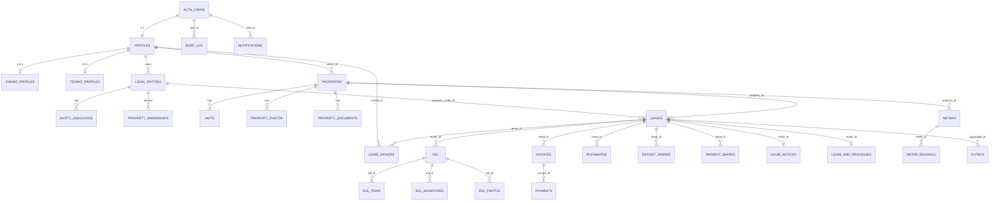
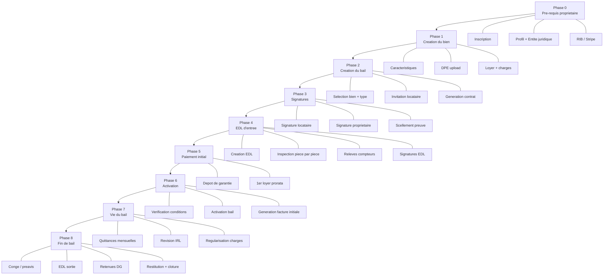
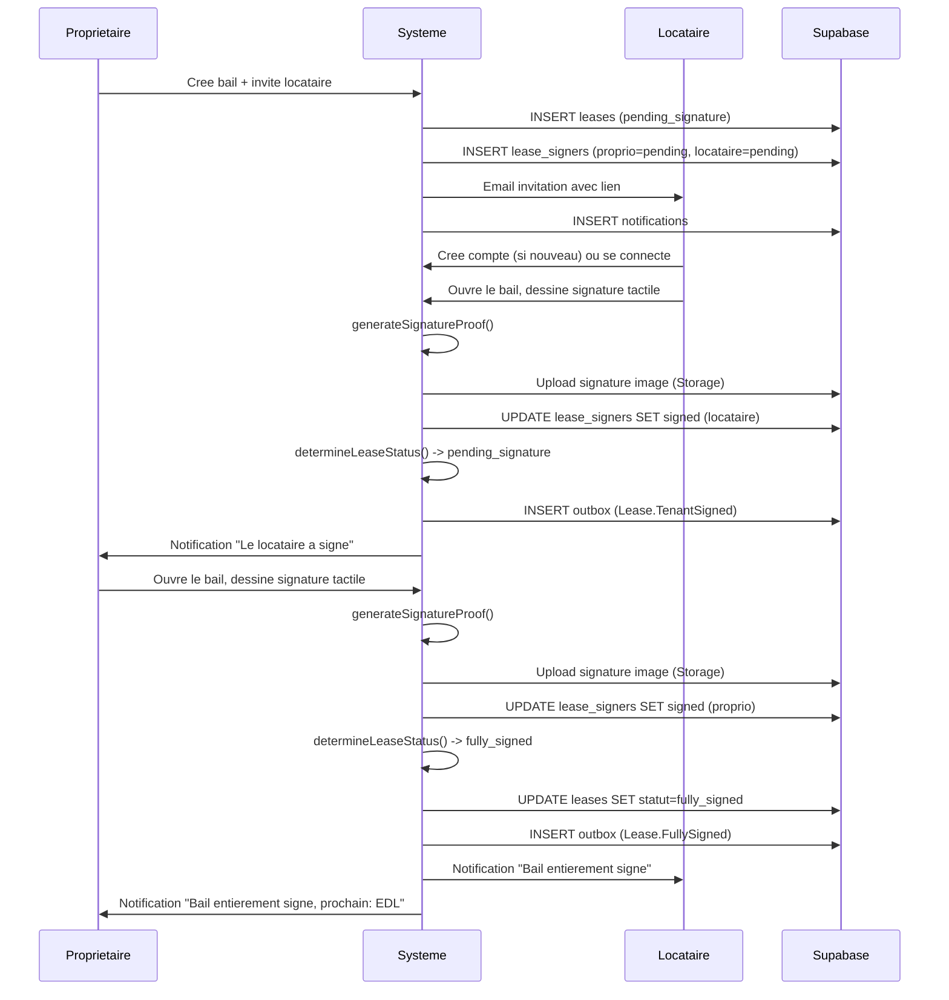
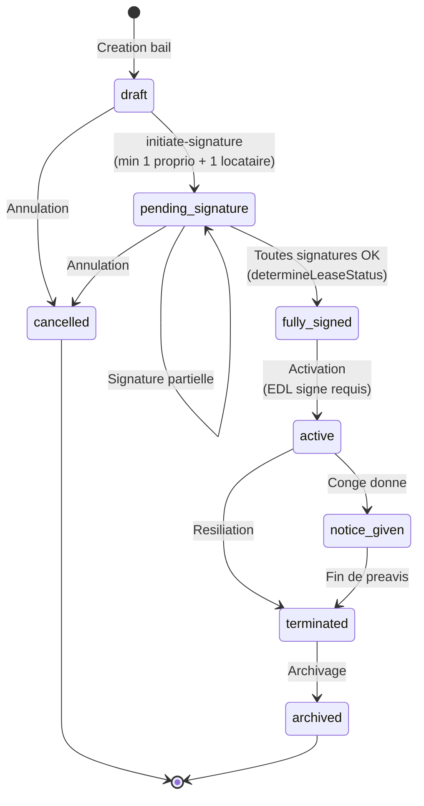

# Audit complet du workflow bail - TALOK

> **Version** : SOTA 2026
> **Date** : 2026-02-11
> **Stack** : Next.js 14+ App Router / Supabase / TypeScript / Tailwind CSS / Netlify
> **Auteur** : Audit Architecture

---

## Table des matieres

1. [Cartographie complete des entites de donnees](#1-cartographie-complete-des-entites-de-donnees)
2. [Workflow sequentiel - Le chemin critique](#2-workflow-sequentiel--le-chemin-critique)
3. [Matrice des etats du bail](#3-matrice-des-etats-du-bail)
4. [Matrice des documents](#4-matrice-des-documents)
5. [Analyse des roles et permissions](#5-analyse-des-roles--permissions)
6. [Recommandations architecture](#6-recommandations-architecture)
7. [Edge cases et cas speciaux](#7-edge-cases--cas-speciaux)

---

## 1. Cartographie complete des entites de donnees

### 1.1 Profile (`profiles`)

| Attribut | Detail |
|---|---|
| **Table Supabase** | `profiles` |
| **Champs critiques** | `id`, `user_id`, `role` (admin/owner/tenant/provider/guarantor), `prenom`, `nom`, `telephone` |
| **Qui la cree** | Systeme (auto-cree au signup via trigger `handle_new_user`) |
| **Ou elle est creee** | Page `/signup` ou invitation par email |
| **Quand** | Immediatement apres creation du compte auth.users |
| **Etats possibles** | Actif (implicite - pas de champ statut sur profiles) |
| **Qui la consomme** | Toutes les pages, RLS policies, lease_signers, invoices, EDL |
| **Dependances amont** | `auth.users` (compte Supabase Auth) |
| **Dependances aval** | `owner_profiles`, `tenant_profiles`, `properties`, `leases` (via lease_signers), `invoices`, `edl`, `notifications` |

### 1.2 Profil Proprietaire (`owner_profiles`)

| Attribut | Detail |
|---|---|
| **Table Supabase** | `owner_profiles` |
| **Champs critiques** | `profile_id`, `type` (particulier/societe), `siret`, `iban`, `adresse_facturation`, `tva_optionnelle` |
| **Qui la cree** | Proprietaire |
| **Ou elle est creee** | Onboarding (`/owner/onboarding/profile`) ou profil (`/owner/profile`) |
| **Quand** | Phase 0 - apres creation du compte, avant tout ajout de bien |
| **Etats possibles** | Complet / Incomplet (pas de champ statut formel, mais `iban` null = incomplet pour Stripe) |
| **Qui la consomme** | LeaseWizard (donnees bailleur), generation bail PDF, facturation |
| **Dependances amont** | `profiles` avec `role = "owner"` |
| **Dependances aval** | `properties` (necessite un owner pour creer un bien), `leases` (donnees bailleur dans le contrat) |

### 1.3 Entite Juridique (`legal_entities`)

| Attribut | Detail |
|---|---|
| **Table Supabase** | `legal_entities` |
| **Champs critiques** | `id`, `owner_profile_id`, `entity_type` (particulier/sci_ir/sci_is/sarl/sas/sasu/sa/snc/eurl/indivision/demembrement/holding), `nom`, `siret`, `siren`, `legal_form`, `fiscal_regime` (ir/is), `tva_regime`, `capital_social`, `is_active` |
| **Qui la cree** | Proprietaire |
| **Ou elle est creee** | `/owner/entities/new` |
| **Quand** | Phase 0 - optionnel mais recommande avant creation de bail SCI/SARL |
| **Etats possibles** | `is_active = true/false` |
| **Qui la consomme** | LeaseWizard (EntitySelector pour choisir l'entite signataire), generation bail PDF (bailleur = entite), comptabilite, fiscalite |
| **Dependances amont** | `profiles` avec `role = "owner"` |
| **Dependances aval** | `leases.signatory_entity_id`, `property_ownerships`, `entity_associates` |

**Sous-entites** :
- `entity_associates` : associes/gerants de l'entite (avec `capital_percentage`, `is_managing_partner`)
- `property_ownerships` : lien entite-propriete (avec `detention_type`, `ownership_percentage`, `acquisition_mode`)

### 1.4 Profil Locataire (`tenant_profiles`)

| Attribut | Detail |
|---|---|
| **Table Supabase** | `tenant_profiles` |
| **Champs critiques** | `profile_id`, `situation_pro`, `revenus_mensuels`, `nb_adultes`, `nb_enfants`, `garant_required`, `cni_number`, `locataire_type` (particulier/professionnel) |
| **Qui la cree** | Systeme (auto-cree) ou locataire (complete son profil) |
| **Ou elle est creee** | Inscription via lien d'invitation ou onboarding locataire |
| **Quand** | Apres reception de l'invitation par le proprietaire (Phase 2-3) |
| **Etats possibles** | Complet / Incomplet |
| **Qui la consomme** | Bail (verification dossier), EDL (identite), signature (CNI pour preuve) |
| **Dependances amont** | `profiles` avec `role = "tenant"` |
| **Dependances aval** | `lease_signers`, `invoices.tenant_id`, `edl_signatures` |

### 1.5 Bien Immobilier (`properties`)

| Attribut | Detail |
|---|---|
| **Table Supabase** | `properties` |
| **Champs critiques** | `id`, `owner_id`, `type` (appartement/maison/studio/parking/local_commercial/bureaux/...), `adresse_complete`, `code_postal`, `ville`, `surface`/`surface_habitable_m2`, `nb_pieces`, `loyer_hc`, `charges_mensuelles`, `dpe_classe_energie`, `dpe_classe_climat`, `dpe_consommation`, `statut` (draft/published/archived), `statut_operationnel` (vacant/rented/notice_period/incomplete) |
| **Qui la cree** | Proprietaire |
| **Ou elle est creee** | `/owner/properties/new` ou onboarding (`/owner/onboarding/property`) |
| **Quand** | Phase 1 - apres configuration du profil proprietaire |
| **Etats possibles** | `draft` -> `pending_review` -> `published` / `rejected` -> `archived` |
| **Statut operationnel** | `incomplete` -> `vacant` -> `rented` -> `notice_period` -> `vacant` |
| **Qui la consomme** | LeaseWizard (selection du bien, pre-remplissage loyer/charges), bail PDF (donnees logement), EDL (adresse), factures |
| **Dependances amont** | `profiles` proprietaire, diagnostics DPE (upload) |
| **Dependances aval** | `leases.property_id`, `edl` (via lease), `units` (lots), `property_photos`, `property_documents` |

**Sous-entites** :
- `units` : lots individuels dans un immeuble multi-lots
- `property_photos` : photos du bien
- `property_documents` : documents attaches (diagnostics, titre de propriete)

### 1.6 Bail (`leases`)

| Attribut | Detail |
|---|---|
| **Table Supabase** | `leases` |
| **Champs critiques** | `id`, `property_id`, `unit_id`, `type_bail` (nu/meuble/colocation/saisonnier/bail_mobilite/etudiant/commercial_3_6_9/professionnel/contrat_parking/bail_mixte/commercial_derogatoire/location_gerance/bail_rural), `signatory_entity_id`, `loyer`, `charges_forfaitaires`, `charges_type` (forfait/provisions), `depot_de_garantie`, `date_debut`, `date_fin`, `statut`, `clauses_particulieres`, `coloc_config`, `activated_at` |
| **Qui la cree** | Proprietaire (via wizard 3 etapes) |
| **Ou elle est creee** | `/owner/leases/new` (LeaseWizard) -> POST `/api/leases/invite` |
| **Quand** | Phase 2 - apres creation du bien et upload DPE |
| **Etats possibles** | Voir [Section 3 - Matrice des etats](#3-matrice-des-etats-du-bail) |
| **Qui la consomme** | Page detail bail, signature, EDL, facturation, fin de bail, comptabilite |
| **Dependances amont** | `properties` (bien existant), `profiles` proprietaire, `legal_entities` (optionnel) |
| **Dependances aval** | `lease_signers`, `edl`, `invoices`, `payments`, `roommates`, `deposit_shares`, `lease_notices`, `lease_end_processes`, `outbox` events |

### 1.7 Signataires du bail (`lease_signers`)

| Attribut | Detail |
|---|---|
| **Table Supabase** | `lease_signers` |
| **Champs critiques** | `id`, `lease_id`, `profile_id` (nullable pour invites), `invited_email`, `invited_name`, `role` (proprietaire/locataire_principal/colocataire/garant), `signature_status` (pending/signed/refused), `signed_at`, `signature_image_path`, `proof_id`, `proof_metadata`, `document_hash`, `ip_inet`, `user_agent` |
| **Qui la cree** | Systeme (auto-cree lors de la creation du bail via `/api/leases/invite`) |
| **Ou elle est creee** | API `/api/leases/invite` (proprietaire + locataire(s)) |
| **Quand** | Phase 2 - simultanément avec la creation du bail |
| **Etats possibles** | `pending` -> `signed` / `refused` |
| **Qui la consomme** | Page signatures, initiate-signature, sign, determineLeaseStatus |
| **Dependances amont** | `leases`, `profiles` (ou `invited_email` si pas encore inscrit) |
| **Dependances aval** | Transition de statut du bail (pending_signature -> fully_signed), generation certificat de preuve |

### 1.8 Etat des Lieux (`edl`)

| Attribut | Detail |
|---|---|
| **Table Supabase** | `edl` |
| **Champs critiques** | `id`, `lease_id`, `property_id`, `type` (entree/sortie), `status` (draft/in_progress/completed/signed/disputed), `scheduled_date`, `completed_date`, `created_by`, `general_notes` |
| **Qui la cree** | Proprietaire (ou admin) |
| **Ou elle est creee** | `/owner/inspections/new` -> POST `/api/edl` (via `createEDL` service) |
| **Quand** | Phase 4 - apres signature complete du bail (`fully_signed`) |
| **Etats possibles** | `draft` -> `in_progress` -> `completed` -> `signed` / `disputed` |
| **Qui la consomme** | Page inspection, activation du bail, fin de bail (comparaison entree/sortie), dépot de garantie |
| **Dependances amont** | `leases` (bail signe), `properties` |
| **Dependances aval** | `edl_items`, `edl_signatures`, `edl_photos`, `meter_readings`, activation du bail, `lease_end_processes` |

**Sous-entites** :
- `edl_items` : elements inspectes piece par piece (`room_name`, `item_name`, `condition`, `notes`)
- `edl_signatures` : signatures des parties sur l'EDL (`signer_role`, `signed_at`, `signature_image_path`, `proof_metadata`)
- `edl_photos` : photos attachees aux elements
- `meter_readings` : releves de compteurs (via `meters`)

### 1.9 Factures / Quittances (`invoices`)

| Attribut | Detail |
|---|---|
| **Table Supabase** | `invoices` |
| **Champs critiques** | `id`, `lease_id`, `owner_id`, `tenant_id`, `periode` (YYYY-MM), `montant_loyer`, `montant_charges`, `montant_total`, `montant_ht`, `montant_tva`, `taux_tva`, `statut` (draft/sent/viewed/partial/paid/late/cancelled), `metadata` (type, includes_deposit, is_prorated) |
| **Qui la cree** | Systeme (auto-generee a l'activation du bail et mensuellement via cron) |
| **Ou elle est creee** | API `/api/leases/[id]/activate` (facture initiale) puis CRON `/api/cron/generate-monthly-invoices` |
| **Quand** | Phase 5 (initiale) puis Phase 7 (mensuellement) |
| **Etats possibles** | `draft` -> `sent` -> `viewed` -> `partial` -> `paid` / `late` / `cancelled` |
| **Qui la consomme** | Dashboard proprietaire, dashboard locataire, comptabilite, export FEC |
| **Dependances amont** | `leases` actif, `profiles` (owner + tenant) |
| **Dependances aval** | `payments`, `payment_shares` (colocation), quittances PDF |

### 1.10 Paiements (`payments`)

| Attribut | Detail |
|---|---|
| **Table Supabase** | `payments` |
| **Champs critiques** | `id`, `invoice_id`, `montant`, `moyen` (cb/virement/prelevement/especes/cheque/autre), `statut` (pending/processing/succeeded/failed/refunded), `date_paiement`, `provider_ref` |
| **Qui la cree** | Systeme (via Stripe webhook) ou proprietaire (saisie manuelle) |
| **Ou elle est creee** | Stripe webhook (`/api/billing/webhook`) ou action manuelle (`markInvoiceAsPaid`) |
| **Quand** | Phase 5 (paiement initial) puis Phase 7 (paiements mensuels) |
| **Etats possibles** | `pending` -> `processing` -> `succeeded` / `failed` -> `refunded` |
| **Qui la consomme** | Dashboard tresorerie, comptabilite, relances automatiques |
| **Dependances amont** | `invoices` |
| **Dependances aval** | Mise a jour statut invoice (partial/paid), comptabilite |

### 1.11 Notifications (`notifications`)

| Attribut | Detail |
|---|---|
| **Table Supabase** | `notifications` |
| **Champs critiques** | `id`, `user_id`, `type` (lease_invite, payment_reminder, etc.), `title`, `body`, `read`, `metadata` |
| **Qui la cree** | Systeme (via API ou outbox events) |
| **Ou elle est creee** | `/api/leases/invite`, outbox processor, cron jobs |
| **Quand** | A chaque evenement significatif du workflow |
| **Etats possibles** | `read = false` -> `read = true` |
| **Qui la consomme** | Header notification bell, page notifications |
| **Dependances amont** | Evenement declencheur (invitation, signature, paiement, etc.) |
| **Dependances aval** | Aucune |

### 1.12 Conge / Preavis (`lease_notices`)

| Attribut | Detail |
|---|---|
| **Table Supabase** | `lease_notices` |
| **Champs critiques** | `id`, `lease_id`, `tenant_profile_id`, `notice_date`, `effective_end_date`, `notice_period_days`, `is_reduced_notice`, `reduced_notice_reason`, `status` (pending/acknowledged/completed/cancelled) |
| **Qui la cree** | Locataire (conge locataire) ou Proprietaire (conge bailleur) |
| **Ou elle est creee** | API `/api/end-of-lease` ou interface fin de bail |
| **Quand** | Phase 8 - quand une partie souhaite mettre fin au bail |
| **Etats possibles** | `pending` -> `acknowledged` -> `completed` / `cancelled` |
| **Qui la consomme** | Processus de fin de bail, EDL sortie, calcul depot de garantie |
| **Dependances amont** | `leases` actif |
| **Dependances aval** | `lease_end_processes`, `departure_notices`, EDL sortie |

### 1.13 Processus de fin de bail (`lease_end_processes`)

| Attribut | Detail |
|---|---|
| **Table Supabase** | `lease_end_processes` |
| **Champs critiques** | `id`, `lease_id`, `property_id`, `status` (pending/triggered/edl_scheduled/edl_in_progress/edl_completed/damages_assessed/dg_calculated/renovation_planned/renovation_in_progress/ready_to_rent/completed/cancelled), `progress_percentage`, `dg_amount`, `dg_retention_amount`, `dg_refund_amount`, `edl_entree_id`, `edl_sortie_id` |
| **Qui la cree** | Proprietaire ou systeme (CRON `lease-expiry-alerts`) |
| **Ou elle est creee** | `/owner/end-of-lease` -> POST `/api/end-of-lease` |
| **Quand** | Phase 8 - apres conge donne ou detection fin de bail |
| **Etats possibles** | Pipeline complet de 12 etats (voir ci-dessus) |
| **Qui la consomme** | Dashboard fin de bail, calcul retenues, restitution DG |
| **Dependances amont** | `leases`, `lease_notices`, `edl` (entree + sortie) |
| **Dependances aval** | Cloture du bail (`leases.statut = terminated`), restitution depot |

### 1.14 Solde de depot de garantie (`dg_settlements`)

| Attribut | Detail |
|---|---|
| **Table Supabase** | Defini dans les types (`DGSettlement`) |
| **Champs critiques** | `deposit_amount`, `total_deductions`, `deductions[]` (DeductionItem), `amount_to_return`, `amount_to_pay`, `edl_entry_id`, `edl_exit_id`, `status` (draft/pending_validation/contested/validated/paid/collected), `legal_deadline`, `is_overdue` |
| **Qui la cree** | Proprietaire (via interface fin de bail) |
| **Quand** | Phase 8 - apres EDL de sortie et comparaison |
| **Etats possibles** | `draft` -> `pending_validation` -> `validated`/`contested` -> `paid`/`collected` |

### 1.15 Audit Trail (`audit_log` + `audit_events`)

| Attribut | Detail |
|---|---|
| **Tables Supabase** | `audit_log` (simple), `audit_events` (partitionnee par mois) |
| **Champs critiques** | `user_id`, `action`, `entity_type`, `entity_id`, `metadata`, `ip_address`, `user_agent`, `risk_level` |
| **Qui la cree** | Systeme (a chaque action sensible) |
| **Quand** | A chaque signature, activation, creation de bail, paiement, etc. |
| **Qui la consomme** | Admin dashboard, audit de conformite, preuve juridique |

### 1.16 Outbox (Bus d'evenements) (`outbox`)

| Attribut | Detail |
|---|---|
| **Table Supabase** | `outbox` |
| **Champs critiques** | `event_type` (Lease.SentForSignature, Lease.TenantSigned, Lease.OwnerSigned, Lease.FullySigned, Lease.Activated, Inspection.Scheduled, etc.), `payload`, `status` (pending/processing/completed/failed), `retry_count` |
| **Qui la cree** | Systeme (a chaque evenement metier) |
| **Quand** | Apres chaque transition d'etat significative |
| **Qui la consomme** | CRON `/api/cron/process-outbox` -> notifications, emails, webhooks |

---

## Diagramme entite-relation



---

## 2. Workflow sequentiel -- Le chemin critique

### Diagramme du flux complet



---

### Phase 0 -- Pre-requis proprietaire

#### Etape 0.1 : Inscription proprietaire

| Attribut | Detail |
|---|---|
| **Qui agit** | Proprietaire |
| **Action requise** | Creer un compte sur Talok avec email + mot de passe |
| **Route** | `/signup` |
| **Donnees produites** | `auth.users` (row), `profiles` (row avec `role = "owner"`) |
| **Validations** | Email valide, mot de passe conforme, pas de doublon |
| **Blocages possibles** | Email deja utilise, erreur Supabase Auth |
| **Etat bail** | N/A |

#### Etape 0.2 : Configuration profil et entite juridique

| Attribut | Detail |
|---|---|
| **Qui agit** | Proprietaire |
| **Action requise** | Completer le profil (nom, prenom, adresse), creer une entite juridique si SCI/SARL |
| **Routes** | `/owner/onboarding/profile`, `/owner/entities/new` |
| **Donnees produites** | `owner_profiles` (row), `legal_entities` (row optionnelle), `entity_associates` (rows) |
| **Validations** | Nom/prenom requis. Pour personne morale : SIRET obligatoire (sauf particulier), forme juridique |
| **Blocages possibles** | SIRET invalide, informations manquantes |
| **Etat bail** | N/A |

#### Etape 0.3 : Informations bancaires

| Attribut | Detail |
|---|---|
| **Qui agit** | Proprietaire |
| **Action requise** | Renseigner l'IBAN pour la reception des loyers (Stripe Connect) |
| **Route** | `/owner/profile/banking` |
| **Donnees produites** | `owner_profiles.iban`, configuration Stripe Connect |
| **Validations** | IBAN valide, verification Stripe |
| **Blocages possibles** | IBAN rejete, KYC Stripe incomplet |
| **Etat bail** | N/A |

**Condition de passage a Phase 1** : Profil proprietaire complet (`profiles` + `owner_profiles` avec au minimum nom, prenom).

---

### Phase 1 -- Creation du bien

#### Etape 1.1 : Saisie des caracteristiques

| Attribut | Detail |
|---|---|
| **Qui agit** | Proprietaire |
| **Action requise** | Renseigner adresse, type, surface, nombre de pieces, etage, chauffage, etc. |
| **Route** | `/owner/properties/new` ou `/owner/onboarding/property` |
| **Donnees produites** | `properties` (row avec `statut = "draft"`) |
| **Validations** | Adresse requise, surface > 0, type de bien valide |
| **Blocages possibles** | Donnees incompletes |
| **Etat bail** | N/A |

#### Etape 1.2 : Upload DPE et diagnostics

| Attribut | Detail |
|---|---|
| **Qui agit** | Proprietaire |
| **Action requise** | Uploader le DPE (fichier PDF du diagnostiqueur), renseigner classe energie + GES |
| **Route** | `/owner/properties/[id]/diagnostics/dpe` |
| **Donnees produites** | `properties.dpe_classe_energie`, `dpe_classe_climat`, `dpe_consommation`, `property_documents` (fichier dans Supabase Storage) |
| **Validations** | DPE classe G = blocage pour habitation (Loi Climat et Resilience art. 160, depuis 01/01/2025) |
| **Blocages possibles** | DPE classe G (location interdite), DPE expire (> 10 ans) |
| **Etat bail** | N/A |

#### Etape 1.3 : Definition loyer et charges

| Attribut | Detail |
|---|---|
| **Qui agit** | Proprietaire |
| **Action requise** | Definir le loyer HC mensuel et les charges |
| **Route** | `/owner/properties/[id]/edit` |
| **Donnees produites** | `properties.loyer_hc`, `properties.charges_mensuelles` |
| **Validations** | Loyer > 0. Verification encadrement des loyers (zone tendue) via `RentControlAlert` |
| **Blocages possibles** | Aucun blocage technique, mais alerte si depassement plafond |
| **Etat bail** | N/A |

**Condition de passage a Phase 2** : Bien cree avec adresse, surface, type, et DPE non-G pour habitation. Le loyer peut etre defini plus tard dans le wizard bail.

---

### Phase 2 -- Creation du bail

#### Etape 2.1 : Selection du type de bail (Wizard Step 1)

| Attribut | Detail |
|---|---|
| **Qui agit** | Proprietaire |
| **Action requise** | Choisir le type de bail parmi 13 types disponibles (nu, meuble, colocation, saisonnier, bail_mobilite, etudiant, commercial_3_6_9, professionnel, contrat_parking, bail_mixte, commercial_derogatoire, location_gerance, bail_rural) |
| **Route** | `/owner/leases/new` (LeaseWizard, etape 1) |
| **Composant** | `LeaseTypeCards` |
| **Donnees produites** | Etat local `selectedType` (pas encore en base) |
| **Validations** | Un type doit etre selectionne. Auto-avance a l'etape 2 apres selection |
| **Blocages possibles** | Aucun |
| **Etat bail** | Pas encore cree |

#### Etape 2.2 : Selection du bien + conditions financieres (Wizard Step 2)

| Attribut | Detail |
|---|---|
| **Qui agit** | Proprietaire |
| **Action requise** | Selectionner le bien, choisir l'entite signataire (si applicable), definir loyer/charges/depot/date debut |
| **Route** | `/owner/leases/new` (LeaseWizard, etape 2) |
| **Composants** | `PropertySelector`, `EntitySelector`, champs financiers |
| **Donnees produites** | Etat local pre-rempli depuis `properties` |
| **Validations** | Bien selectionne + loyer > 0. DPE G bloque. Depot <= max legal (1 mois nu, 2 mois meuble, 0 bail mobilite). Duree 6 ans si bailleur personne morale + habitation. `DomTomDiagnostics` verifie specificites DOM-TOM |
| **Blocages possibles** | DPE G, aucun bien compatible avec le type de bail, loyer = 0 |
| **Etat bail** | Pas encore cree |

#### Etape 2.3 : Invitation locataire + finalisation (Wizard Step 3)

| Attribut | Detail |
|---|---|
| **Qui agit** | Proprietaire |
| **Action requise** | Saisir email locataire (mode invite) ou creer bail vierge (mode manual). Optionnel : ajouter garant, clauses personnalisees. Vue split avec apercu temps reel du bail |
| **Route** | `/owner/leases/new` (LeaseWizard, etape 3) |
| **Composants** | `TenantInvite` / `MultiTenantInvite`, `GarantForm`, `CustomClauses`, `LeasePreview` |
| **Donnees produites** | Soumission vers POST `/api/leases/invite` qui cree : `leases` (row), `lease_signers` (proprio + locataire(s)), `notifications` (in-app), `roommates` + `deposit_shares` (si colocation) |
| **Validations** | Email locataire valide (mode invite) ou mode manuel autorise. Au moins 1 colocataire pour colocation. Depot max legal verifie cote serveur |
| **Blocages possibles** | Email invalide, erreur serveur, DPE G (re-verifie cote serveur) |
| **Etat bail** | `draft` (mode manuel) ou `pending_signature` (mode invite) |

**Side effects de la creation** :
- Email d'invitation envoye au locataire (via `sendLeaseInviteEmail`)
- Notification in-app si le locataire a deja un compte
- Auto-save du wizard dans localStorage (via `useAutoSave`)
- Audit log non cree a ce stade (cree lors des transitions suivantes)

**Condition de passage a Phase 3** : Bail cree en base avec statut `pending_signature` (ou transition manuelle de `draft` vers `pending_signature` via POST `/api/leases/[id]/initiate-signature`).

---

### Phase 3 -- Signatures

#### Diagramme de sequence des signatures



#### Etape 3.1 : Signature par le locataire

| Attribut | Detail |
|---|---|
| **Qui agit** | Locataire |
| **Action requise** | Se connecter (ou creer un compte), ouvrir le bail, dessiner sa signature tactile sur ecran |
| **Route** | `/signature-edl/[token]` (lien invitation) ou dashboard locataire |
| **API** | POST `/api/leases/[id]/sign` |
| **Donnees produites** | `lease_signers.signature_status = "signed"`, `signed_at`, `signature_image_path`, `proof_id`, `proof_metadata` (hash SHA-256, IP, UA, timestamp, etc.), `audit_log` (lease_signed), `outbox` (Lease.TenantSigned) |
| **Validations** | Utilisateur authentifie, est bien un signataire du bail (par profile_id ou invited_email), signature image non vide, rate limiting |
| **Blocages possibles** | Pas encore inscrit, pas autorise, deja signe, rate limit |
| **Etat bail** | Reste `pending_signature` (car proprio n'a pas encore signe) |

#### Etape 3.2 : Signature par le proprietaire

| Attribut | Detail |
|---|---|
| **Qui agit** | Proprietaire |
| **Action requise** | Ouvrir le bail, dessiner sa signature tactile |
| **Route** | `/owner/leases/[id]` |
| **API** | POST `/api/leases/[id]/sign` |
| **Donnees produites** | Memes que 3.1 + `outbox` (Lease.OwnerSigned + Lease.FullySigned si tous ont signe) |
| **Validations** | Memes que 3.1 + verification ownership via property.owner_id |
| **Etat bail** | `fully_signed` (si tous les signataires ont signe) |

**Determination du statut** (fonction `determineLeaseStatus`) :
- 0 signe -> `draft`
- Quelques signes mais pas tous -> `pending_signature`
- Tous signes MAIS locataire sans profile_id -> `pending_signature`
- Tous signes avec profils valides -> `fully_signed`

**Conformite eIDAS** : Chaque signature genere un `SignatureProof` contenant :
- Hash SHA-256 du document
- Hash SHA-256 de l'image de signature
- Identite du signataire (nom, email, CNI si disponible)
- Metadonnees techniques (IP, User-Agent, taille ecran, appareil tactile, geolocalisation)
- Horodatage ISO 8601 avec timezone
- Hash d'integrite de la preuve elle-meme

**Condition de passage a Phase 4** : `leases.statut = "fully_signed"`.

---

### Phase 4 -- Etat des lieux d'entree

#### Etape 4.1 : Creation de l'EDL

| Attribut | Detail |
|---|---|
| **Qui agit** | Proprietaire |
| **Action requise** | Creer un EDL d'entree pour le bail signe |
| **Route** | `/owner/inspections/new` |
| **API** | POST `/api/edl` (delegue a `createEDL` service) |
| **Donnees produites** | `edl` (row avec `type = "entree"`, `status = "draft"` ou `"scheduled"`), `edl_signatures` (auto-injectees depuis lease_signers), `outbox` (Inspection.Scheduled), `audit_log` |
| **Validations** | Bail existe, proprietaire = owner du bien, pas d'EDL entree existant en draft/in_progress (deduplication) |
| **Blocages possibles** | EDL deja existant (reutilise l'existant), bail non signe |
| **Etat bail** | Reste `fully_signed` |

#### Etape 4.2 : Realisation piece par piece

| Attribut | Detail |
|---|---|
| **Qui agit** | Proprietaire + Locataire (sur le terrain, mobile-first) |
| **Action requise** | Inspecter chaque piece : etat des murs, sols, plafonds, equipements. Prendre des photos. Noter les observations |
| **Route** | `/owner/inspections/[id]/edit` |
| **Donnees produites** | `edl_items` (rows par element inspecte), `edl_photos` (dans Storage) |
| **Validations** | `condition` parmi (bon/moyen/mauvais/tres_mauvais) |
| **Etat EDL** | `draft` -> `in_progress` |

#### Etape 4.3 : Releves des compteurs

| Attribut | Detail |
|---|---|
| **Qui agit** | Proprietaire |
| **Action requise** | Photographier les compteurs, saisir les releves (eau, electricite, gaz) |
| **API** | POST `/api/edl/[id]/meter-readings` |
| **Donnees produites** | `meter_readings` (rows), photos OCR optionnel |
| **Validations** | Valeur numerique positive, compteur associe au bien |
| **Etat EDL** | Reste `in_progress` |

#### Etape 4.4 : Signature de l'EDL par les deux parties

| Attribut | Detail |
|---|---|
| **Qui agit** | Proprietaire + Locataire |
| **Action requise** | Valider l'EDL puis signer (signature tactile) |
| **API** | POST `/api/edl/[id]/validate` puis POST `/api/edl/[id]/sign` |
| **Donnees produites** | `edl_signatures` (rows avec `signed_at`, `signature_image_path`, `proof_metadata`), `edl.status` passe a `signed` quand toutes les signatures sont collectees |
| **Validations** | Profile resolution (4 etapes de fallback), rate limiting, image signature non vide |
| **Etat EDL** | `in_progress` -> `completed` -> `signed` |

**Condition de passage a Phase 5** : EDL d'entree avec `status = "signed"`.

---

### Phase 5 -- Paiement initial

#### Etape 5.1 : Encaissement depot de garantie + premier loyer

| Attribut | Detail |
|---|---|
| **Qui agit** | Locataire (paiement) / Systeme (generation facture) |
| **Action requise** | Payer le depot de garantie + premier loyer (prorata si entree en cours de mois) |
| **Donnees produites** | Facture initiale generee automatiquement lors de l'activation (Phase 6), `payments` (row) |
| **Validations** | Montant correct, 3D Secure (SCA/PSD2), prorata calcule automatiquement |
| **Etat bail** | Reste `fully_signed` |

> **Note implementation actuelle** : La facture initiale est generee au moment de l'activation (Phase 6, `POST /api/leases/[id]/activate`), incluant loyer prorata + charges prorata + depot de garantie. Le paiement effectif se fait ensuite via Stripe.

---

### Phase 6 -- Activation du bail

#### Etape 6.1 : Verification des conditions et activation

| Attribut | Detail |
|---|---|
| **Qui agit** | Proprietaire |
| **Action requise** | Verifier les conditions et activer le bail |
| **API** | GET `/api/leases/[id]/activate` (check conditions) puis POST `/api/leases/[id]/activate` |
| **Donnees produites** | `leases.statut = "active"`, `leases.activated_at`, facture initiale (`invoices` row avec `metadata.type = "initial_invoice"`, `includes_deposit = true`, `is_prorated`), `outbox` (Lease.Activated), `audit_log` |
| **Conditions verifiees** | 1) Bail `fully_signed` (obligatoire), 2) EDL entree `signed` (obligatoire sauf `force_without_edl`), 3) Date debut atteinte (avertissement si futur) |
| **Options** | `force_without_edl: true` (bypass EDL), `skip_date_check: true` (bypass date) |
| **Blocages possibles** | Bail pas fully_signed, EDL non signe, EDL inexistant |
| **Etat bail** | `fully_signed` -> `active` |

**Side effects de l'activation** :
1. Generation facture initiale avec calcul prorata automatique
2. Evenement `Lease.Activated` dans outbox -> notifications aux deux parties
3. Demarrage du cycle de facturation mensuelle (CRON `generate-monthly-invoices`)
4. Demarrage des rappels de loyer (CRON `rent-reminders`)

---

### Phase 7 -- Vie du bail

#### Etape 7.1 : Quittances mensuelles

| Attribut | Detail |
|---|---|
| **Qui agit** | Systeme (CRON) |
| **Action** | Generation automatique des factures mensuelles |
| **CRON** | `/api/cron/generate-monthly-invoices` |
| **Donnees produites** | `invoices` (1 row/mois/bail actif) |
| **Cycle** | `draft` -> `sent` -> `viewed` -> `paid` (ou `late`) |

#### Etape 7.2 : Paiements et relances

| Attribut | Detail |
|---|---|
| **Qui agit** | Locataire (paiement) / Systeme (relances) |
| **CRONs** | `/api/cron/payment-reminders`, `/api/cron/rent-reminders` |
| **Donnees produites** | `payments`, `notifications`, `outbox` events |

#### Etape 7.3 : Revision annuelle du loyer (IRL)

| Attribut | Detail |
|---|---|
| **Qui agit** | Systeme (CRON) |
| **CRON** | `/api/cron/irl-indexation` |
| **Donnees produites** | `leases.loyer` mis a jour, notification au locataire |
| **Validations** | Calcul selon l'Indice de Reference des Loyers (IRL) publie par l'INSEE |

#### Etape 7.4 : Regularisation des charges

| Attribut | Detail |
|---|---|
| **Qui agit** | Proprietaire |
| **Action** | Regularisation annuelle si `charges_type = "provisions"` |
| **API** | POST `/api/accounting/charges/regularisation` |

---

### Phase 8 -- Fin de bail

#### Etape 8.1 : Conge / Preavis

| Attribut | Detail |
|---|---|
| **Qui agit** | Locataire ou Proprietaire |
| **Action** | Donner conge avec motif et duree de preavis |
| **Route** | `/owner/end-of-lease` |
| **API** | POST `/api/end-of-lease` |
| **Donnees produites** | `lease_notices` (row), `lease_end_processes` (row), `leases.statut` -> `notice_given` |
| **Validations** | Delai de preavis legal (1 mois zone tendue, 3 mois sinon pour le locataire ; 6 mois pour le proprio) |
| **CRON** | `/api/cron/lease-expiry-alerts` (detection automatique) |

#### Etape 8.2 : EDL de sortie

| Attribut | Detail |
|---|---|
| **Qui agit** | Proprietaire + Locataire |
| **Action** | Realiser l'EDL de sortie (meme processus que Phase 4) |
| **Donnees produites** | `edl` (type = "sortie"), `edl_items`, `edl_signatures` |
| **Etat processus** | `edl_scheduled` -> `edl_in_progress` -> `edl_completed` |

#### Etape 8.3 : Comparaison EDL entree/sortie et retenues

| Attribut | Detail |
|---|---|
| **Qui agit** | Proprietaire (via systeme) |
| **Action** | Comparer les deux EDL, identifier les degradations, calculer les retenues |
| **Donnees produites** | Comparaison item par item, `dg_settlements` (deductions, montant a restituer) |
| **Etat processus** | `damages_assessed` -> `dg_calculated` |

#### Etape 8.4 : Restitution depot de garantie

| Attribut | Detail |
|---|---|
| **Qui agit** | Proprietaire |
| **Action** | Valider le solde et effectuer le virement |
| **Validations** | Delai legal : 1 mois si conforme, 2 mois si retenues (Art. 22 loi 89-462) |
| **Donnees produites** | `dg_settlements.status` -> `paid`, `payments` (refund) |
| **Etat processus** | `ready_to_rent` -> `completed` |

#### Etape 8.5 : Cloture du bail

| Attribut | Detail |
|---|---|
| **Qui agit** | Proprietaire |
| **Action** | Terminer le bail |
| **Donnees produites** | `leases.statut` -> `terminated` -> `archived` |
| **Side effects** | Bien repasse en `statut_operationnel = "vacant"` |

---

## 3. Matrice des etats du bail

### State machine du bail



### Matrice detaillee

| Etat | Code | Conditions d'entree | Actions possibles | Conditions de sortie | Etat(s) suivant(s) |
|---|---|---|---|---|---|
| **Brouillon** | `draft` | Bail cree (via wizard mode manuel) | Modifier, supprimer, completer, ajouter signataires, envoyer pour signature | Au moins 1 signataire proprio + 1 locataire | `pending_signature`, `cancelled` |
| **En attente de signature** | `pending_signature` | `initiate-signature` appele OU creation en mode invite | Signer (chaque partie), annuler | Tous les signataires ont signe avec profils valides | `fully_signed`, `cancelled` |
| **Entierement signe** | `fully_signed` | `determineLeaseStatus()` detecte 100% signe | Creer EDL entree, activer (avec ou sans EDL) | EDL entree signe (ou force) + activation manuelle | `active` |
| **Actif** | `active` | POST `/api/leases/[id]/activate` | Generer quittances, reviser loyer, regulariser charges, donner conge | Conge donne ou resiliation | `notice_given`, `terminated` |
| **Preavis** | `notice_given` | Conge donne par locataire ou proprietaire | Realiser EDL sortie, calculer retenues DG | Fin du preavis + EDL sortie + restitution DG | `terminated` |
| **Termine** | `terminated` | `terminateLease()` ou fin de preavis | Archiver, consulter historique | Decision d'archivage | `archived` |
| **Archive** | `archived` | Archivage manuel | Consulter (lecture seule) | Aucune | Etat final |
| **Annule** | `cancelled` | Annulation avant activation | Consulter (lecture seule) | Aucune | Etat final |

### Transitions et guards

| Transition | Guard (condition) | Side effects |
|---|---|---|
| `draft` -> `pending_signature` | >= 1 proprio signer + >= 1 locataire signer | `audit_log`, `outbox` (Lease.SentForSignature), notifications |
| `pending_signature` -> `fully_signed` | Tous signataires `signed` + locataire a `profile_id` | `audit_log` (lease_signed), `outbox` (Lease.FullySigned), notifications |
| `fully_signed` -> `active` | EDL entree `signed` (sauf force) | `activated_at`, facture initiale, `outbox` (Lease.Activated), `audit_log` |
| `active` -> `notice_given` | Conge valide avec delai legal | `lease_notices`, `lease_end_processes`, notifications |
| `active/notice_given` -> `terminated` | Fin preavis + EDL sortie + DG reglee | `leases.date_fin`, `audit_log`, propriete -> vacant |

---

## 4. Matrice des documents

| Document | Obligatoire ? | Source legale | Cree par | Cree quand | Format | Depend de | Utilise par |
|---|---|---|---|---|---|---|---|
| **Contrat de bail** | Oui | Loi ALUR (Loi 2014-366), Art. 3 loi 89-462 | Systeme (auto-genere via `LeasePreview`) | Phase 2 (apercu) / Phase 3 (version signee) | PDF | `properties` + `profiles` + `legal_entities` | Signatures, activation, preuve contractuelle |
| **DPE** | Oui (habitation) | Art. L126-26 CCH, Loi Climat et Resilience | Externe (diagnostiqueur agree) | Phase 1 (upload) | PDF uploade | `properties` | Bail (annexe), conformite (DPE G = blocage) |
| **Notice d'information** | Oui | Decret 2015-587 du 29 mai 2015 | Systeme (auto-genere) | Phase 2 | PDF | Aucune (modele standard) | Annexe obligatoire du bail |
| **EDL d'entree** | Oui | Art. 3-2 loi 89-462, Decret 2016-382 | Proprietaire + Locataire | Phase 4 | PDF (genere apres signature) | Bail signe (`fully_signed`) | Activation bail, comparaison EDL sortie, retenues DG |
| **EDL de sortie** | Oui (a la sortie) | Art. 3-2 loi 89-462 | Proprietaire + Locataire | Phase 8 | PDF | Bail actif, conge donne | Calcul retenues DG, restitution depot |
| **Certificat de signature** | Oui (preuve) | eIDAS (Reglement EU 910/2014), Art. 1367 Code Civil | Systeme (`generateSignatureProof`) | Phase 3 et 4 (a chaque signature) | JSON + metadonnees | Signature tactile + identite signataire | Audit, preuve juridique |
| **Quittance de loyer** | Oui (sur demande) | Art. 21 loi 89-462 | Systeme (auto-genere mensuel) | Phase 7 (mensuel) | PDF | `invoices` avec `statut = "paid"` | Locataire (justificatif), proprietaire (comptabilite) |
| **Reglement de copropriete** | Oui (si applicable) | Art. 3-3 loi 89-462 | Proprietaire (upload) | Phase 1-2 | PDF uploade | `properties` (si en copro) | Annexe bail |
| **Assurance habitation** | Oui (locataire) | Art. 7g loi 89-462, Art. L113-16 Code des assurances | Locataire (upload) | Phase 3-6 (avant ou apres signature) | PDF uploade | `tenant_profiles` | Verification conformite |
| **Conge / Preavis** | Oui (fin bail) | Art. 15 loi 89-462 | Locataire ou Proprietaire | Phase 8 | PDF / LRAR | `leases` actif | `lease_notices`, processus fin de bail |
| **Inventaire meuble** | Oui (meuble) | Art. 25-5 loi 89-462 | Proprietaire | Phase 2 | PDF / annexe bail | `properties` (si meuble) | Bail meuble, EDL |
| **Diagnostic amiante** | Oui (avant 1997) | Art. L1334-13 CSP | Externe (diagnostiqueur) | Phase 1 | PDF uploade | `properties` (annee construction) | Annexe bail |
| **CREP (plomb)** | Oui (avant 1949) | Art. L1334-5 CSP | Externe (diagnostiqueur) | Phase 1 | PDF uploade | `properties` (annee construction) | Annexe bail |
| **ERNMT (risques)** | Oui | Art. L125-5 Code env. | Systeme / Proprietaire | Phase 2 | PDF | Localisation du bien | Annexe bail |
| **Solde de tout compte DG** | Oui (fin bail) | Art. 22 loi 89-462 | Systeme (calcul) + Proprietaire (validation) | Phase 8 | PDF | EDL entree + sortie, factures | Restitution depot de garantie |

### Specificites DOM-TOM

| Document | Specificite | Territoire |
|---|---|---|
| **Diagnostic termites** | Obligatoire en zone declaree | Martinique, Guadeloupe, Reunion, Guyane |
| **Diagnostic cyclonique** | Requis pour constructions recentes | Martinique, Guadeloupe, Saint-Martin |
| **Loi Letchimy** | Dispositions specifiques logement indigne | Outre-mer (Loi 2011-725) |

Le composant `DomTomDiagnostics` dans le LeaseWizard detecte automatiquement le departement via le code postal et affiche les diagnostics supplementaires requis.

---

## 5. Analyse des roles & permissions

### Matrice des actions par role

| Action | Proprietaire | Locataire | Garant | Admin | Systeme |
|---|---|---|---|---|---|
| **Creer un bien** | Initie + Complete | - | - | Peut creer | - |
| **Creer un bail** | Initie + Complete | - | - | Peut creer | - |
| **Envoyer pour signature** | Initie | - | - | Peut initier | - |
| **Signer le bail** | Signe | Signe | Signe (si garant) | - | - |
| **Creer EDL** | Initie | - | - | Peut creer | - |
| **Realiser EDL** | Participe | Participe | - | Peut participer | - |
| **Signer EDL** | Signe | Signe | - | - | - |
| **Activer le bail** | Initie | - | - | Peut activer | - |
| **Generer quittance** | Consulte | Consulte | - | Consulte | Genere (CRON) |
| **Payer loyer** | - | Paie | - | - | Via Stripe |
| **Envoyer relances** | Peut envoyer | Recoit | - | - | Auto (CRON) |
| **Reviser loyer (IRL)** | Consulte | Notifie | - | - | Calcule (CRON) |
| **Donner conge** | Peut donner | Peut donner | - | - | Detecte (CRON) |
| **Realiser EDL sortie** | Participe | Participe | - | - | - |
| **Calculer retenues DG** | Valide | Conteste | - | Arbitre | Calcule |
| **Restituer DG** | Execute | Recoit | - | - | - |
| **Terminer bail** | Initie | - | - | Peut terminer | Auto (fin preavis) |

### Matrice de visibilite

| Donnee | Proprietaire | Locataire | Garant | Admin |
|---|---|---|---|---|
| Bail (detail) | Ses baux | Ses baux | Bail garantie | Tous |
| Bien (detail) | Ses biens | Biens avec bail actif | - | Tous |
| EDL | EDL de ses biens | EDL de ses baux | - | Tous |
| Factures | Ses factures emises | Ses factures recues | - | Toutes |
| Paiements | Paiements recus | Ses paiements | - | Tous |
| Profil locataire | Locataires de ses biens | Son profil | - | Tous |
| Entite juridique | Ses entites | - | - | Toutes |

### Notifications par role

| Evenement | Proprietaire | Locataire | Garant |
|---|---|---|---|
| Bail cree + invitation | - | Email + in-app | - |
| Locataire a signe | In-app + outbox | - | - |
| Proprietaire a signe | - | In-app + outbox | - |
| Bail entierement signe | In-app (next: EDL) | In-app (next: attendre EDL) | - |
| Bail active | In-app | In-app | - |
| Facture generee | In-app | In-app | - |
| Paiement recu | In-app | In-app | - |
| Rappel loyer | - | In-app + email | - |
| Conge donne | In-app | In-app | - |
| EDL planifie | In-app | In-app | - |
| CNI expire bientot | - | In-app | - |
| Bail expire bientot | In-app | In-app | - |

---

## 6. Recommandations architecture

### 6.a Organisation des tables Supabase

#### Relations existantes (conformes)

L'architecture actuelle est bien structuree avec :
- **Separation claire** profiles / owner_profiles / tenant_profiles (pattern EAV)
- **Foreign keys** correctes (leases -> properties, lease_signers -> leases, etc.)
- **UNIQUE constraints** (lease_signers(lease_id, profile_id), invoices(lease_id, periode))
- **Event sourcing** via outbox pattern

#### Recommandations d'amelioration

**1. Index manquants recommandes**

```sql
-- Recherche frequente de baux par statut
CREATE INDEX idx_leases_statut ON leases(statut) WHERE statut NOT IN ('archived', 'cancelled');

-- Recherche de factures impayees
CREATE INDEX idx_invoices_statut_periode ON invoices(statut, periode) WHERE statut IN ('sent', 'late');

-- Lookup signataires par email (invitations)
CREATE INDEX idx_lease_signers_invited_email ON lease_signers(invited_email) WHERE invited_email IS NOT NULL;

-- Outbox non traites
CREATE INDEX idx_outbox_pending ON outbox(created_at) WHERE status = 'pending';

-- EDL par bail et type
CREATE INDEX idx_edl_lease_type ON edl(lease_id, type);
```

**2. Contraintes CHECK recommandees**

```sql
-- Verifier coherence depot de garantie
ALTER TABLE leases ADD CONSTRAINT chk_depot_positif
  CHECK (depot_de_garantie >= 0);

-- Verifier coherence dates
ALTER TABLE leases ADD CONSTRAINT chk_dates_bail
  CHECK (date_fin IS NULL OR date_fin > date_debut);

-- Verifier statut EDL
ALTER TABLE edl ADD CONSTRAINT chk_edl_status
  CHECK (status IN ('draft', 'scheduled', 'in_progress', 'completed', 'signed', 'disputed'));
```

**3. Politiques RLS recommandees**

```sql
-- Proprietaire ne voit que ses baux (via properties)
CREATE POLICY "owner_leases_select" ON leases FOR SELECT USING (
  EXISTS (
    SELECT 1 FROM properties p
    WHERE p.id = leases.property_id
    AND p.owner_id = public.user_profile_id()
  )
);

-- Locataire ne voit que ses baux (via lease_signers)
CREATE POLICY "tenant_leases_select" ON leases FOR SELECT USING (
  EXISTS (
    SELECT 1 FROM lease_signers ls
    WHERE ls.lease_id = leases.id
    AND ls.profile_id = public.user_profile_id()
  )
);

-- Separation lecture/ecriture : seul le proprietaire peut modifier
CREATE POLICY "owner_leases_update" ON leases FOR UPDATE USING (
  EXISTS (
    SELECT 1 FROM properties p
    WHERE p.id = leases.property_id
    AND p.owner_id = public.user_profile_id()
  )
);
```

### 6.b Machine a etats (State Machine)

#### Schema recommande (XState-compatible)

```typescript
// lib/machines/lease-machine.ts

import { createMachine, assign } from 'xstate';

export const leaseMachine = createMachine({
  id: 'lease',
  initial: 'draft',
  context: {
    leaseId: '',
    signersCount: 0,
    signedCount: 0,
    hasEDL: false,
    edlSigned: false,
  },
  states: {
    draft: {
      on: {
        INITIATE_SIGNATURE: {
          target: 'pending_signature',
          guard: 'hasRequiredSigners', // >= 1 owner + 1 tenant
          actions: ['logAudit', 'emitOutbox', 'notifySigners'],
        },
        CANCEL: { target: 'cancelled', actions: ['logAudit'] },
      },
    },
    pending_signature: {
      on: {
        SIGN: [
          {
            target: 'fully_signed',
            guard: 'allSignersSigned',
            actions: ['updateSigner', 'logAudit', 'emitFullySigned'],
          },
          {
            target: 'pending_signature', // reste dans le meme etat
            actions: ['updateSigner', 'logAudit', 'notifyOtherParty'],
          },
        ],
        CANCEL: { target: 'cancelled', actions: ['logAudit'] },
      },
    },
    fully_signed: {
      on: {
        ACTIVATE: {
          target: 'active',
          guard: 'canActivate', // EDL signed or force
          actions: ['setActivatedAt', 'generateInitialInvoice', 'logAudit', 'emitActivated'],
        },
      },
    },
    active: {
      on: {
        GIVE_NOTICE: {
          target: 'notice_given',
          actions: ['createNotice', 'logAudit', 'notifyParties'],
        },
        TERMINATE: {
          target: 'terminated',
          actions: ['setTerminationDate', 'logAudit'],
        },
      },
    },
    notice_given: {
      on: {
        TERMINATE: {
          target: 'terminated',
          guard: 'noticePeriodCompleted',
          actions: ['setTerminationDate', 'logAudit'],
        },
      },
    },
    terminated: {
      on: {
        ARCHIVE: { target: 'archived', actions: ['logAudit'] },
      },
    },
    cancelled: { type: 'final' },
    archived: { type: 'final' },
  },
});
```

**Recommandation d'implementation** : Plutot que XState (qui ajouterait une dependance runtime), utiliser le pattern actuel (enum + switch dans les API routes) mais **extraire les guards et side effects dans un service dedie** :

```typescript
// lib/services/lease-state.service.ts
export class LeaseStateService {
  canTransition(from: LeaseStatus, to: LeaseStatus, context: LeaseContext): boolean;
  getAvailableTransitions(status: LeaseStatus, context: LeaseContext): LeaseTransition[];
  executeTransition(leaseId: string, transition: LeaseTransition): Promise<void>;
}
```

### 6.c Architecture des pages Next.js

#### Structure actuelle (conforme)

```
/app/owner/
  leases/
    page.tsx                    # Liste des baux (Server Component)
    new/
      page.tsx                  # Loader (Server Component)
      LeaseWizard.tsx           # Wizard 3 etapes (Client Component)
      LeaseTypeCards.tsx         # Selection type (Client Component)
      PropertySelector.tsx      # Selection bien (Client Component)
      TenantInvite.tsx          # Invitation locataire (Client Component)
      MultiTenantInvite.tsx     # Colocation (Client Component)
      GarantForm.tsx            # Garant (Client Component)
      ColocationConfig.tsx      # Config coloc (Client Component)
    [id]/
      page.tsx                  # Detail bail (Server Component)
      LeaseDetailsClient.tsx    # Interactions (Client Component)
      tabs/                     # Onglets detail
      signers/                  # Gestion signataires
      roommates/                # Colocataires
      edit/                     # Modification
  inspections/
    page.tsx                    # Liste EDL (Server Component)
    new/
      page.tsx                  # Creation EDL
    [id]/
      page.tsx                  # Detail EDL
      edit/                     # Edition EDL (mobile-first)
      photos/                   # Photos EDL
  end-of-lease/
    page.tsx                    # Processus fin de bail
  entities/
    page.tsx                    # Entites juridiques
    new/                        # Creation entite
    [entityId]/                 # Detail entite
```

#### Recommandations

**Server vs Client Components** :

| Route | Type | Justification |
|---|---|---|
| `/owner/leases/page.tsx` | Server | Fetch liste avec RLS, streaming |
| `/owner/leases/new/LeaseWizard.tsx` | Client | Etat local complexe, animations, auto-save |
| `/owner/leases/[id]/page.tsx` | Server | Fetch detail avec relations |
| `/owner/leases/[id]/LeaseDetailsClient.tsx` | Client | Actions interactives (signer, activer) |
| `/owner/inspections/[id]/edit/` | Client | Mobile-first, camera, temps reel |
| `/owner/end-of-lease/page.tsx` | Server | Liste + pipeline status |

**Cache et revalidation** :
- `revalidatePath` deja utilise dans les server actions (conforme)
- Recommandation : ajouter `revalidateTag` pour les invalidations croisees (ex: modifier un bail -> revalider la page du bien)

### 6.d UX/UI -- Principes SOTA 2026

#### Workflow presentation

**Recommandation : Stepper + Checklist hybrid**

Le wizard actuel (3 etapes) est bien concu pour la creation. Pour le suivi post-creation, recommander une **checklist progressive** sur la page detail du bail :

```
Bail "123 Rue Example"
========================
[x] Bail cree                    12 jan 2026
[x] Locataire invite             12 jan 2026
[x] Signe par Marie Dupont       14 jan 2026
[x] Signe par Jean Martin        15 jan 2026
[ ] Etat des lieux d'entree      -> Planifier
[ ] Paiement initial             En attente
[ ] Remise des cles              -> Confirmer
[ ] Bail actif                   -
```

#### Design system des statuts

| Statut | Couleur | Icone | Variante Badge |
|---|---|---|---|
| `draft` | Gris (slate) | `FileEdit` | `muted` |
| `pending_signature` | Orange (amber) | `Clock` | `warning` |
| `partially_signed` | Bleu (blue) | `PenLine` | `info` |
| `fully_signed` | Bleu (blue) | `CheckCheck` | `info` |
| `active` | Vert (green) | `CircleCheck` | `success` |
| `notice_given` | Orange (amber) | `AlertTriangle` | `warning` |
| `terminated` | Gris (slate) | `XCircle` | `muted` |
| `archived` | Gris (slate) | `Archive` | `muted` |
| `cancelled` | Gris (slate) | `Ban` | `muted` |

> L'implementation actuelle dans `LEASE_STATUS_VARIANTS` (`lib/types/status.ts`) est deja conforme a ces recommandations.

#### Mobile-first pour EDL

L'EDL doit etre realise sur le terrain avec un smartphone. Recommandations :
- **Camera native** : acces direct via `navigator.mediaDevices` pour photos par element
- **Mode hors-ligne** : Service Worker + IndexedDB pour les zones sans reseau
- **Signature tactile** : composant Canvas adapte aux petits ecrans (deja implemente)
- **GPS** : geolocalisation optionnelle pour la preuve de presence

#### Empty states

Chaque page liste doit avoir un empty state engageant :
- `/owner/leases` vide -> "Creez votre premier bail en quelques clics" + CTA
- `/owner/inspections` vide -> "Planifiez un etat des lieux" + explication
- `/owner/end-of-lease` vide -> "Aucun bail en fin de vie" (etat positif)

---

## 7. Edge cases & cas speciaux

### 7.1 Bail avec co-locataires

**Implementation actuelle** : Supportee via `type_bail = "colocation"` dans le LeaseWizard.

| Aspect | Implementation |
|---|---|
| **Configuration** | `ColocationConfig` : nombre de places (2-10), type bail (unique/individuel), solidarite, mode de repartition (equal/custom/by_room) |
| **Invitations** | `MultiTenantInvite` : email + nom + role (principal/colocataire) + poids + garant optionnel par colocataire |
| **Donnees** | `roommates` (1 row par colocataire), `deposit_shares` (part de DG), `payment_shares` (repartition mensuelle) |
| **Clause de solidarite** | Configurable avec duree (1-6 mois) |
| **Particularites** | Chaque colocataire est un signataire independant. Le poids determine la repartition loyer/charges/DG |

**Lacune identifiee** : Pas de gestion du remplacement d'un colocataire en cours de bail (sortie partielle + arrivee nouveau colocataire). Le champ `roommates.left_on` existe mais le workflow de remplacement n'est pas implemente.

### 7.2 Bail avec garant

**Implementation actuelle** : Supportee via `GarantForm` dans le LeaseWizard.

| Aspect | Implementation |
|---|---|
| **Types de garant** | Personne physique, Visale (Action Logement), personne morale |
| **Donnees collectees** | nom, prenom, adresse, email, telephone, date/lieu naissance, lien parente, type garantie |
| **Signataire** | Ajoute comme `lease_signers` avec `role = "garant"` |
| **Colocation** | Garant individuel par colocataire possible (`has_guarantor` + `guarantor_email` dans invitee) |

**Lacune identifiee** : Le garant Visale necessiterait une integration API avec Action Logement pour verifier l'eligibilite. Actuellement, c'est une saisie manuelle.

### 7.3 Proprietaire = societe

**Implementation actuelle** : Entierement supportee via `legal_entities`.

| Aspect | Implementation |
|---|---|
| **Types supportes** | 15 types : particulier, sci_ir, sci_is, sarl, sarl_famille, eurl, sas, sasu, sa, snc, indivision, demembrement, holding |
| **Selection** | `EntitySelector` dans le wizard (etape 2) |
| **Impact duree bail** | Automatique : 6 ans minimum si personne morale + bail habitation (art. 10 loi 89-462) |
| **SIRET** | Obligatoire pour SCI, SARL, SAS, SA, SNC (`ENTITIES_REQUIRING_SIRET`) |
| **Representant legal** | Via `entity_associates` avec `is_managing_partner = true` |

### 7.4 Logement en DOM-TOM

**Implementation actuelle** : Detection automatique via code postal dans `DomTomDiagnostics`.

| Aspect | Implementation |
|---|---|
| **Detection** | Code postal commence par 971 (Guadeloupe), 972 (Martinique), 973 (Guyane), 974 (Reunion), 976 (Mayotte) |
| **Diagnostics supplementaires** | Termites (obligatoire en zone declaree), diagnostic cyclonique |
| **Specificites** | Composant `DomTomDiagnostics` affiche les obligations supplementaires |

**Lacune identifiee** : Pas de verification automatique que les diagnostics specifiques DOM-TOM ont effectivement ete uploades avant la creation du bail. C'est actuellement un avertissement informatif.

### 7.5 Meuble vs Vide

**Implementation actuelle** : Supporte via `type_bail` (nu/meuble).

| Aspect | Nu | Meuble |
|---|---|---|
| **Duree min** | 3 ans (6 si SCI) | 1 an (9 mois etudiant) |
| **Depot max** | 1 mois loyer HC | 2 mois loyer HC |
| **Preavis locataire** | 3 mois (1 en zone tendue) | 1 mois |
| **Inventaire** | Non | Oui (annexe obligatoire) |

Le `LEASE_TYPE_CONFIGS` gere correctement `maxDepositMonths` et `durationMonths` par type.

### 7.6 Bail mobilite

**Implementation actuelle** : Supporte avec specificites.

| Aspect | Implementation |
|---|---|
| **Duree** | 1-10 mois, non renouvelable |
| **Depot de garantie** | Interdit (Art. 25-13 Loi ELAN) - force a 0 dans le wizard |
| **Affichage** | Champ depot masque, remplace par message explicatif |
| **Garant** | Recommande (puisque pas de depot) |

### 7.7 Renouvellement / Reconduction tacite

**Implementation actuelle** : `tacite_reconduction: true` est le defaut dans les donnees de preview du bail.

**Lacune identifiee** : Pas de mecanisme automatique pour la reconduction tacite a l'echeance. Le CRON `lease-expiry-alerts` detecte les baux proches de leur date de fin mais ne gere pas la reconduction automatique.

**Recommandation** : Ajouter un champ `renouvellement_mode` (tacite/explicite/non_renouvelable) et un CRON qui prolonge automatiquement `date_fin` pour les baux a reconduction tacite.

### 7.8 Avenant au bail

**Implementation actuelle** : Le statut `amended` existe dans les types (`LeaseStatus` dans `lib/types/index.ts`) mais **aucun workflow d'avenant n'est implemente**.

**Recommandation** : Implementer une table `lease_amendments` :
```sql
CREATE TABLE lease_amendments (
  id UUID PRIMARY KEY,
  lease_id UUID REFERENCES leases(id),
  amendment_type TEXT, -- 'loyer', 'duree', 'occupant', 'clause', 'autre'
  description TEXT,
  old_values JSONB,
  new_values JSONB,
  effective_date DATE,
  signed_by_owner BOOLEAN DEFAULT FALSE,
  signed_by_tenant BOOLEAN DEFAULT FALSE,
  status TEXT DEFAULT 'draft', -- 'draft', 'pending_signature', 'signed', 'cancelled'
  created_at TIMESTAMPTZ DEFAULT NOW()
);
```

### 7.9 Changement de proprietaire pendant le bail

**Implementation actuelle** : `transferPropertyOwnership()` dans le service `legal-entities.service.ts` permet de transferer une propriete entre entites juridiques.

**Lacune identifiee** : Le transfert de propriete ne met pas a jour les baux actifs associes. En droit francais, le bail est transmis au nouveau proprietaire (Art. 1743 Code Civil), mais le systeme ne gere pas :
- Le changement de signataire proprietaire sur les baux actifs
- La notification au locataire du changement de bailleur
- Le transfert des obligations financieres (depot de garantie)

### 7.10 EDL realise par un tiers

**Implementation actuelle** : Le champ `edl_signatures.signer_role` inclut `witness` comme role possible, mais le workflow ne gere pas explicitement les tiers (huissier, agent immobilier).

**Recommandation** : Ajouter les roles `huissier` et `agent_immobilier` dans les roles de signataires EDL, avec un champ `is_third_party_edl` sur la table `edl`.

---

## Annexe : Inventaire des CRONs

| CRON | Frequence | Action | Entites impactees |
|---|---|---|---|
| `generate-monthly-invoices` | Mensuel (1er du mois) | Genere les factures pour tous les baux actifs | `invoices` |
| `payment-reminders` | Hebdomadaire | Envoie des rappels pour factures impayees | `notifications`, `outbox` |
| `rent-reminders` | Mensuel (J-5 echeance) | Rappel de loyer avant echeance | `notifications` |
| `lease-expiry-alerts` | Quotidien | Alerte baux proches de leur date de fin | `notifications` |
| `irl-indexation` | Trimestriel | Revision IRL des loyers | `leases.loyer` |
| `check-cni-expiry` | Quotidien | Verifie expiration des CNI locataires | `notifications` |
| `process-outbox` | Toutes les minutes | Traite les evenements outbox en attente | `outbox`, `notifications` |
| `process-webhooks` | Toutes les 5 minutes | Traite la file de webhooks | `outbox` |
| `onboarding-reminders` | Quotidien | Relance les onboardings incomplets | `notifications` |
| `notifications` | Continu | Envoie les notifications pendantes | `notifications` |
| `refresh-analytics` | Quotidien | Rafraichit les donnees analytiques | `analytics_*` |
| `subscription-alerts` | Quotidien | Alerte sur abonnements a probleme | `subscriptions` |
| `visit-reminders` | Quotidien | Rappel des visites planifiees | `notifications` |

---

## Annexe : Inventaire des evenements Outbox

| Event Type | Declencheur | Payload | Consommateur |
|---|---|---|---|
| `Lease.SentForSignature` | `initiate-signature` | `lease_id`, `signers[]` | Notifications signataires |
| `Lease.TenantSigned` | Locataire signe | `lease_id`, `owner_user_id`, `tenant_name` | Notification proprietaire |
| `Lease.OwnerSigned` | Proprietaire signe | `lease_id`, `tenant_user_id`, `owner_name` | Notification locataire |
| `Lease.FullySigned` | Toutes signatures OK | `lease_id`, `user_id`, `next_step` | Notifications deux parties |
| `Lease.Activated` | Bail active | `lease_id`, `activated_by`, `edl_present` | Notifications + demarrage CRON |
| `Inspection.Scheduled` | EDL cree | `edl_id`, `lease_id`, `type` | Notifications parties |

---

*Document genere le 2026-02-11 - Audit Talok Workflow Bail v1.0*
