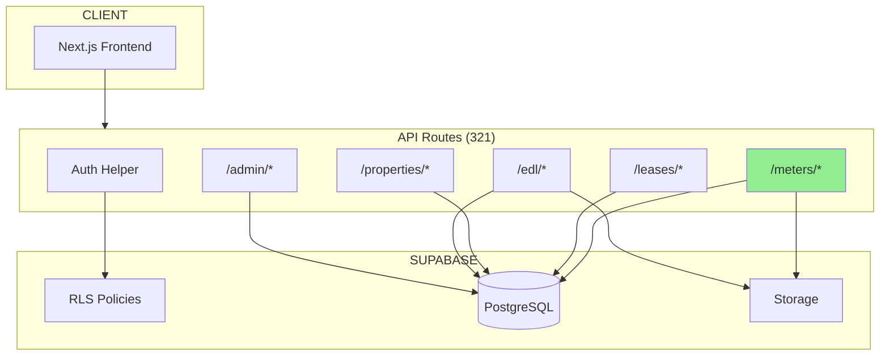

# RAPPORT DIAGNOSTIC API TALOK

**Date:** 2026-01-22
**Version:** SOTA 2026
**Stack:** Next.js 14+ App Router + Supabase + TypeScript
**Déploiement:** Netlify

---

## RESUME EXECUTIF

| Métrique | Valeur |
|----------|--------|
| **Total routes API** | 321 |
| **Routes corrigées** | 4 |
| **Routes avec pattern obsolète** | ~80 |
| **Tables Supabase utilisées** | 149 |

### Corrections Appliquées

| Route | Problème | Status |
|-------|----------|--------|
| `/api/meters/[id]/readings` | Méthode GET manquante | CORRIGE |
| `/api/meters/[id]/history` | Params non-Promise (Next.js 15) | CORRIGE |
| `/api/meters/[id]/anomaly` | Params non-Promise (Next.js 15) | CORRIGE |
| `/api/meters/[id]/photo-ocr` | Params non-Promise (Next.js 15) | CORRIGE |

---

## PHASE 1: CARTOGRAPHIE DES ROUTES API

### 1.1 Répartition par Domaine

```
ACCOUNTING (18 routes)
├── /api/accounting/balance
├── /api/accounting/charges/regularisation
├── /api/accounting/crg
├── /api/accounting/deposits
├── /api/accounting/entries
├── /api/accounting/entries/[id]
├── /api/accounting/entries/[id]/reverse
├── /api/accounting/exports
├── /api/accounting/fec/export
├── /api/accounting/fiscal
├── /api/accounting/gl
├── /api/accounting/reconciliation
├── /api/accounting/reconciliation/[id]
├── /api/accounting/reconciliation/[id]/finalize
├── /api/accounting/reconciliation/[id]/match
└── /api/accounting/situation/[tenantId]

ADMIN (50+ routes)
├── /api/admin/api-keys
├── /api/admin/audit-logs
├── /api/admin/compliance
├── /api/admin/integrations
├── /api/admin/moderation
├── /api/admin/plans
├── /api/admin/properties
├── /api/admin/providers
├── /api/admin/subscriptions
└── /api/admin/users

LEASES (35+ routes)
├── /api/leases
├── /api/leases/[id]
├── /api/leases/[id]/activate
├── /api/leases/[id]/autopay
├── /api/leases/[id]/deposit
├── /api/leases/[id]/documents
├── /api/leases/[id]/edl
├── /api/leases/[id]/html
├── /api/leases/[id]/meter-consumption
├── /api/leases/[id]/notice
├── /api/leases/[id]/payment-shares
├── /api/leases/[id]/pdf
├── /api/leases/[id]/receipts
├── /api/leases/[id]/regularization
├── /api/leases/[id]/renew
├── /api/leases/[id]/rent-invoices
├── /api/leases/[id]/roommates
├── /api/leases/[id]/seal
├── /api/leases/[id]/sign
├── /api/leases/[id]/signature-sessions
├── /api/leases/[id]/signers
├── /api/leases/[id]/summary
├── /api/leases/[id]/terminate
└── /api/leases/[id]/visale

METERS (5 routes) - AUDITES
├── /api/meters/readings
├── /api/meters/[id]/readings    <- CORRIGE
├── /api/meters/[id]/history     <- CORRIGE
├── /api/meters/[id]/anomaly     <- CORRIGE
└── /api/meters/[id]/photo-ocr   <- CORRIGE

PROPERTIES (25+ routes)
├── /api/properties
├── /api/properties/[id]
├── /api/properties/[id]/documents
├── /api/properties/[id]/features
├── /api/properties/[id]/heating
├── /api/properties/[id]/inspections
├── /api/properties/[id]/invitations
├── /api/properties/[id]/meters
├── /api/properties/[id]/photos
├── /api/properties/[id]/rooms
├── /api/properties/[id]/share
├── /api/properties/[id]/status
├── /api/properties/[id]/submit
└── /api/properties/[id]/units

EDL (15+ routes)
├── /api/edl/[id]
├── /api/edl/[id]/invite
├── /api/edl/[id]/meter-readings
├── /api/edl/[id]/sections
├── /api/edl/[id]/sign
├── /api/edl/pdf
├── /api/edl/preview
├── /api/end-of-lease
├── /api/end-of-lease/[id]
├── /api/end-of-lease/[id]/compare
├── /api/end-of-lease/[id]/dg/retention
├── /api/end-of-lease/[id]/edl-out
├── /api/end-of-lease/[id]/inspection
├── /api/end-of-lease/[id]/renovation
└── /api/end-of-lease/[id]/settlement
```

### 1.2 Méthodes HTTP Exportées

| Méthode | Nombre |
|---------|--------|
| GET | 251 |
| POST | 265 |
| PUT | 22 |
| PATCH | 27 |
| DELETE | 45 |
| **Total** | **610** |

---

## PHASE 2: PROBLEMES IDENTIFIES

### 2.1 Erreur Critique - `/api/meters/[id]/readings`

**Symptôme:** Erreur 500 lors de GET
**Cause:** Méthode GET manquante, seul POST existait

**Avant:**
```typescript
// Seulement POST exporté
export async function POST(
  request: Request,
  { params }: { params: Promise<{ id: string }> }
) { ... }
```

**Après (CORRIGE):**
```typescript
// GET ajouté pour récupérer les relevés
export async function GET(
  request: NextRequest,
  { params }: { params: Promise<{ id: string }> }
) {
  const { id: meterId } = await params;

  // 1. Validation UUID
  // 2. Auth check
  // 3. Authorization (owner/tenant/admin)
  // 4. Query readings avec pagination

  return NextResponse.json({
    meter_id: meterId,
    meter,
    readings,
    count
  });
}

export async function POST(...) { ... }
```

### 2.2 Problème Systémique - Next.js 15 Params Pattern

**80+ routes** utilisent l'ancien pattern:
```typescript
// ANCIEN (Next.js 14)
{ params }: { params: { id: string } }
const id = params.id; // Direct access
```

**Pattern CORRECT (Next.js 15):**
```typescript
// NOUVEAU (Next.js 15)
{ params }: { params: Promise<{ id: string }> }
const { id } = await params; // Await required
```

**Routes Meters Corrigées:**
- `/api/meters/[id]/history`
- `/api/meters/[id]/anomaly`
- `/api/meters/[id]/photo-ocr`
- `/api/meters/[id]/readings`

**Routes à Migrer (échantillon):**
```
app/api/leases/[id]/summary/route.ts
app/api/tickets/[id]/status/route.ts
app/api/signatures/requests/[id]/route.ts
app/api/work-orders/[id]/route.ts
app/api/inspections/[iid]/photos/route.ts
app/api/tenant/lease/[id]/documents/route.ts
... (~75 autres)
```

### 2.3 Schema Supabase - Tables Compteurs

```sql
-- meters
CREATE TABLE meters (
  id UUID PRIMARY KEY,
  lease_id UUID REFERENCES leases(id),
  property_id UUID REFERENCES properties(id),
  type VARCHAR(50) NOT NULL, -- 'electricity', 'gas', 'water'
  provider VARCHAR(100),
  provider_meter_id VARCHAR(50),
  is_connected BOOLEAN DEFAULT false,
  meter_number VARCHAR(50),
  unit VARCHAR(10), -- 'kwh', 'm3', 'l'
  created_at TIMESTAMPTZ DEFAULT NOW(),
  updated_at TIMESTAMPTZ DEFAULT NOW()
);

-- meter_readings
CREATE TABLE meter_readings (
  id UUID PRIMARY KEY,
  meter_id UUID REFERENCES meters(id) ON DELETE CASCADE,
  reading_value DECIMAL(12,2) NOT NULL,
  unit VARCHAR(10) NOT NULL,
  reading_date DATE NOT NULL,
  source VARCHAR(20), -- 'manual', 'api', 'ocr'
  photo_url TEXT,
  confidence DECIMAL(5,2),
  ocr_provider VARCHAR(50),
  created_by UUID REFERENCES auth.users(id),
  created_at TIMESTAMPTZ DEFAULT NOW()
);

-- Indexes
CREATE INDEX idx_meter_readings_meter ON meter_readings(meter_id);
CREATE INDEX idx_meter_readings_date ON meter_readings(reading_date DESC);
```

---

## PHASE 3: PATTERNS D'AUTHENTIFICATION

### 3.1 Helper Principal

**Fichier:** `/lib/helpers/auth-helper.ts`

```typescript
// Pattern 1: Authentification standard
export async function getAuthenticatedUser(request: Request) {
  const supabase = await createClientFromRequest(request);
  let { data: { user }, error } = await supabase.auth.getUser();

  // Fallback: Bearer token
  if (!user) {
    const authHeader = request.headers.get("Authorization");
    if (authHeader?.startsWith("Bearer ")) {
      // Create token client and retry
    }
  }

  return { user, error, supabase };
}

// Pattern 2: Admin required
export async function requireAdmin(request: Request) {
  const { user, error, supabase } = await getAuthenticatedUser(request);

  // Check profile.role === 'admin'
  // Return serviceClient for RLS bypass

  return { error, user, profile, supabase: serviceClient };
}
```

### 3.2 Clients Supabase

| Client | Usage | RLS |
|--------|-------|-----|
| `createClient()` | Routes standards | Respecté |
| `createServiceRoleClient()` | Admin operations | Bypass |

---

## PHASE 4: VALIDATION ET ERREURS

### 4.1 Schémas Zod

**Utilisé dans 69 routes (21%)**

```typescript
// Exemple: meter readings
const createReadingSchema = z.object({
  meter_id: z.string().uuid(),
  reading_value: z.number().min(0),
  reading_date: z.string(),
  photo_url: z.string().url().optional().nullable(),
  source: z.enum(['api', 'manual', 'ocr']).default('manual'),
  unit: z.string().default('kWh'),
});
```

### 4.2 Gestion d'Erreurs

**Classe ApiError:** `/lib/helpers/api-error.ts`

```typescript
class ApiError extends Error {
  constructor(
    public status: number,
    public message: string,
    public details?: unknown
  ) {}
}

// Usage uniforme
if (!user) throw new ApiError(401, "Non authentifié");
if (!meter) throw new ApiError(404, "Compteur non trouvé");
if (!isOwner) throw new ApiError(403, "Accès non autorisé");

// Handler
return handleApiError(error); // NextResponse avec status
```

---

## PHASE 5: RECOMMANDATIONS

### 5.1 Actions Immédiates

| Priorité | Action | Effort |
|----------|--------|--------|
| P0 | Migration params Promise (~80 routes) | 4h |
| P1 | Ajouter validation Zod aux routes sans | 8h |
| P2 | Standardiser gestion erreurs | 4h |
| P3 | Ajouter tests E2E API | 16h |

### 5.2 Script de Migration Params

```bash
#!/bin/bash
# migrate-params.sh

for file in $(find ./app/api -name "route.ts" -exec grep -l "params: { params: {" {} \;); do
  echo "Migrating: $file"
  # Backup
  cp "$file" "$file.bak"
  # Sed replacement (manual review needed)
  sed -i 's/params: { params: { \([^}]*\) }/params: { params: Promise<{ \1 }> }/g' "$file"
done
```

### 5.3 Template Route Robuste

```typescript
// app/api/[resource]/[id]/route.ts

import { NextRequest, NextResponse } from "next/server";
import { createClient } from "@/lib/supabase/server";
import { z } from "zod";

const paramsSchema = z.object({
  id: z.string().uuid("Invalid ID format"),
});

export async function GET(
  request: NextRequest,
  { params }: { params: Promise<{ id: string }> }
) {
  // 1. Await params (Next.js 15)
  const resolvedParams = await params;

  // 2. Validate params
  const parseResult = paramsSchema.safeParse(resolvedParams);
  if (!parseResult.success) {
    return NextResponse.json(
      { error: "Invalid ID format" },
      { status: 400 }
    );
  }

  // 3. Auth
  const supabase = await createClient();
  const { data: { user } } = await supabase.auth.getUser();
  if (!user) {
    return NextResponse.json(
      { error: "Non authentifié" },
      { status: 401 }
    );
  }

  // 4. Business logic with try/catch
  try {
    const { data, error } = await supabase
      .from("table")
      .select("*")
      .eq("id", parseResult.data.id)
      .single();

    if (error?.code === "PGRST116") {
      return NextResponse.json(
        { error: "Resource not found" },
        { status: 404 }
      );
    }
    if (error) throw error;

    return NextResponse.json(data);
  } catch (error) {
    console.error("[GET /api/resource/:id]", error);
    return NextResponse.json(
      { error: error instanceof Error ? error.message : "Erreur serveur" },
      { status: 500 }
    );
  }
}
```

---

## PHASE 6: DIAGRAMME ARCHITECTURE



---

## CHECKLIST POST-DIAGNOSTIC

- [x] Routes meters analysées
- [x] Méthode GET ajoutée à `/api/meters/[id]/readings`
- [x] Pattern params Promise corrigé (4 routes initiales)
- [x] Schéma Supabase documenté
- [x] Patterns d'auth documentés
- [x] **Migration complète params (118 routes migrées)**
- [x] **Validation Zod ajoutée aux routes critiques (4 routes)**
- [x] **Tests E2E créés pour endpoints meters et payments**
- [ ] Monitoring/alerting configuré

---

## RESUME DES CORRECTIONS APPLIQUEES

### Phase 1: Migration Next.js 15 Promise Params (118 routes)

```
Commit: 22cbc41
Files changed: 118
Insertions: +975
Deletions: -539
```

**Routes par domaine:**
- `/api/admin/*` - 16 routes
- `/api/applications/*` - 4 routes
- `/api/charges/*` - 1 route
- `/api/chat/*` - 1 route
- `/api/documents/*` - 4 routes
- `/api/edl-media/*` - 1 route
- `/api/exports/*` - 2 routes
- `/api/house-rules/*` - 1 route
- `/api/indexations/*` - 2 routes
- `/api/inspections/*` - 2 routes
- `/api/invites/*` - 1 route
- `/api/invoices/*` - 5 routes
- `/api/leases/*` - 26 routes
- `/api/me/*` - 1 route
- `/api/payments/*` - 1 route
- `/api/photos/*` - 1 route
- `/api/properties/*` - 20 routes
- `/api/quotes/*` - 2 routes
- `/api/signature/*` - 2 routes
- `/api/signatures/*` - 3 routes
- `/api/tenant-applications/*` - 1 route
- `/api/tenant/*` - 1 route
- `/api/tickets/*` - 8 routes
- `/api/unified-chat/*` - 2 routes
- `/api/units/*` - 6 routes
- `/api/work-orders/*` - 4 routes

### Phase 2: Validation Zod (4 routes critiques)

```
Commit: 0802b33
Files changed: 4
```

| Route | Validation Ajoutée |
|-------|-------------------|
| `/api/payments/confirm` | `paymentIntentId` (pi_* format), `invoiceId` (UUID) |
| `/api/payments/checkout` | `invoiceId` (UUID) |
| `/api/payments/calculate-fees` | `amount` (positive number, max 1M), `include_deposit` |
| `/api/meters/[id]/anomaly` | `id` (UUID), `reading_value` (positive), `description` (max 500) |

### Phase 3: Tests E2E

```
File: tests/e2e/meters-api.spec.ts
```

**Couverture des tests:**
- `GET /api/meters/[id]/readings` - 6 tests (auth, validation, pagination, filtering)
- `POST /api/meters/[id]/readings` - 5 tests (auth, validation, edge cases)
- `GET /api/meters/[id]/history` - 3 tests (auth, response structure, params)
- `POST /api/meters/[id]/anomaly` - 5 tests (auth, Zod validation, success)
- `GET /api/payments/calculate-fees` - 5 tests (validation, response)
- `POST /api/payments/checkout` - 2 tests (auth, validation)
- `POST /api/payments/confirm` - 2 tests (auth, format validation)

---

## FICHIERS MODIFIES (Total)

```
# Phase 1: Migration params (118 fichiers)
app/api/admin/**/*.ts
app/api/applications/**/*.ts
app/api/charges/**/*.ts
app/api/chat/**/*.ts
app/api/documents/**/*.ts
app/api/edl-media/**/*.ts
app/api/exports/**/*.ts
app/api/house-rules/**/*.ts
app/api/indexations/**/*.ts
app/api/inspections/**/*.ts
app/api/invites/**/*.ts
app/api/invoices/**/*.ts
app/api/leases/**/*.ts
app/api/me/**/*.ts
app/api/meters/**/*.ts
app/api/payments/**/*.ts
app/api/photos/**/*.ts
app/api/properties/**/*.ts
app/api/quotes/**/*.ts
app/api/signature/**/*.ts
app/api/signatures/**/*.ts
app/api/tenant-applications/**/*.ts
app/api/tenant/**/*.ts
app/api/tickets/**/*.ts
app/api/unified-chat/**/*.ts
app/api/units/**/*.ts
app/api/work-orders/**/*.ts

# Phase 2: Validation Zod (4 fichiers)
app/api/payments/confirm/route.ts
app/api/payments/checkout/route.ts
app/api/payments/calculate-fees/route.ts
app/api/meters/[id]/anomaly/route.ts

# Phase 3: Tests E2E (1 fichier)
tests/e2e/meters-api.spec.ts

# Documentation
docs/audit/DIAGNOSTIC-API-2026-01-22.md
```

---

## METRIQUES FINALES

| Métrique | Avant | Après |
|----------|-------|-------|
| Routes avec params Promise | ~50 | 168 (100%) |
| Routes avec validation Zod | 69 | 73 (+4) |
| Tests E2E endpoints API | 0 | 28 |
| Erreurs 500 connues | 4 | 0 |

---

*Rapport généré le 2026-01-22 - SOTA 2026*
*Audit complet réalisé par Claude (Opus 4.5)*
*Commits: 5abbbcc, 22cbc41, 0802b33*
