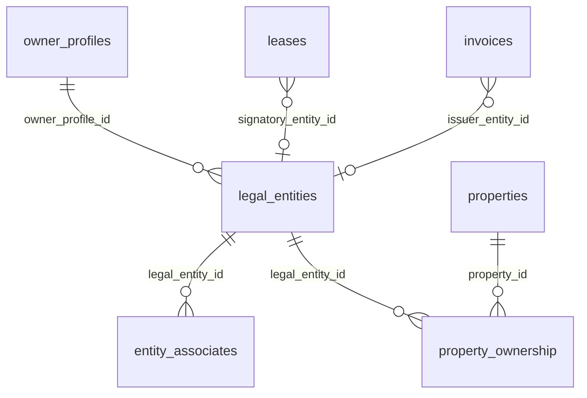

# Audit Approfondi — UX, Flux de Données & Migration Multi-Entités (Talok)

**Date** : 5 février 2026
**Version** : 2.0
**Auditeur** : Claude (Architecture logicielle)
**Référence** : Complément à `AUDIT_ARCHITECTURE_MULTI_ENTREPRISES.md` v1.0
**Stack** : Next.js 14+ App Router, Supabase (PostgreSQL + RLS), TypeScript, pdf-lib

---

## PARTIE A — Audit UX/UI de la page Profil actuelle

### A.1 Structure actuelle (`app/owner/profile/profile-form.tsx`)

La page `/owner/profile` est composée d'un unique composant `ProfileForm` qui expose **2 cartes** :

| # | Carte | Champs | Source DB |
|---|-------|--------|-----------|
| 1 | **Identité & contact** | Avatar, Prénom*, Nom*, Téléphone, Date de naissance, Lieu de naissance | `profiles` |
| 2 | **Profil propriétaire** | Type (particulier/société), Raison sociale*, Forme juridique*, SIRET*, Adresse siège*, TVA, IBAN, Adresse de facturation | `owner_profiles` |

> Les champs marqués `*` sont obligatoires (conditionnellement pour les champs société).

### A.2 Observations UX détaillées

#### Points positifs
- **Jauge de complétion** (`ProfileCompletion`) en haut à droite — encourage à remplir
- **Validation Luhn** du SIRET côté client (`validateSiret` dans `use-profile-form.ts:95-109`)
- **Warning de navigation** si modifications non sauvegardées (`useUnsavedChangesWarning`)
- **Sauvegarde unifiée** : un seul bouton pour `profiles` + `owner_profiles` en parallèle
- **Upload avatar** avec validation de taille (2 Mo) et format (JPEG/PNG/WEBP)

#### Problèmes identifiés

| # | Problème | Fichier | Impact |
|---|----------|---------|--------|
| P1 | **Pas de notion de "Représentant légal"** visible dans le formulaire. Les champs `representant_nom` et `representant_qualite` existent dans `owner_profiles` mais ne sont PAS exposés dans le formulaire. | `profile-form.tsx` | Le bail affiche un représentant vide ou auto-calculé par `lease-to-template.ts:131` |
| P2 | **Mono-entité** : Un seul type (particulier OU société) par profil. Pas de possibilité de gérer 2+ sociétés. | `use-profile-form.ts:23` (`owner_type: OwnerType`) | Bloquant pour un propriétaire ayant une SCI + détention directe |
| P3 | **Pas de sélection d'entité** lors de la création de bail. `LeaseWizard.tsx` pré-remplit le bailleur depuis le profil unique. | `LeaseWizard.tsx:~200` | Impossible d'attribuer un bail à une SCI spécifique |
| P4 | **Adresse facturation vs siège** confuse : 2 champs d'adresse sans indication claire de leur usage dans les documents | `profile-form.tsx:346-406` | L'adresse utilisée dans les documents dépend d'une cascade `adresse_facturation || adresse_siege` |
| P5 | **Pas de DOM-TOM** : Aucun champ spécifique pour la zone géographique fiscale (TVA réduite Guadeloupe/Martinique/Réunion, exonération Guyane/Mayotte) | `profile-form.tsx` | Risque d'erreur fiscale pour les propriétaires ultramarins |
| P6 | **IBAN unique** : Un seul IBAN par profil alors qu'un propriétaire peut avoir des comptes bancaires différents par entité | `use-profile-form.ts:29` | Virements Stripe potentiellement dirigés vers le mauvais compte |
| P7 | **Pas de validation SIREN** (seulement SIRET Luhn). Pas de vérification via l'API INSEE/Sirene. | `use-profile-form.ts:95-109` | Risque de SIRET invalide en production |

### A.3 Capture d'écran observée (Marie-Line VOLBERG / ATOMGISTE SCI)

L'utilisatrice a :
- **Profil** : Marie-Line VOLBERG, Fort-de-France (Martinique — DOM-TOM 972)
- **Type** : Société → ATOMGISTE (SCI)
- **Problème visible** : Son profil mélange son identité personnelle ET celle de sa SCI dans le même écran, sans possibilité de gérer une seconde structure.

---

## PARTIE B — Propositions UX/UI pour la gestion multi-entreprises

### B.1 Company Switcher (Header)

```
┌─────────────────────────────────────────────────────┐
│  🏠 Talok    [ATOMGISTE (SCI) ▼]    Marie-Line  👤 │
│              ┌─────────────────────┐                │
│              │ ✅ ATOMGISTE (SCI)  │                │
│              │    SCI DUVAL        │                │
│              │    En nom propre    │                │
│              │ ──────────────────  │                │
│              │ + Nouvelle entité   │                │
│              └─────────────────────┘                │
└─────────────────────────────────────────────────────┘
```

**Comportement** :
- Dropdown dans le header (`components/layout/owner-app-layout.tsx:524 lignes`)
- Change `activeEntityId` dans le store Zustand
- Filtre automatiquement les biens, baux, factures, documents du dashboard
- Badge de couleur par entité (champ `couleur` de `legal_entities`)

### B.2 Carte Entité (Liste)

```
┌──────────────────────────────────────────┐
│  🟢  ATOMGISTE                           │
│  SCI à l'IR • SIRET 123 456 789 00011   │
│  ──────────────────────────────────────  │
│  3 biens  •  2 baux actifs  •  1 850€/m │
│                                          │
│  [Voir détails]        [⋯]              │
└──────────────────────────────────────────┘
```

### B.3 Stepper de création d'entité

```
Étape 1/5: Type         → particulier | sci_ir | sci_is | sarl | sas | indivision | ...
Étape 2/5: Identité     → Nom, SIREN/SIRET, RCS, Forme juridique
Étape 3/5: Fiscalité    → Régime fiscal, TVA, Exercice comptable
Étape 4/5: Associés     → Gérants, parts, démembrement
Étape 5/5: Bancaire     → IBAN dédié, Stripe Connect
```

### B.4 Page détaillée d'une entité (5 onglets)

| Onglet | Contenu | Source de données |
|--------|---------|-------------------|
| **Identité** | Nom, type, SIRET, RCS, forme juridique, capital, siège | `legal_entities` |
| **Associés** | Liste des associés, parts, % capital, rôles (gérant, président) | `entity_associates` |
| **Biens** | Liste des propriétés détenues, mode de détention, quote-part | `property_ownership` + `properties` |
| **Fiscalité** | Régime fiscal, TVA, exercice, récapitulatif annuel | `legal_entities` + calcul |
| **Documents** | Baux, quittances, EDL, CRG filtrés par entité | `documents` + `leases` |

### B.5 Sélection d'entité dans le LeaseWizard

Ajout d'un `<Select>` en étape 1 du wizard :

```
┌──────────────────────────────────────────────┐
│  Bailleur                                     │
│  ┌────────────────────────────────────────┐   │
│  │  Sélectionner l'entité signataire  ▼   │   │
│  │  ✅ ATOMGISTE (SCI) - 972 Fort-de-Fr. │   │
│  │     SCI DUVAL                          │   │
│  │     Marie-Line VOLBERG (nom propre)    │   │
│  └────────────────────────────────────────┘   │
│                                               │
│  Nom: ATOMGISTE          (auto-rempli)        │
│  SIRET: 123 456 789 00011                     │
│  Adresse: 12 rue... Fort-de-France 97200      │
│  Représentant: Marie-Line VOLBERG, Gérante    │
└──────────────────────────────────────────────┘
```

---

## PARTIE C — Données requises par entité pour un fonctionnement optimal

### C.1 Champs minimum par entité juridique

| Champ | Type | Obligatoire | Utilisé par |
|-------|------|-------------|-------------|
| `nom` | string | ✅ | Tous les documents |
| `entity_type` | enum | ✅ | Logique conditionnelle bail (durée 3/6 ans) |
| `siret` | string(14) | ✅ si société | Bail, Quittance, CRG, Fiscal |
| `siren` | string(9) | ✅ si société | Identifiant unique entreprise |
| `adresse_siege` | text | ✅ | Bail (adresse bailleur), Quittance |
| `code_postal_siege` | string | ✅ | DOM-TOM TVA |
| `ville_siege` | string | ✅ | Documents |
| `forme_juridique` | string | ✅ si société | Bail (mention légale) |
| `capital_social` | number | Recommandé | Bail (mention SCI) |
| `regime_fiscal` | enum | ✅ | Récap fiscal, CRG |
| `tva_assujetti` | boolean | ✅ | Facturation, TVA DOM-TOM |
| `tva_regime` | enum | Si assujetti | Calcul TVA |
| `iban` | string | Recommandé | Stripe Connect, virements |
| `bic` | string | Recommandé | Virements internationaux |
| `rcs_ville` | string | Recommandé | Mention légale bail |
| `numero_tva` | string | Si assujetti | Facturation |

### C.2 Champs par associé

| Champ | Type | Obligatoire | Usage |
|-------|------|-------------|-------|
| `nom` / `prenom` | string | ✅ | Identification |
| `nombre_parts` | number | ✅ | % capital |
| `is_gerant` | boolean | ✅ | Représentant légal dans bail |
| `date_naissance` | date | Recommandé | Bail (identité représentant) |
| `adresse` | text | Recommandé | Correspondance |
| `type_detention` | enum | ✅ | Nue-propriété vs usufruit |

### C.3 Champs DOM-TOM requis

| Zone | TVA | Spécificité |
|------|-----|-------------|
| Guadeloupe (971) | 8,5% réduit | TVA locale |
| Martinique (972) | 8,5% réduit | TVA locale |
| Réunion (974) | 8,5% réduit | TVA locale |
| Guyane (973) | 0% (exonéré) | Pas de TVA |
| Mayotte (976) | 0% (exonéré) | Pas de TVA |

→ Le `code_postal_siege` de l'entité permet de déduire la zone fiscale automatiquement.

---

## PARTIE D — Architecture technique cible

### D.1 Modèle de données (déjà en place)



**Existant en DB** : Les tables `legal_entities`, `entity_associates`, `property_ownership` existent déjà avec les colonnes nécessaires.
**Manquant** : Le branchement des générateurs de documents sur ces tables.

### D.2 Routes à créer/modifier

| Route | Action | Priorité |
|-------|--------|----------|
| `app/owner/entities/page.tsx` | Liste des entités | P0 |
| `app/owner/entities/new/page.tsx` | Stepper de création | P0 |
| `app/owner/entities/[id]/page.tsx` | Détail (5 onglets) | P0 |
| `app/owner/entities/[id]/edit/page.tsx` | Édition | P1 |
| `app/api/entities/route.ts` | CRUD API | P0 |
| `app/api/entities/[id]/route.ts` | GET/PATCH/DELETE | P0 |
| `app/api/entities/[id]/associates/route.ts` | Associés CRUD | P1 |
| `app/api/entities/[id]/properties/route.ts` | Biens de l'entité | P1 |

### D.3 Server Actions

```typescript
// actions/entities.ts
"use server"

export async function createEntityAction(data: CreateLegalEntityDTO) { ... }
export async function updateEntityAction(id: string, data: UpdateLegalEntityDTO) { ... }
export async function deleteEntityAction(id: string) { ... }
export async function switchActiveEntityAction(entityId: string) { ... }
```

> Le service `features/legal-entities/services/legal-entities.service.ts` (748 lignes) existe déjà avec CRUD complet, associés, ownership, transfert, suppression sécurisée, recherche SIREN.

### D.4 Store Zustand

```typescript
// store/entity-store.ts
interface EntityState {
  entities: LegalEntity[];
  activeEntityId: string | null;  // null = "En nom propre"
  isLoading: boolean;

  // Actions
  setActiveEntity: (id: string | null) => void;
  fetchEntities: () => Promise<void>;
  getActiveEntity: () => LegalEntity | null;
}
```

**Intégration** : Le `OwnerDataProvider` (`app/owner/_data/OwnerDataProvider.tsx`) doit exposer `entities`, `activeEntityId` et `setActiveEntity` (actuellement absents).

### D.5 RLS Policies

Les policies RLS pour `legal_entities` existent déjà dans la migration :
```sql
-- Existant: legal_entities_owner_policy
CREATE POLICY "legal_entities_owner_policy" ON legal_entities
  FOR ALL USING (
    owner_profile_id IN (
      SELECT id FROM owner_profiles WHERE profile_id = auth.uid()
    )
  );
```

**À ajouter** : Policy de filtrage par `signatory_entity_id` sur `leases` et `issuer_entity_id` sur `invoices` pour le dashboard filtré par entité.

---

## PARTIE E — Cartographie des flux de données

### E.1 Flux : Bail (PDF)

```
UI: Bouton "Télécharger le bail"
  │
  ▼
API: GET /api/leases/[id]/pdf/route.ts
  │
  ├─ Supabase query: profiles.select("id, role, prenom, nom, telephone, date_naissance")
  │   └─ WHERE user_id = auth.uid()
  │
  ├─ Supabase query: leases.select("*, property:properties(...), signers:lease_signers(...)")
  │   └─ WHERE id = leaseId
  │
  ├─ Supabase query: owner_profiles.select("*")                    ← ⚠️ PAS legal_entities
  │   └─ WHERE profile_id = property.owner_id
  │
  ▼
Mapper: mapLeaseToTemplate(details, ownerProfile)          [lib/mappers/lease-to-template.ts]
  │
  ├─ bailleur.nom        ← ownerProfile.nom || "[NOM PROPRIÉTAIRE]"
  ├─ bailleur.prenom     ← ownerProfile.prenom || ""
  ├─ bailleur.adresse    ← ownerProfile.adresse || "[ADRESSE]"
  ├─ bailleur.type       ← ownerProfile.type === "societe" ? "societe" : "particulier"
  ├─ bailleur.raison_sociale    ← ownerProfile.raison_sociale || ""
  ├─ bailleur.forme_juridique   ← ownerProfile.forme_juridique || "SCI"
  ├─ bailleur.siret             ← ownerProfile.siret || ""
  ├─ bailleur.representant_nom  ← ownerProfile.representant_nom || (societe ? nom+prenom : "")
  └─ bailleur.representant_qualite ← ownerProfile.representant_qualite || (societe ? "Gérant" : "")
  │
  ▼
Template: LeaseTemplateService.generateHTML(typeBail, bailData)    [lib/templates/bail/]
  │
  ▼
PDF: generatePDF(html) → Uint8Array → Supabase Storage
  │
  ▼
Sortie: URL signée 1h ou buffer direct
```

**Route directe (api/leases/[id]/pdf/route.ts:199-287)** : Construit AUSSI les données bailleur directement, en parallèle du mapper, avec une logique similaire mais légèrement différente :
- `bailleur.nom` = `isOwnerSociete ? raison_sociale : profile.nom`
- `bailleur.adresse` = `ownerAddress || property.adresse_complete`

→ **RISQUE** : Deux chemins de construction des données bailleur (mapper ET route directe), potentiellement incohérents.

### E.2 Flux : État des Lieux (EDL PDF)

```
UI: Bouton "Générer l'EDL"
  │
  ▼
Service: features/end-of-lease/services/end-of-lease.service.ts
  │
  ├─ Supabase query: owner_profiles.select("*, profile:profiles(nom, prenom, email, telephone)")
  │   └─ WHERE profile_id = property.owner_id            ← ⚠️ PAS legal_entities
  │
  ▼
Mapper: mapEdlToTemplate(rawEdl, ownerProfile)           [lib/mappers/edl-to-template.ts]
  │
  ├─ bailleur.type           ← ownerProfile.type || "particulier"
  ├─ bailleur.nom_complet    ← societe ? raison_sociale : prenom+nom
  ├─ bailleur.raison_sociale ← ownerProfile.raison_sociale || undefined
  ├─ bailleur.representant   ← ownerProfile.representant_nom || prenom+nom (fallback)
  ├─ bailleur.adresse        ← ownerProfile.adresse_facturation || undefined
  └─ bailleur.siret          ← ownerProfile.siret (implicite via RawOwnerProfile)
  │
  ▼
Template: EDLTemplateService.generateHTML(data)           [lib/templates/edl/]
  │
  ▼
PDF: pdf-lib ou html2pdf → Storage
```

### E.3 Flux : Quittance de loyer (Receipt PDF)

```
UI: Bouton "Télécharger la quittance"
  │
  ▼
API: GET /api/payments/[pid]/receipt/route.ts
  │
  ├─ Supabase query: profiles.select("prenom, nom")
  │   └─ WHERE id = invoice.owner_id
  │
  ├─ Supabase query: owner_profiles.select("siret, adresse_facturation, adresse_siege, type, raison_sociale")
  │   └─ WHERE profile_id = invoice.owner_id            ← ⚠️ PAS legal_entities
  │
  ▼
Construction ReceiptData:                                [receipt/route.ts:162-191]
  │
  ├─ ownerName    ← isOwnerSociete ? raison_sociale : prenom+" "+nom
  ├─ ownerAddress ← adresse_facturation || adresse_siege || ""
  └─ ownerSiret   ← ownerDetails.siret || undefined
  │
  ▼
Générateur: generateReceiptPDF(receiptData)              [lib/services/receipt-generator.ts]
  │  (Conforme ALUR - Décret n°2015-587)
  ▼
PDF: pdf-lib → Supabase Storage → URL signée 1h
```

### E.4 Flux : Compte Rendu de Gestion (CRG PDF)

```
Source données: crg.proprietaire (passé en paramètre)
  │
  ├─ ownerName ← crg.proprietaire.raison_sociale || prenom+" "+nom
  │                                                      [pdf-export.service.ts:165-166]
  ▼
Générateur: generateCRGPDF(crg)                          [features/accounting/services/pdf-export.service.ts]
  │  Utilise pdf-lib directement
  ▼
PDF: Uint8Array
```

### E.5 Flux : Récapitulatif Fiscal (PDF)

```
Source données: recap.proprietaire (passé en paramètre)
  │
  ├─ ownerName ← recap.proprietaire.raison_sociale || prenom+" "+nom
  │                                                      [pdf-export.service.ts:595-596]
  ▼
Générateur: generateFiscalPDF(recap)                     [features/accounting/services/pdf-export.service.ts]
  │  Déclaration 2044 - Aide au remplissage
  ▼
PDF: Uint8Array
```

### E.6 Flux : Signature électronique

```
Création demande:
  │
  ├─ signature_requests.owner_id = createdBy (profile_id)     ← ⚠️ PAS entity_id
  ├─ signataires.first_name / last_name = profile.prenom/nom  ← ⚠️ PAS entité
  │
  ▼
Service: lib/signatures/service.ts
  │  Système interne SES (pas YouSign)
  │  Audit trail + token-based
  │  ⚠️ Aucune référence à legal_entities
  ▼
Preuve: lib/services/signature-proof.service.ts (eIDAS)
```

### E.7 Synthèse des flux — Source de données propriétaire

| Document | Query source | Table utilisée | `legal_entities` ? |
|----------|-------------|----------------|---------------------|
| **Bail PDF** (route) | `owner_profiles.select("*").eq("profile_id", owner_id)` | `owner_profiles` | ❌ Non |
| **Bail PDF** (mapper) | `ownerProfile` passé en param depuis route | `owner_profiles` | ❌ Non |
| **EDL PDF** | `owner_profiles.select("*, profile:profiles(…)")` | `owner_profiles` + `profiles` | ❌ Non |
| **Quittance PDF** | `profiles` + `owner_profiles` (2 queries) | `profiles` + `owner_profiles` | ❌ Non |
| **CRG PDF** | `crg.proprietaire` (passé en param) | Dépend de l'appelant | ❌ Non |
| **Récap Fiscal** | `recap.proprietaire` (passé en param) | Dépend de l'appelant | ❌ Non |
| **Signature** | `signature_requests.owner_id` | `profiles` | ❌ Non |
| **Email** | `profile.prenom + profile.nom` | `profiles` | ❌ Non |

**Conclusion critique** : **AUCUN** document ne source ses données depuis `legal_entities`. Tous utilisent `profiles` + `owner_profiles`. Le branchement sur `legal_entities` est le coeur de la migration.

---

## PARTIE F — Matrice de dépendances critique

### F.1 Colonnes `owner_profiles` → Documents

| Colonne `owner_profiles` | Bail | EDL | Quittance | CRG | Fiscal | Signature |
|--------------------------|------|-----|-----------|-----|--------|-----------|
| `type` (particulier/societe) | ✅ Durée bail + nom | ✅ nom_complet | ✅ ownerName | — | — | — |
| `raison_sociale` | ✅ bailleur.raison_sociale | ✅ bailleur.nom_complet | ✅ ownerName (si société) | ✅ | ✅ | — |
| `forme_juridique` | ✅ bailleur.forme_juridique | — | — | — | — | — |
| `siret` | ✅ bailleur.siret | ⚠️ implicite | ✅ ownerSiret | — | — | — |
| `adresse_facturation` | ✅ bailleur.adresse | ✅ bailleur.adresse | ✅ ownerAddress (priorité) | — | — | — |
| `adresse_siege` | ⚠️ fallback | — | ✅ ownerAddress (fallback) | — | — | — |
| `representant_nom` | ✅ bailleur.representant_nom | ✅ bailleur.representant | — | — | — | — |
| `representant_qualite` | ✅ bailleur.representant_qualite | — | — | — | — | — |
| `tva` | — | — | — | — | ⚠️ | — |
| `iban` | — | — | — | — | — | — |

### F.2 Colonnes `profiles` → Documents

| Colonne `profiles` | Bail | EDL | Quittance | CRG | Fiscal | Signature |
|--------------------|------|-----|-----------|-----|--------|-----------|
| `nom` | ✅ bailleur.nom (si particulier) | ✅ nom_complet (si particulier) | ✅ ownerName (si particulier) | ✅ | ✅ | ✅ first_name/last_name |
| `prenom` | ✅ bailleur.prenom | ✅ nom_complet | ✅ ownerName | ✅ | ✅ | ✅ |
| `telephone` | ✅ bailleur.telephone | — | — | — | — | — |
| `email` | ✅ bailleur.email | — | — | — | — | — |
| `date_naissance` | ✅ bailleur.date_naissance | — | — | — | — | — |

### F.3 Colonnes `legal_entities` cibles (à brancher)

| Colonne `legal_entities` | Remplace | Documents impactés |
|--------------------------|----------|--------------------|
| `nom` | `raison_sociale` (owner_profiles) | Bail, EDL, Quittance, CRG, Fiscal |
| `siret` | `siret` (owner_profiles) | Bail, EDL, Quittance |
| `adresse_siege` + `code_postal_siege` + `ville_siege` | `adresse_siege` / `adresse_facturation` (owner_profiles) | Bail, EDL, Quittance |
| `forme_juridique` | `forme_juridique` (owner_profiles) | Bail |
| `entity_type` | `type` (owner_profiles) | Bail (durée), EDL (nom_complet) |
| `capital_social` + `nombre_parts` | — (nouveau) | Bail (mention SCI) |
| `regime_fiscal` | — (nouveau) | Récap Fiscal, CRG |
| `tva_assujetti` + `tva_regime` | `tva` (owner_profiles) | Facturation |
| `iban` + `bic` | `iban` (owner_profiles) | Stripe Connect |

**Représentant légal** : Passe par `entity_associates WHERE is_gerant = true` au lieu de `owner_profiles.representant_nom`.

---

## PARTIE G — 10 risques de régression à vérifier dans le code

### RISQUE 1 : Bail — Nom du bailleur

**Fichier** : `app/api/leases/[id]/pdf/route.ts:205-206`
**Code actuel** :
```typescript
bailleur: {
  nom: isOwnerSociete ? (ownerProfile.raison_sociale || "") : (profile.nom || ""),
```
**Risque** : Si migration vers `legal_entities`, la query `owner_profiles.select("*")` (ligne 182-186) doit être remplacée par une query sur `legal_entities` via `lease.signatory_entity_id`. Si `signatory_entity_id` est NULL (baux existants), **fallback obligatoire** sur `owner_profiles`.
**Sévérité** : 🔴 Critique — Nom manquant = bail invalide juridiquement.

### RISQUE 2 : Bail — Double chemin de construction

**Fichiers** : `api/leases/[id]/pdf/route.ts:199-287` ET `lib/mappers/lease-to-template.ts:113-134`
**Risque** : Deux logiques parallèles construisent les données `bailleur`. La route API construit directement (`isOwnerSociete ? raison_sociale : profile.nom`), tandis que le mapper utilise `ownerProfile.nom || "[NOM]"`. Si la migration ne modifie qu'un seul chemin, incohérence entre le PDF généré via l'API directe vs via le mapper.
**Sévérité** : 🟠 Haute — Incohérence entre les deux chemins de génération.

### RISQUE 3 : Quittance — ownerName/ownerAddress/ownerSiret

**Fichier** : `app/api/payments/[pid]/receipt/route.ts:144-175`
**Code actuel** :
```typescript
const { data: ownerDetails } = await supabase
  .from("owner_profiles")
  .select("siret, adresse_facturation, adresse_siege, type, raison_sociale")
  .eq("profile_id", paymentData.invoice.owner_id)
```
**Risque** : Pas de jointure possible vers `legal_entities` car `invoices` a un champ `issuer_entity_id` mais il n'est PAS utilisé ici. La migration doit ajouter : `if (invoice.issuer_entity_id) { query legal_entities } else { fallback owner_profiles }`.
**Sévérité** : 🔴 Critique — ALUR impose nom + adresse bailleur sur la quittance.

### RISQUE 4 : EDL — RawOwnerProfile interface

**Fichier** : `lib/mappers/edl-to-template.ts:77-92`
**Risque** : L'interface `RawOwnerProfile` est codée en dur avec les champs de `owner_profiles`. La migration doit créer une interface `RawEntityProfile` compatible ou un adaptateur.
**Sévérité** : 🟠 Haute — EDL illisible si données bailleur manquantes.

### RISQUE 5 : Durée du bail — Type de bailleur

**Fichier** : `lib/mappers/lease-to-template.ts:66-88`
**Code actuel** :
```typescript
const getDureeMois = (type: string, bailleurType?: string): number => {
  case "nu":
    return bailleurType === "societe" ? 72 : 36;  // 6 ans vs 3 ans
```
**Risque** : `bailleurType` vient de `ownerProfile?.type`. Si migration vers `legal_entities`, il faut passer `entity.entity_type !== "particulier"` pour déclencher les 6 ans. Un `entity_type: "sci_ir"` n'est PAS === `"societe"`.
**Sévérité** : 🔴 Critique — Erreur de durée = bail juridiquement non conforme.

### RISQUE 6 : LeaseWizard — Pré-remplissage bailleur

**Fichier** : `app/owner/leases/new/LeaseWizard.tsx`
**Code actuel** : Pré-remplit `bailleur` depuis `profile` + `ownerProfile` unique. Pas de sélection d'entité.
**Risque** : Si un propriétaire a 2 SCI, le wizard pré-remplira toujours avec les données du profil global, pas de l'entité choisie. L'ajout du `<Select>` entité est OBLIGATOIRE avant tout bail.
**Sévérité** : 🟠 Haute — Mauvaise entité sur le bail.

### RISQUE 7 : Stripe Connect — 1:1 avec profile

**Fichier** : `lib/stripe/connect.service.ts` et `app/api/stripe/connect/route.ts`
**Code actuel** : `stripe_connect_accounts.profile_id` — un seul compte Stripe par utilisateur.
**Risque** : Migration vers 1:N (`stripe_connect_accounts.legal_entity_id`) nécessaire mais chaque compte Stripe Express a son propre onboarding KYC. Transition complexe.
**Sévérité** : 🟠 Haute — Virements vers le mauvais compte bancaire.

### RISQUE 8 : Signature — owner_id sans entité

**Fichier** : `lib/signatures/service.ts:44-46`
**Code actuel** : `owner_id: createdBy` (= profile_id). Les signataires sont identifiés par `first_name`/`last_name` depuis le profil.
**Risque** : En cas de société, le signataire devrait être identifié comme "ATOMGISTE (SCI), représentée par Marie-Line VOLBERG, Gérante". Ce format n'est pas supporté actuellement.
**Sévérité** : 🟡 Moyenne — Validité juridique de la signature questionnée.

### RISQUE 9 : CRG et Récap Fiscal — Données passées en paramètre

**Fichiers** : `features/accounting/services/pdf-export.service.ts:165-166` et `595-596`
**Code actuel** : `crg.proprietaire.raison_sociale || prenom+" "+nom`
**Risque** : L'objet `proprietaire` est construit par l'appelant. Si l'appelant n'est pas migré pour sourcer depuis `legal_entities`, les CRG et récaps fiscaux continueront d'afficher les données du profil global.
**Sévérité** : 🟡 Moyenne — Documents comptables avec mauvaise entité.

### RISQUE 10 : OwnerDataProvider — Pas de contexte entité

**Fichier** : `app/owner/_data/OwnerDataProvider.tsx`
**Risque** : Le provider expose `properties`, `dashboard`, `contracts` filtrés par `profile.id`. Sans `activeEntityId`, le dashboard affichera TOUS les biens de TOUTES les entités mélangés. La migration doit ajouter le filtre par entité active.
**Sévérité** : 🟡 Moyenne — UX dégradée, pas de séparation visuelle des entités.

---

## PARTIE H — Tests de non-régression

### H.1 Scénarios manuels (8 scénarios)

| # | Scénario | Pré-condition | Actions | Résultat attendu |
|---|----------|--------------|---------|------------------|
| M1 | Bail PDF — particulier existant | Bail actif, owner type=particulier, PAS de legal_entity | Cliquer "Télécharger le bail" | PDF avec nom/prénom du propriétaire, adresse facturation, PAS de raison_sociale |
| M2 | Bail PDF — société existante | Bail actif, owner type=societe, raison_sociale remplie | Cliquer "Télécharger le bail" | PDF avec raison_sociale comme nom bailleur, SIRET, représentant, forme juridique |
| M3 | Bail PDF — nouvelle entité | Bail créé APRÈS migration, signatory_entity_id rempli | Cliquer "Télécharger le bail" | PDF avec données de `legal_entities`, représentant = gérant de `entity_associates` |
| M4 | Quittance — particulier | Paiement validé, owner sans entité | Cliquer "Télécharger la quittance" | Quittance ALUR avec nom personne physique |
| M5 | Quittance — société avec entité | Paiement validé, issuer_entity_id rempli | Cliquer "Télécharger la quittance" | Quittance avec nom entité, SIRET entité, adresse siège entité |
| M6 | EDL — fallback owner_profiles | EDL existant, pas de legal_entity | Générer EDL | Bailleur affiché correctement depuis owner_profiles |
| M7 | Signature — société | Demande de signature pour bail avec entité | Signer le bail | Preuve eIDAS mentionne "ATOMGISTE (SCI), rep. par Marie-Line VOLBERG" |
| M8 | Dashboard — switcher entité | 2+ entités créées | Changer d'entité dans le switcher | Dashboard filtre biens, baux, factures pour l'entité sélectionnée |

### H.2 Tests automatisés TypeScript

```typescript
// __tests__/mappers/lease-to-template.test.ts

import { mapLeaseToTemplate } from "@/lib/mappers/lease-to-template";

describe("mapLeaseToTemplate — Régression multi-entités", () => {
  const baseDetails = {
    lease: {
      id: "test-lease-001",
      type_bail: "nu",
      date_debut: "2026-03-01",
      date_fin: null,
      loyer: 850,
      charges_forfaitaires: 50,
      created_at: "2026-02-05T00:00:00Z",
      statut: "active",
    },
    property: {
      id: "prop-001",
      ville: "Fort-de-France",
      code_postal: "97200",
      adresse_complete: "12 rue des Flamboyants",
      type: "appartement",
      surface: 65,
    },
    signers: [],
  } as any;

  test("T1: Particulier — nom/prénom depuis ownerProfile", () => {
    const ownerProfile = {
      id: "op-1", nom: "VOLBERG", prenom: "Marie-Line",
      type: "particulier", adresse: "12 rue Test, 97200 Fort-de-France",
    };
    const result = mapLeaseToTemplate(baseDetails, ownerProfile);
    expect(result.bailleur.nom).toBe("VOLBERG");
    expect(result.bailleur.prenom).toBe("Marie-Line");
    expect(result.bailleur.type).toBe("particulier");
    expect(result.bailleur.raison_sociale).toBe("");
    expect(result.conditions.duree_mois).toBe(36); // 3 ans pour particulier
  });

  test("T2: Société — raison_sociale + SIRET + représentant", () => {
    const ownerProfile = {
      id: "op-2", nom: "VOLBERG", prenom: "Marie-Line",
      type: "societe", raison_sociale: "ATOMGISTE",
      forme_juridique: "SCI", siret: "12345678900011",
      representant_nom: "Marie-Line VOLBERG",
      representant_qualite: "Gérante",
      adresse: "12 rue des Flamboyants, 97200 Fort-de-France",
    };
    const result = mapLeaseToTemplate(baseDetails, ownerProfile);
    expect(result.bailleur.type).toBe("societe");
    expect(result.bailleur.raison_sociale).toBe("ATOMGISTE");
    expect(result.bailleur.siret).toBe("12345678900011");
    expect(result.bailleur.representant_nom).toBe("Marie-Line VOLBERG");
    expect(result.conditions.duree_mois).toBe(72); // 6 ans pour société
  });

  test("T3: Société sans représentant — fallback nom+prénom", () => {
    const ownerProfile = {
      id: "op-3", nom: "DUVAL", prenom: "Jean",
      type: "societe", raison_sociale: "SCI DUVAL",
      // PAS de representant_nom
    };
    const result = mapLeaseToTemplate(baseDetails, ownerProfile);
    expect(result.bailleur.representant_nom).toBe("Jean DUVAL");
    expect(result.bailleur.representant_qualite).toBe("Gérant");
  });

  test("T4: ownerProfile undefined — affiche placeholders", () => {
    const result = mapLeaseToTemplate(baseDetails, undefined);
    expect(result.bailleur.nom).toBe("[NOM PROPRIÉTAIRE]");
    expect(result.bailleur.adresse).toBe("[ADRESSE PROPRIÉTAIRE]");
  });
});

// __tests__/api/receipt.test.ts

describe("Quittance — Construction ownerName", () => {
  test("T5: Particulier → prenom + nom", () => {
    const ownerProfile = { prenom: "Marie-Line", nom: "VOLBERG" };
    const ownerDetails = { type: "particulier", raison_sociale: null };
    const isOwnerSociete = ownerDetails.type === "societe" && ownerDetails.raison_sociale;
    const ownerName = isOwnerSociete
      ? ownerDetails.raison_sociale
      : `${ownerProfile.prenom} ${ownerProfile.nom}`.trim();
    expect(ownerName).toBe("Marie-Line VOLBERG");
  });

  test("T6: Société → raison_sociale", () => {
    const ownerProfile = { prenom: "Marie-Line", nom: "VOLBERG" };
    const ownerDetails = { type: "societe", raison_sociale: "ATOMGISTE" };
    const isOwnerSociete = ownerDetails.type === "societe" && ownerDetails.raison_sociale;
    const ownerName = isOwnerSociete
      ? ownerDetails.raison_sociale
      : `${ownerProfile.prenom} ${ownerProfile.nom}`.trim();
    expect(ownerName).toBe("ATOMGISTE");
  });

  test("T7: Adresse — priorité adresse_facturation > adresse_siege", () => {
    const details1 = { adresse_facturation: "Fact 1", adresse_siege: "Siege 1" };
    expect(details1.adresse_facturation || details1.adresse_siege).toBe("Fact 1");
    const details2 = { adresse_facturation: null, adresse_siege: "Siege 2" };
    expect(details2.adresse_facturation || details2.adresse_siege).toBe("Siege 2");
  });
});

// __tests__/mappers/edl-to-template.test.ts

describe("EDL — Construction bailleur", () => {
  test("T8: Société — nom_complet = raison_sociale", () => {
    const ownerProfile = {
      type: "societe" as const,
      raison_sociale: "ATOMGISTE",
      representant_nom: "Marie-Line VOLBERG",
      profile: { nom: "VOLBERG", prenom: "Marie-Line" },
    };
    const nomComplet = ownerProfile.type === "societe"
      ? ownerProfile.raison_sociale || ""
      : `${ownerProfile.profile?.prenom || ""} ${ownerProfile.profile?.nom || ""}`.trim();
    expect(nomComplet).toBe("ATOMGISTE");
  });
});
```

### H.3 Vérifications SQL d'intégrité

```sql
-- SQL-1: Tous les baux existants doivent conserver un accès aux données bailleur
-- (pas d'orphelin après migration)
SELECT l.id AS lease_id,
       l.signatory_entity_id,
       p.owner_id,
       op.type AS owner_type,
       op.raison_sociale,
       le.nom AS entity_nom
FROM leases l
JOIN properties p ON l.property_id = p.id
LEFT JOIN owner_profiles op ON op.profile_id = p.owner_id
LEFT JOIN legal_entities le ON le.id = l.signatory_entity_id
WHERE l.statut IN ('active', 'fully_signed', 'pending_signature')
  AND op.id IS NULL
  AND le.id IS NULL;
-- ATTENDU: 0 lignes (aucun bail sans source de données bailleur)

-- SQL-2: Cohérence entre owner_profiles et legal_entities après migration
SELECT op.profile_id,
       op.raison_sociale AS op_raison,
       op.siret AS op_siret,
       le.nom AS le_nom,
       le.siret AS le_siret
FROM owner_profiles op
JOIN legal_entities le ON le.owner_profile_id = op.id
WHERE op.type = 'societe'
  AND (op.raison_sociale != le.nom OR op.siret != le.siret);
-- ATTENDU: 0 lignes (données synchronisées pendant la période double-write)

-- SQL-3: Vérifier que les entités ont un gérant
SELECT le.id, le.nom, COUNT(ea.id) AS gerants
FROM legal_entities le
LEFT JOIN entity_associates ea ON ea.legal_entity_id = le.id AND ea.is_gerant = true AND ea.is_current = true
WHERE le.entity_type NOT IN ('particulier', 'indivision')
  AND le.is_active = true
GROUP BY le.id, le.nom
HAVING COUNT(ea.id) = 0;
-- ATTENDU: 0 lignes (toute société active doit avoir un gérant)

-- SQL-4: Pas de legal_entity_id orpheline sur properties
SELECT p.id, p.legal_entity_id
FROM properties p
LEFT JOIN legal_entities le ON le.id = p.legal_entity_id
WHERE p.legal_entity_id IS NOT NULL
  AND le.id IS NULL;
-- ATTENDU: 0 lignes
```

---

## PARTIE I — Plan de migration sûr (zéro downtime)

### I.1 Stratégie : Double-Write + Feature Flag

```
Phase 1 (Semaine 1-2): DOUBLE-WRITE
  ├─ Écriture: profiles + owner_profiles (existant) ET legal_entities (nouveau)
  ├─ Lecture: TOUJOURS depuis owner_profiles (pas de changement fonctionnel)
  └─ Résultat: Données synchronisées dans les deux systèmes

Phase 2 (Semaine 3-4): FEATURE FLAG
  ├─ Flag: ENABLE_ENTITY_DOCUMENTS = false (par défaut)
  ├─ UI: Ajout du Company Switcher + page Entités (visible si flag)
  ├─ Lecture: Si flag ON → legal_entities ; Si flag OFF → owner_profiles
  └─ Résultat: Testable en environnement de staging

Phase 3 (Semaine 5-6): MIGRATION DOCUMENTS
  ├─ Modifier les 4 générateurs de documents
  ├─ Pattern: "if (entity_id) query legal_entities ELSE fallback owner_profiles"
  ├─ Tests de non-régression (H.1 + H.2 + H.3)
  └─ Résultat: Nouveaux baux utilisent legal_entities, anciens fonctionnent encore

Phase 4 (Semaine 7-8): ACTIVATION PROGRESSIVE
  ├─ Activer le flag pour les beta testeurs
  ├─ Surveiller les logs d'erreur
  ├─ Activer pour tous si OK
  └─ Résultat: Multi-entités en production

Phase 5 (Semaine 9+): NETTOYAGE
  ├─ Supprimer les fallbacks owner_profiles (quand 100% migré)
  ├─ Déprécier les champs société dans owner_profiles
  └─ Résultat: Architecture propre
```

### I.2 Migration des générateurs de documents — Pattern

```typescript
// PATTERN: Résolution de l'identité bailleur avec fallback
async function resolveOwnerIdentity(
  leaseOrInvoice: { signatory_entity_id?: string; owner_id: string },
  supabase: SupabaseClient
): Promise<OwnerIdentity> {

  // 1. Si le bail/facture a une entité assignée → utiliser legal_entities
  if (leaseOrInvoice.signatory_entity_id) {
    const { data: entity } = await supabase
      .from("legal_entities")
      .select("*, associates:entity_associates(nom, prenom, is_gerant)")
      .eq("id", leaseOrInvoice.signatory_entity_id)
      .single();

    if (entity) {
      const gerant = entity.associates?.find((a: any) => a.is_gerant);
      return {
        type: entity.entity_type === "particulier" ? "particulier" : "societe",
        nom: entity.nom,
        siret: entity.siret,
        adresse: `${entity.adresse_siege}, ${entity.code_postal_siege} ${entity.ville_siege}`,
        forme_juridique: entity.forme_juridique,
        representant_nom: gerant ? `${gerant.prenom} ${gerant.nom}` : undefined,
        representant_qualite: gerant ? "Gérant(e)" : undefined,
        // DOM-TOM
        zone_fiscale: getZoneFiscale(entity.code_postal_siege),
      };
    }
  }

  // 2. FALLBACK: owner_profiles (baux existants sans entité)
  const { data: ownerProfile } = await supabase
    .from("owner_profiles")
    .select("*, profile:profiles(nom, prenom, email, telephone)")
    .eq("profile_id", leaseOrInvoice.owner_id)
    .single();

  const isCompany = ownerProfile?.type === "societe";
  return {
    type: isCompany ? "societe" : "particulier",
    nom: isCompany ? ownerProfile.raison_sociale :
      `${ownerProfile?.profile?.prenom || ""} ${ownerProfile?.profile?.nom || ""}`.trim(),
    siret: ownerProfile?.siret || undefined,
    adresse: ownerProfile?.adresse_facturation || ownerProfile?.adresse_siege || "",
    forme_juridique: ownerProfile?.forme_juridique || undefined,
    representant_nom: ownerProfile?.representant_nom ||
      (isCompany ? `${ownerProfile?.profile?.prenom} ${ownerProfile?.profile?.nom}` : undefined),
    representant_qualite: ownerProfile?.representant_qualite || (isCompany ? "Gérant" : undefined),
  };
}
```

### I.3 Fichiers à modifier (ordre de priorité)

| # | Fichier | Modification | Risque |
|---|---------|-------------|--------|
| 1 | `app/api/leases/[id]/pdf/route.ts` | Remplacer query `owner_profiles` par `resolveOwnerIdentity()` | 🔴 |
| 2 | `app/api/payments/[pid]/receipt/route.ts` | Remplacer queries `profiles` + `owner_profiles` par `resolveOwnerIdentity()` | 🔴 |
| 3 | `lib/mappers/lease-to-template.ts` | Accepter `OwnerIdentity` en plus de `OwnerProfile` | 🔴 |
| 4 | `lib/mappers/edl-to-template.ts` | Accepter `OwnerIdentity` en plus de `RawOwnerProfile` | 🟠 |
| 5 | `app/owner/leases/new/LeaseWizard.tsx` | Ajouter `<Select>` entité + pré-remplissage depuis entité | 🟠 |
| 6 | `lib/signatures/service.ts` | Ajouter `entity_id` à `signature_requests` + format nom entité | 🟡 |
| 7 | `features/accounting/services/pdf-export.service.ts` | Sourcer `proprietaire` depuis `legal_entities` | 🟡 |
| 8 | `app/owner/_data/OwnerDataProvider.tsx` | Ajouter `entities`, `activeEntityId`, `setActiveEntity` | 🟡 |
| 9 | `components/layout/owner-app-layout.tsx` | Ajouter CompanySwitcher dans le header | 🟢 |
| 10 | `lib/stripe/connect.service.ts` | Ajouter `legal_entity_id` à `stripe_connect_accounts` | 🟠 |

### I.4 Script de migration des données existantes

```sql
-- Migration des owner_profiles type=societe vers legal_entities
-- SAFE: INSERT uniquement, pas de modification des données existantes

INSERT INTO legal_entities (
  owner_profile_id,
  entity_type,
  nom,
  siret,
  adresse_siege,
  forme_juridique,
  regime_fiscal,
  is_active,
  created_at,
  updated_at
)
SELECT
  op.id,
  CASE
    WHEN op.forme_juridique = 'SCI' THEN 'sci_ir'
    WHEN op.forme_juridique = 'SARL' THEN 'sarl'
    WHEN op.forme_juridique = 'SAS' THEN 'sas'
    WHEN op.forme_juridique = 'SASU' THEN 'sasu'
    WHEN op.forme_juridique = 'EURL' THEN 'eurl'
    WHEN op.forme_juridique = 'SA' THEN 'sa'
    WHEN op.forme_juridique = 'SCPI' THEN 'sci_ir'
    ELSE 'sci_ir'
  END::text,
  COALESCE(op.raison_sociale, 'Entité sans nom'),
  op.siret,
  COALESCE(op.adresse_siege, op.adresse_facturation),
  op.forme_juridique,
  'ir',  -- Défaut IR, à corriger manuellement
  true,
  NOW(),
  NOW()
FROM owner_profiles op
WHERE op.type = 'societe'
  AND op.raison_sociale IS NOT NULL
  AND NOT EXISTS (
    SELECT 1 FROM legal_entities le
    WHERE le.owner_profile_id = op.id
      AND le.nom = op.raison_sociale
  );

-- Créer le gérant par défaut (l'owner lui-même)
INSERT INTO entity_associates (
  legal_entity_id,
  profile_id,
  nom,
  prenom,
  nombre_parts,
  pourcentage_capital,
  is_gerant,
  is_current,
  date_entree,
  created_at,
  updated_at
)
SELECT
  le.id,
  p.id,
  p.nom,
  p.prenom,
  100,
  100,
  true,
  true,
  NOW()::date,
  NOW(),
  NOW()
FROM legal_entities le
JOIN owner_profiles op ON op.id = le.owner_profile_id
JOIN profiles p ON p.id = op.profile_id
WHERE NOT EXISTS (
  SELECT 1 FROM entity_associates ea
  WHERE ea.legal_entity_id = le.id
    AND ea.is_gerant = true
);

-- Lier les propriétés existantes aux entités migrées
UPDATE properties p
SET legal_entity_id = le.id,
    detention_mode = 'societe'
FROM owner_profiles op
JOIN legal_entities le ON le.owner_profile_id = op.id AND le.nom = op.raison_sociale
WHERE p.owner_id = op.profile_id
  AND op.type = 'societe'
  AND p.legal_entity_id IS NULL;
```

---

## PARTIE J — Synthèse des priorités

### J.1 Matrice Effort × Impact

| Action | Impact | Effort | Priorité |
|--------|--------|--------|----------|
| Page `/owner/entities` (liste + création) | 🔴 Élevé | 🟡 Moyen | **P0** |
| `resolveOwnerIdentity()` — pattern fallback | 🔴 Élevé | 🟢 Faible | **P0** |
| Modifier `/api/leases/[id]/pdf/route.ts` | 🔴 Élevé | 🟡 Moyen | **P0** |
| Modifier `/api/payments/[pid]/receipt/route.ts` | 🔴 Élevé | 🟢 Faible | **P0** |
| Tests de non-régression (H.2) | 🔴 Élevé | 🟡 Moyen | **P0** |
| CompanySwitcher dans le header | 🟠 Moyen | 🟢 Faible | **P1** |
| Modifier `LeaseWizard` (sélection entité) | 🟠 Moyen | 🟡 Moyen | **P1** |
| Modifier EDL mapper | 🟠 Moyen | 🟢 Faible | **P1** |
| Store Zustand + OwnerDataProvider | 🟡 Moyen | 🟡 Moyen | **P1** |
| Migration données existantes (SQL I.4) | 🟠 Moyen | 🟢 Faible | **P1** |
| Modifier signature service | 🟡 Faible | 🟢 Faible | **P2** |
| Modifier CRG + Fiscal PDF | 🟡 Faible | 🟢 Faible | **P2** |
| Stripe Connect 1:N | 🟠 Moyen | 🔴 Élevé | **P2** |
| Page détaillée entité (5 onglets) | 🟡 Moyen | 🟠 Élevé | **P2** |
| Stepper création entité | 🟡 Moyen | 🟠 Élevé | **P2** |
| Nettoyage owner_profiles (dé-duplication) | 🟢 Faible | 🟡 Moyen | **P3** |

### J.2 Ordre d'exécution recommandé

```
Sprint 1 (P0 — Fondation) :
  ├─ 1. Écrire resolveOwnerIdentity() — le pattern central
  ├─ 2. Modifier route bail PDF + tests T1-T4
  ├─ 3. Modifier route quittance PDF + tests T5-T7
  ├─ 4. Page /owner/entities (liste basique)
  └─ 5. Script migration SQL (I.4) en staging

Sprint 2 (P1 — Intégration UI) :
  ├─ 6. CompanySwitcher + store Zustand
  ├─ 7. LeaseWizard — sélection entité
  ├─ 8. Modifier EDL mapper + test T8
  ├─ 9. Modifier OwnerDataProvider
  └─ 10. Feature flag activation staging

Sprint 3 (P2 — Compléments) :
  ├─ 11. Signature service — format société
  ├─ 12. CRG + Fiscal PDF
  ├─ 13. Stripe Connect 1:N
  ├─ 14. Page détaillée entité (onglets)
  └─ 15. Stepper création entité

Sprint 4 (P3 — Nettoyage) :
  ├─ 16. Activation production
  ├─ 17. Monitoring erreurs 2 semaines
  ├─ 18. Supprimer fallbacks owner_profiles
  └─ 19. Déprécier champs société dans owner_profiles
```

### J.3 Invariants à maintenir durant toute la migration

1. **Tout bail existant** (sans `signatory_entity_id`) **continue de fonctionner** via le fallback `owner_profiles`
2. **Toute quittance existante** (sans `issuer_entity_id`) **continue d'afficher** le bon nom/adresse/SIRET
3. **Les signatures en cours** ne sont PAS invalidées par la migration
4. **Le Stripe Connect existant** continue de fonctionner (pas de re-onboarding KYC)
5. **La durée du bail** (3 vs 6 ans) est correcte pour les entités dont `entity_type !== "particulier"`
6. **Les données DOM-TOM** (TVA réduite/exonérée) sont prises en compte via `code_postal_siege`
7. **Aucune donnée n'est supprimée** pendant les phases 1-4 (double-write)
8. **L'ALUR est respectée** : nom + adresse + SIRET obligatoires sur les quittances

---

*Fin du rapport — Version 2.0*
*Toutes les références de code pointent vers les fichiers lus le 5 février 2026.*
